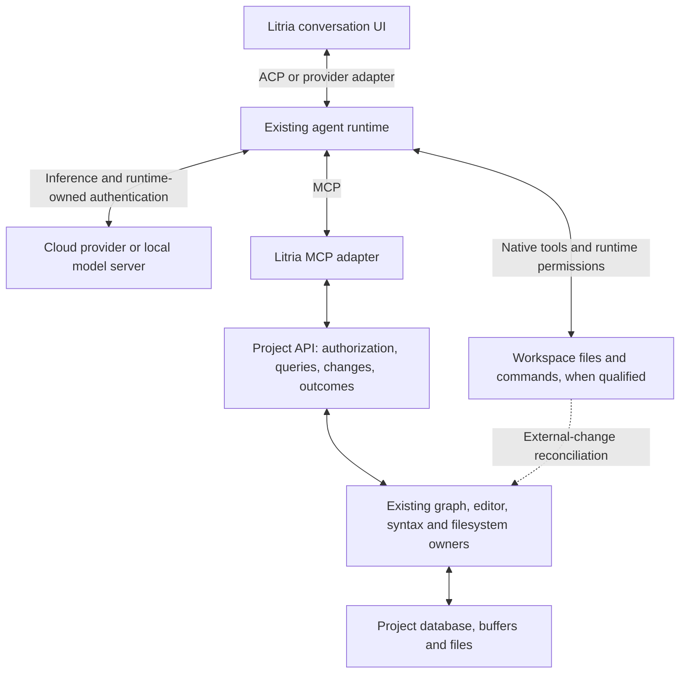

# Agent integration: project access, connections, and lifecycle

**Status:** Canonical design brief; direction accepted for planning on 2026-09-19. Not implemented or runtime-qualified.
**Decision record:** [ADR-031](031-agent-integration-and-lifecycle.md).
**Owner direction:** Connect an agent, point it at an existing project, and work together. Support frontier providers and users' own local models. Remember connections across projects. Closing Litria must stop its agent work by default.

## 1. Product outcome and scope

A user can begin a project without configuring AI. When they need help, **Connect an agent** attaches a supported agent to the project already open in Litria. The agent can explain the project, understand its graph and current editor state, and propose or perform permitted changes. No project recreation, database knowledge, terminal configuration, or hand-edited MCP JSON is required for a supported connection.

The normal experience is:

**Choose an agent → reuse or complete sign-in → confirm the current project and access → start working.**

After setup, the connection remains available across projects. Each project has its own conversations and access decisions. Reopening Litria restores saved state with the agent idle. A message or explicit user action starts new work.

### Included in the first supported experience

- One qualified existing agent runtime, integrated into Litria's conversation UI.
- A provider-independent Project API, exposed through a small local MCP adapter.
- A verified cloud-model route and a verified local-model route, using that runtime where possible. A second adapter is justified only if necessary to satisfy those routes.
- Reusable authentication, project attachment, visible activity and approvals, cancellation, and conversation restoration where the runtime supports it.
- Useful graph/source reads followed by reviewed text edits and file creation once the relevant write gates pass.

Model flexibility is a requirement; universal compatibility is not a release claim. A connection that can chat has not thereby demonstrated safe project editing.

### Deferred

Litria's own agent reasoning loop; a universal provider OAuth broker; arbitrary agent installation commands; an outbound MCP service marketplace; remote/cloud-hosted agent execution; autonomous schedules; multi-agent orchestration; unattended continuation; broad structural graph/file mutations; and a mode guaranteeing that every native filesystem operation passes through Litria.

Advanced background execution may be considered separately. It is absent from the initial flow and off by default if introduced later.

## 2. Provenance and relationship to earlier research

This brief consolidates the owner's 2026-09-19 discussion and supersedes the delivery recommendations in the [initial MCP research](../ideas/brief-mcp-integration.md) and [Project API proposal](../ideas/brief-project-api-mcp.md). Those documents remain historical research, including source inspection and unresolved implementation findings.

The principal refinement is to **reuse an existing agent runtime**. Litria does not need to implement an agent engine, collect every provider's credentials, or exclusively mediate every file operation to provide the requested experience.

The earlier proposal's R6 recommendation to require a mode with exclusively API-mediated project access is no longer the default. Its warning remains valid: MCP grants cannot constrain separate native tools. R1-R5 and R7-R9 remain implementation concerns, interpreted through the boundaries below. No earlier draft, example schema, numeric budget, or compatibility suggestion becomes an implemented guarantee through this consolidation.

Industry precedents support this division of work. JetBrains connects external agents through ACP and can supply its own IDE MCP server. VS Code offers both an editor-integrated harness and separate provider runtimes. T3 Code uses provider adapters while retaining its own session and recovery responsibilities. These are architectural precedents, not evidence that a Litria integration has been tested. [JetBrains ACP](https://www.jetbrains.com/help/ai-assistant/acp.html), [VS Code harnesses](https://code.visualstudio.com/docs/agents/run/agent-harnesses), [T3 architecture](https://github.com/pingdotgg/t3code/blob/main/docs/internals/overview.md).

## 3. Architecture and ownership

**ACP means Agent Client Protocol.** It carries conversation/session control between Litria and an agent. MCP supplies tools and context. Neither protocol is selected by the number of agents. Prefer ACP when the chosen runtime supports the required capabilities; otherwise place its supported SDK/protocol behind an adapter. Do not claim all IDEs use ACP: VS Code's Agent Host documents its own AHP interface. [ACP session setup](https://agentclientprotocol.com/protocol/v1/session-setup), [VS Code Agent Host](https://code.visualstudio.com/docs/agents/concepts/agent-host).

| Responsibility | Owner |
|---|---|
| Model calls, tool loop, model selection capabilities | Existing agent runtime and its provider integration |
| Runtime-owned login, refresh and credential storage | Runtime; Litria invokes supported flows without scraping or copying credentials |
| Connection profiles, lifecycle, cancellation and normalized session events | Proposed Litria agent lifecycle service and runtime adapters |
| External request authentication, project binding, limits and authorization | Rust-owned Project API boundary and MCP adapter |
| Live graph, selection, source relationships and editor state | Existing owning domains/services through injected adapters |
| Litria-mediated writes | Editor/save/FSM owners and their native persistence boundary |
| Native agent file operations | Runtime permissions; Litria observes and reconciles their effects |

The [Domain Register](../../Orchestration.md#2-domain-register) remains authoritative. The Project API is a typed application service, not an initially public REST server. A narrow request bridge reaches frontend-owned state; this does not relocate the editor or graph into Rust. Raw SQL and unrestricted database mutation are never part of the agent contract.

Agent lifecycle infrastructure is new responsibility. Exact module placement and any new command domain must be registered, with relevant guard coverage, before implementation. This ADR does not add a new JavaScript domain or widen App.jsx's composition contract. Existing `ConnectionDomain` means graph connections and must not acquire provider/session ownership because of the name.

For the first local integration, prefer a bundled stdio MCP helper and authenticated local IPC to the running application, subject to the compatibility spike. Bind each channel to one project session. Do not introduce a public listener or remote OAuth service merely to connect a local child process. If a supported runtime requires loopback HTTP, qualify its authentication, origin, lifetime and token handling separately.

## 4. Persistent connections, project sessions, and access

Keep four concepts distinct:

| Record | Lifetime and meaning |
|---|---|
| Connection profile | User-level runtime/adapter identity, account or endpoint reference, model preferences and readiness. Available across projects. |
| Credential reference | Runtime-owned profile or secure app-owned credential reference. Never project database content, source-controlled config, or transcript content. |
| Project session | Conversation identity/history, model/provider binding, workspace registration and current workspace epoch. Restore only in its associated project. |
| Project grant | Allowed resources/actions and approval policy for a connection and project. Revalidated when a session attaches; unrelated projects do not inherit it. |

Workspace registration is machine-local and bound to a canonical filesystem root/identity. A new workspace epoch fences stale requests whenever that binding changes. A copied project database ID is not sufficient authority. Roots, principals and epochs come from the trusted connection context, not model-supplied arguments.

Switching projects keeps the account connection and starts or restores the target project's conversation in an idle state. The initial single-project experience cancels/drains outgoing project work before detaching it; it does not silently leave another project's turn running. Returning to a project restores its history, not permission to continue a previous task automatically.

Restoration capabilities must be negotiated. ACP has optional saved-session loading; persistence and cross-client reuse depend on runtime support and accessible session storage. When resumption is unsupported, Litria can retain a local transcript for viewing and offer a new conversation; it must not represent a fresh agent session as having full previous context. [ACP sessions](https://agentclientprotocol.com/protocol/v1/session-setup).

Compatible IDEs may use the same installed runtime and credential profile. That does not establish universal portability of another IDE's own account or chat history. OpenCode documents integration with both Zed and JetBrains; JetBrains documents reuse of existing agent authentication. [OpenCode ACP](https://opencode.ai/docs/acp/), [JetBrains ACP](https://www.jetbrains.com/help/ai-assistant/acp.html).

Connection preferences belong in app settings; reusable secrets belong with their credential owner. Conversation history is sensitive project data: keep it out of ordinary logs and version-controlled files, provide deletion, and define retention before shipping. Operation receipts contain minimal identifiers/outcomes rather than unrestricted source snapshots. Changing provider/account must not automatically send the prior transcript to a new destination.

## 5. Connection and authentication experience

1. **Choose.** Offer supported agents and existing connections first. Detect installed runtimes without starting a project session. Provide a local-model route through a compatible runtime. Advanced executable/endpoint configuration stays out of the normal path.
2. **Set up if necessary.** Reuse a supported installation. A managed installation requires an explicit install action, verified distribution and tested version; it is never a hidden side effect of opening a project or checking status.
3. **Authenticate.** Reuse the selected account's valid runtime login. Otherwise invoke its supported browser or terminal-assisted flow. Browser completion advances Litria automatically after actual authentication succeeds. A callback page or subprocess launch alone does not establish success.
4. **Validate.** Distinguish account readiness, model availability and tool compatibility. Use non-generative checks where supported. Do not send source or issue a paid test generation merely to verify login. Show validation pending when a harmless check is unavailable.
5. **Attach.** Preselect the current project. Show a short destination/access summary and any runtime-specific limits. After user attachment, negotiate MCP and confirm an authorized project-context read. Routine permitted reads should not create repeated approval prompts.
6. **Work.** Accept the user's first prompt. Present streaming activity, concrete change review when required, native permission requests, and a visible Stop action. Do not start an unsolicited project analysis after connecting.

Browser login is a supported adapter capability, not a universal replacement for API keys. Do not borrow another application's OAuth client identity or treat a subscription login as a generic API entitlement. Unsupported routes use a clearly labeled key/endpoint path or remain unavailable.

Authentication and metadata probes run without project context. Qualify startup behavior so they do not load project hooks or launch configured tools as an unreviewed side effect. Require HTTPS for credential-bearing remote endpoints; allow loopback HTTP for explicitly selected local services. Validate destination and redirect handling, and never forward an existing credential to a changed endpoint automatically.

Runtime-owned credentials stay with that runtime. Litria stores the selected profile reference and obtains status through supported interfaces. Explicitly choosing an existing shared profile permits reuse; silently changing its global active account does not. Disconnecting Litria removes its project access and stops its work without implicitly signing the user out of every other IDE. Provider sign-out is a separate action that explains effects on a shared profile.

If Litria directly owns a key, use a native credential vault and retain only its reference in application state. An unavailable vault yields explicit session-only use or a clear error, not silent plaintext fallback. If Litria ever owns an OAuth flow, use a provider-supported public-client flow with PKCE, transaction-bound callbacks and refresh/revocation handling; this is conditional work, not a prerequisite for the runtime-owned first integration. [Native-app OAuth](https://www.rfc-editor.org/rfc/rfc8252).

For local inference, persist the endpoint and model selection. A model server supplies inference; the agent runtime supplies the loop and project tools. OpenCode supports local Ollama models, and Ollama's default local API requires no authentication. This establishes a candidate route, not a selected Litria runtime or a guarantee for every local model. Remote/LAN endpoints require deliberate endpoint and credential configuration. [OpenCode providers](https://opencode.ai/docs/providers/#ollama), [Ollama authentication](https://docs.ollama.com/api/authentication).

Keep login errors separate from model access, billing, offline endpoints and project permissions. Preserve a valid connection when its provider is temporarily unavailable. Never switch accounts, providers or local/cloud inference automatically to recover from an error.

## 6. Execution lifetime and token use

**Owner decision, 2026-09-19: closing Litria stops Litria's agent work by default. Remembered setup and history do not authorize continued execution.**

| Event | Required default behavior |
|---|---|
| Launch/reopen Litria | Restore connection metadata and history with no active turn. |
| Restore a session or reconnect a channel | Reconcile state without submitting a prompt or replaying a task. |
| Switch or close the attached project | Fence old access, cancel/drain its turn and resolve or record in-flight mutations before rebinding. Keep login. |
| User presses Stop | Stop admitting tool work, request runtime cancellation, and report confirmed or uncertain outcomes. |
| Close the Litria window owning the session, quit, or exit through an update | Run the same stop-and-cleanup protocol; do not silently detach work into a daemon or tray process. |
| Unexpected app/frontend failure | Backend supervision revokes the lost session and cancels work; native process ownership must cover backend death as well. |
| Reopen after interruption | Show interrupted work and existing effects. Offer an explicit Continue action; do not automatically spend tokens to recover. |

Closing protocol: fence new project calls and queued turns; request cancellation; resolve or record already-started mutations; stop Litria-owned agent processes and descendants within a bounded shutdown interval; persist final or uncertain session outcomes. An adapter that cannot satisfy the default lifetime contract is not a supported initial integration.

Process ownership is precise. Do not kill an unrelated CLI session or a pre-existing shared local model server. Cancel Litria's request to such a service and stop only processes it owns. Qualify parent-death cleanup on each supported OS; a frontend cancellation callback alone does not cover crashes or orphaned children.

No automatic prompt submission follows login, refresh, resume, project switch, reconnect or startup. Metadata/health checks must not start a tool loop, project hooks or paid generation. Within a user-started active turn, bounded transport retries may be qualified; an unknown generation or mutation outcome is never blindly replayed as new work.

Stopping a local session cannot retract an already-sent provider request or guarantee zero additional billing for inference already in flight. The adapter must document provider cancellation behavior and must not label an unconfirmed remote operation as cancelled. This limit does not permit additional turns after closure. Detached remote jobs are outside the initial supported mode.

Continued work after closure, scheduling, autonomous retries across restarts and background project sessions require a separate design and explicit advanced opt-in, with visible activity, spending controls and reliable cancellation. They are not bundled into connection persistence.

## 7. Project API and MCP contract

The Project API defines semantics independently of the model, MCP transport and UI. Use a shared versioned schema with validated requests, typed results/errors, deadlines and bounded queues. Expose a small capability-qualified tool surface; unsupported mutations are unavailable. Tool descriptions and model-supplied approval fields never confer authority.

| Initial tool family | Contract |
|---|---|
| `litria_project_context` | Small project/selection summary, available capabilities, policy and freshness. |
| `litria_graph_query` | Bounded graph neighborhood with relationship provenance and explicit partial/stale state. |
| `litria_files_read`, `litria_files_search` | Authorized documents/ranges and bounded search; indicate buffer versus disk and document revision. |
| `litria_diagnostics_list` | Available diagnostic details, producer and indexed revision; unavailable is different from no errors. |
| `litria_changes_prepare` | Validate proposed edits/creation and produce an immutable plan and reviewable diff without applying it. |
| `litria_changes_apply` | Execute an authorized current plan once, through existing owners, and return effect-specific outcomes. |
| `litria_operations_get` | Authorized read of an operation's status after approval, cancellation, lost response or reconnect. |

These names are proposed contract targets, not implemented endpoints. Define exact schemas, error codes and measured budgets in the implementation plan. The prior proposal's example limits are provisional. Test a small-context local model; bound work and allocations before constructing large results. Prefer summaries and explicit expansion to full-project exports.

### Reads

- Use live owner snapshots for graph and selection; database rows alone are not current editor context.
- Return the effective open buffer when permitted; otherwise return saved file content. Label the source, dirty state, document identity and revision.
- Distinguish canvas coordinates, filesystem paths and source ranges. Source-derived relationships change through source/syntax operations, not fabricated database edges.
- Scope pagination/caches to the connection, project epoch and permission generation. Reject expired cursors rather than mixing snapshots silently.
- Apply exclusions before building summaries, searches, snippets, graph relationships, diagnostics, diffs and errors. Metadata can also disclose sensitive files.
- A returned revision vector describes observations; it does not claim an atomic snapshot spanning editor memory, files and SQLite.

### Litria-mediated changes

Use **prepare → authorize → revalidate → apply through owners → record outcomes**. Default to concrete review for these changes; an explicit session grant may allow ordinary source edits without repeat review. Sensitive paths, policy/config changes and higher-risk operations need separately defined rules.

Start with `text.edit` and `file.create`. Edits require an expected document revision; creation requires absence and never becomes an implicit overwrite. An editor-owned compare-and-apply operation checks the live model at the actual mutation boundary. Saved writes additionally validate the disk baseline. Buffer application is not a successful save, and saving pre-existing human edits must be included in the approved effect.

The native persistence boundary must pin the workspace/epoch, preserve existing content on failed replacement, and return awaited typed outcomes. Preserve the FSM's filename, ordering and reconciliation rules. An agent-specific queue alone cannot prevent races with typing, autosave or another filesystem writer.

Each immutable plan has one logical operation identity and a durable claim to execution. Bind approval to the requester, project, content/revisions and expiry. Deduplicate preparation/application across transport retries, including different request IDs for the same plan. Define rejected, expired, applying, applied, partial, conflict, cancelled, failed and needs-review outcomes; report buffer, disk and metadata effects separately. Do not advertise a multi-file/editor/database transaction as atomic.

On interruption or uncertain persistence, reconcile before retrying. Recovery must not launch a model turn. Receipts and session restoration are not automatic rollback; an undo action must validate the current content and describe which effects it can restore.

### Internal database access

The supported agent interface reads and changes Litria state through these services. Do not supply a DB handle, SQL tool or database credential. Exclude internal state from MCP disclosure.

A native agent with broad filesystem access may still reach database files. MCP exclusions are not OS enforcement. Qualify runtime restrictions and database placement before claiming native access is blocked; if that cannot be enforced, disclose the broader native scope and do not market the connection as database-isolated.

## 8. Native tools, permissions, and editor synchronization

Runtime-native filesystem tools may coexist with Litria MCP tools. This avoids requiring a replacement agent engine or universal filesystem proxy. Their permission mechanism remains the runtime's, and their edits are external filesystem changes from Litria's perspective.

Litria's own API writes still use the editor/FSM path. Runtime-native edits do not inherit that path's plan approval, conditional commit, undo or receipt guarantees. A native completion event cannot be relabeled as a Litria-verified save. Publish the distinction in connection details and make permissions truthful at the point of use.

Prefer native permission requests presented within Litria, preserving the original action and grant scope. Do not map a provider's broad permission to a narrower label. Only offer a connection-wide Read only or Review changes preset if both the MCP and native-tool paths actually enforce it. Otherwise restrict the runtime or explain the separate controls; never silently fall back to full access.

Before enabling native edits, qualify observation and reconciliation of create/edit/rename/delete, including graph and syntax refresh. A dirty editor buffer must not be silently replaced by disk changes or silently overwrite an agent's new disk version. Detect the divergence, preserve both versions and require an explicit resolution. Watchers alone do not provide pre-write protection; adapters needing a stronger guarantee must use editor callbacks or mediated writes and demonstrate their coverage.

Command execution remains a separate permission and delivery gate. No generic shell tool is added to the first Litria MCP catalog. Native commands, hooks and plugins must respect the repository's visible execution/consent policy; a hidden runtime command is not an exception. If an adapter cannot provide the required execution path, disable that capability or withhold support until a policy-compliant integration is proven. Project-authored configuration is an inert proposal until reviewed, not automatic permission to launch programs.

## 9. Security and operational boundaries

| Concern | Required control and remaining limit |
|---|---|
| Project A request reaches B after a switch | Pin workspace identity/epoch through editor, filesystem and DB operations; reject stale replies. Row IDs or a mutable current-project reference are insufficient. |
| Prompt injection in project material | Treat retrieved content as data; authorize actions outside the model. Instructions and filtering do not provide containment. |
| Secret disclosure | Filter every MCP export surface and avoid raw source in logs. Native tools and unknown secrets require their own controls; a local agent can still use cloud inference. |
| Native access exceeds MCP grants | Qualify actual runtime permissions. Working directory, Git worktree and tool annotations are not sandboxes. |
| Credentials reach the wrong endpoint/account | Bind account, endpoint and profile deliberately; no automatic credential forwarding or provider fallback. Sanitize inherited credential overrides without breaking the explicitly selected supported profile. |
| Unsafe runtime/config installation | Explicit setup, tested exact versions, integrity checks for managed artifacts, no project-triggered downloads or unreviewed launch commands. Origin alone is not proof of safety. |
| Local bridge impersonation | Authenticate channels and bind them to the owned session/project; use OS permissions and short-lived credentials. Same-user malware remains outside this guarantee. |
| Duplicate or stale writes | Immutable plans, final revision checks, one execution claim and truthful receipts. Uncertain external outcomes require reconciliation. |
| Runaway work or lost UI | Deadlines, backpressure, explicit Stop, parent-death supervision and no automatic continuation. Remote in-flight cancellation has provider-specific limits. |
| Misleading restored state | Separate configured, authenticated, project-ready, running, stopped and uncertain states. A saved transcript is not a live task. |

Use a bounded activity trail with project/session identity, relative resources, approvals, operation IDs and outcomes. Redact tokens, callback URLs, raw tool arguments and source/prompt bodies from routine diagnostics. Account metadata and history can still be sensitive. Any support export must be deliberate and inspectable.

The [security policy](../../../Agents/docs/security-policy.md) and [dependency compatibility policy](../../../Agents/docs/dependency-change-policy.md) govern the eventual runtime/process/network implementation. This brief records design controls; it is not a completed security audit.

## 10. Implementation gates and unresolved choices

These are prerequisites for a build plan, not completed checks or a schedule.

| Gate | Evidence required |
|---|---|
| Runtime and platform qualification | Pick the runtime, adapter, supported versions/OSes, distribution method and auth ownership. Demonstrate packaged startup, MCP attachment, native permission behavior and cancellation. |
| Cloud and local model routes | Complete a small graph-assisted task with each supported route. Verify model/tool capability and context budgeting; disclose unsupported combinations. |
| Authentication and persistence | Existing login, fresh setup, cancellation, expiry/refresh, account isolation, restart and project switching without repeated login or unsolicited generation. |
| Foreground lifecycle | Stop, window close, project switch, update/restart and crash during streaming/tool execution. Verify descendants exit or requests cancel, other apps' processes survive, and reopening remains idle. |
| Safe project identity and writes | Resolve the prior proposal's R1-R5: DB epoch binding, conditional persistence, awaited outcomes, editor compare-and-apply, and approval/retry/recovery transitions. |
| Native edit coexistence | Dirty buffers, external edits, rename/delete, syntax/graph refresh, competing writes and unavailable project persistence. Establish exactly which native restrictions are enforceable. |
| Disclosure and resource bounds | Resolve R8-R9 across every read/diff/error/cache surface, large graphs/files, malformed input and a small-context model. |
| Product usability | First connection inside an existing project; no required MCP JSON; clear unavailable/expired states; useful permission summaries and no prompts for every routine authorized read. |

Before coding, settle the minimum shared schemas, session/operation storage, installed helper transport, concrete domain/service placement, shutdown deadline and fallback, and the exact native-tool capability set. Revalidate earlier source-inspection findings against the then-current implementation. Preserve the [earlier R1-R9 review](../ideas/brief-project-api-mcp.md#12-adversarial-design-review--2026-09-19) as evidence, not as proof that those issues have been fixed.

A sensible implementation order is to qualify runtime/auth/lifetime first, establish the API identity and read contract, then enable mediated writes and native synchronization as their gates pass. The first useful release must satisfy its advertised cloud/local and lifecycle behavior; unfinished capabilities remain unavailable. A separate build plan should own delivery slices and tests once the runtime spike resolves those choices.

## 11. Verification record

2026-09-19: consolidated existing repository inspection and primary-source research with the owner's product decisions. Validation passed for 54 local references and four heading anchors across the new brief/ADR and both historical briefs; new-document encoding, code fences and trailing whitespace also passed. `git diff --check` passed for tracked changes, supplemented by the reference check for these untracked documents. No runtime was installed, authenticated or executed; no protocol, provider, local-model or packaged-platform compatibility test was performed. The accepted ADR specifies intended behavior, not current shipped functionality.
