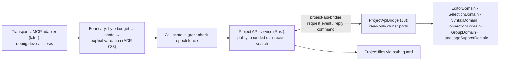

# Project API contract: operations, identity and the owner bridge

**Status:** Accepted design brief (2026-09-30 — owner ruling on PR #85). Proposed 2026-09-30 and revised the same day after peer review by Codex (§16). No code yet; the [build plan](project-api-build-plan.md) owns delivery.
**Decision records:** [ADR-031](031-agent-integration-and-lifecycle.md) owns the Project API's semantics. [ADR-033](../../adrs/033-contract-schema-source-of-truth.md) owns how its contracts are written and checked. [ADR-032](../../adrs/032-workspace-epoch-fencing-and-write-truthfulness.md) owns the workspace epoch.
**Parent design:** [agent integration brief §7](brief-agent-integration.md#7-project-api-and-mcp-contract), which names the tool family and asks for "exact schemas, error codes and measured budgets" in implementation planning. This brief makes the read half of §7 implementable. Where §7 and this brief disagree, §7 wins until it is amended.
**Owner direction (2026-09-29/30):** build order is contract → bounded reads → one version-checked buffer edit → conditional disk writes and receipts. `litria_files_search` stays in the first read set.

## 1. Scope

**In:**
- the five read operations of the `project-api` family;
- a second contract family, `project-api-bridge`, through which the Rust boundary asks live frontend owners for state;
- the call context: who is calling, with which grant, against which workspace;
- the disclosure policy applied to every read;
- error taxonomy, per-item outcomes, operational budgets and versioning for both families;
- answers to ADR-033's open questions 2, 4, 5 and 6 for these families.

**Out:**
- **Runtime selection, ACP sessions, authentication and the external transport.** This means the stdio MCP helper and the authenticated local IPC it would use. These stay behind ADR-031's runtime-qualification gate ([agent brief §10](brief-agent-integration.md#10-implementation-gates-and-unresolved-choices)). Everything in this brief can be built and tested without an agent runtime, and none of it reaches users until that gate passes.
- **The write contract** (`litria_changes_prepare`, `litria_changes_apply`, `litria_operations_get`). §13 records its direction and the prerequisites found today. Its contract is written as its own increment once the reads land.
- **The UI's call path.** Presentation code keeps using domain selectors and commands ([Orchestration §4](../../Orchestration.md)). The Project API is the boundary for external principals, not a façade for the app's own UI, and existing fast paths are untouched.

## 2. Baseline

Verified at `a32b5d1` (2026-09-30) by read-only code inspection. §16 records the method.

| Needed by §7 | What exists today | Consequence |
|---|---|---|
| Server-selected workspace identity | ADR-032's epoch, the string `ws-{n}` minted from a process counter (`db/mod.rs:229-233`). `OpenWorkspace` holds `{ epoch, conn }` and **no root** (`db/mod.rs:212-215`). Every file, terminal, LSP and preferences command takes its root from JavaScript. | Rust cannot resolve a root from an epoch. The binding must be recorded in Rust (§4.1). |
| Bounded reads | `read_project_file` is an unbounded `fs::read_to_string`, UTF-8 only (`project_ops.rs:10-16`). | The API needs its own bounded reader (§5). The legacy command is not changed. |
| Enumeration and search | One walker (`project_tree.rs`): unbounded, aborts on one unreadable directory, lists dotfiles, ignores `.gitignore`. Rust has no content search. The app's search panel (Ctrl+P) searches canvas pieces only. | Search is new work (§7.3). |
| Document revisions | None anywhere. Monaco models exist only for tabs activated in a pane and are recreated on reopen and pane unmount. `getVersionId()` is used once, for Python semantic tokens. | Revisions are defined here (§4.5). |
| Buffer truth | The editor session (`editorSessionDomain.js`) holds `workingCode` and `code` per tab. Tab id = piece id. Closed tabs **stay** in `tabsById`, so a closed tab can still be dirty (`CLOSE_TAB`, `:477-499`). Dirty means `workingCode ≠ code` after CRLF normalization. | The API reads the session, not Monaco (§5). |
| Detailed diagnostics | `diagnosticStore` keeps counts only. Full messages exist only as Monaco markers on tabs with a live model. The LSP `publishDiagnostics` version is dropped in Rust (`lsp/ipc_bridge.rs:22-30`). | A detail store is needed (§7.5). |
| Graph provenance and freshness | Canvas wires are `{ id: 'conn_n', sourceId, targetId, type: 'reference' }`, created the same way for hand-drawn and discovered wires, with no origin field. `SyntaxDomain` holds the source edges, and `getEdgeIdForConnection` links the two. No revision or generation marker exists. | Provenance is derived and freshness is reported honestly (§7.4). |
| Rust → frontend request/reply | None. Rust only broadcasts (`app.emit`) and streams per invocation (`ipc::Channel`). The nearest pattern is the LSP client's pending-request map (`lsp/session.rs:38-42`). | The bridge is new infrastructure (§8). |
| Sensitive-path policy | None in code. The rules exist only as design text: [MCP brief](../ideas/brief-mcp-integration.md) line 196, and the [Project API proposal](../ideas/brief-project-api-mcp.md) §10 and R8. | The policy is defined here (§6). |
| File watcher | None. External edits are not observed, and saves overwrite disk unconditionally. | A clean open buffer can be stale against disk (§5). Writes inherit the problem (§13). |

## 3. Architecture and placement

**Rust**
- `src-tauri/src/contracts/` keeps the ADR-033 machinery: boundary, catalog, error, plus the test-only generation, drift, fixture and MCP-proof modules. It becomes production-compiled (§12, Q6). The family types live under `contracts/project_api/` and `contracts/project_api_bridge/`. Artifacts go in `src-tauri/contracts/<family>/v1/`.
- A new service module, `src-tauri/src/project_api/`, holds the policy, path validation, bounded reader, search and bridge client. It calls `path_guard` and `db` directly, not the Tauri command adapters. [`rust-module-ownership.md`](../../rust-module-ownership.md) is stale (it omits `db`, `lsp`, `crash`, `preferences`, `platform` and `contracts`). The slice that adds the module updates that document.

**JavaScript**
- `src/app/projectApiBridge.js` is a pure factory, `createProjectApiBridge({ ports })`, tested under `node --test`.
- `src/app/useProjectApiBridge.js` is the hook the shell invokes. It builds the ports from the owning domains' selectors and listens for bridge requests. It is one hook import in `App.jsx`, which passes the shell's four-rule test as a hook invocation.
- The bridge is an adapter, not a domain. It holds no state and, in v1, calls selectors only. It needs a [Domain Register](../../Orchestration.md#2-domain-register) entry before code lands; the build plan's P2 adds it.
- The bridge never touches Monaco. It reads the editor session, which keeps the editor-engine guard's seal intact. ProjectDomain does not host it: Orchestration forbids ProjectDomain from reaching workspace owners.

## 4. Identity, binding and the call context

### 4.1 Rust records the workspace binding

`OpenWorkspace` gains the canonical project root, recorded when `db_open_project` or `db_bootstrap_project` mints the epoch and removed on close. This extends ADR-032 decision 1 (Rust is the authority for workspace identity) and matches ADR-031 §6: roots come from the trusted context, never from request arguments.

The Project API reads the pair `(epoch, root)` from that binding. It never takes a root, and never trusts one the frontend supplies. A single-file (untitled) session has no workspace database, so it has no binding, and every operation returns `notReady`.

### 4.2 The call context

Every request is dispatched with a `CallContext { principal, grant, epoch }`, built by the transport from its authenticated channel:
- `principal` — who is calling;
- `grant` — the capability set from the catalog, for example `project.files.read`;
- `epoch` — the workspace the channel was attached to.

Request payloads carry none of these. v1 has two principals:
- `test`, used by Rust tests;
- `dev`, a debug-build-only command for driving the live app over CDP. It follows the precedent of `crash_test_panic` and is excluded from release builds by `cfg(debug_assertions)`.

Real agent principals arrive with the transport, behind the runtime gate.

### 4.3 Fencing

Each operation checks `context.epoch` against the current binding twice: when it starts and before it returns.
- A mismatch returns `workspaceChanged`. Any partial result is discarded.
- No binding returns `notReady`.

**The global epoch alone does not prove what the frontend's state describes.** `dbOpenProject` sets the new epoch as soon as the open command returns (`dbStorage.js:103-106`). React then resets the editor in an effect and loads file contents asynchronously (`useProjectPersistence.js:180-183`, `:299-319`). For a while, the epoch says B and the selectors still hold A, or a half-loaded B. The bridge is therefore bound to the epoch its owners' state actually belongs to:

- **Ready epoch.** The bridge takes its epoch from the project instance it serves: `projectInstance._dbState.workspaceEpoch`, the epoch the state was hydrated from. It becomes ready only after hydration for that instance finishes: DB state applied, piece contents loaded, editor session restored.
- **Attach.** Only a ready bridge attaches to Rust, with `project_api_bridge_attach { epoch }`. Rust sends a request only to a bridge attached for the request's epoch; otherwise the call returns `ownerUnavailable`. The bridge detaches when its project instance changes. Detach runs in a React effect, and nothing guarantees it runs before the editor reset. The per-reply check below closes that window instead: the global epoch changes before React re-renders, so a reply for the old project is refused as soon as the switch begins.
- **Attach generation.** Each attach returns a generation token, and every reply carries it. A webview reload or a replaced listener re-attaches under a new generation, so Rust refuses replies from an old generation. Requests addressed to the old listener time out.
- **Per reply.** The bridge answers a request only when the request's epoch, its own ready epoch and `getWorkspaceEpoch()` all agree. Otherwise it refuses with `workspaceChanged`.

Locks: Rust copies the binding out under the database lock, then releases it. It never holds the database or write lock while doing file work or waiting for the bridge (R4 of the [Project API proposal](../ideas/brief-project-api-mcp.md)).

### 4.4 Document identity is the project-relative path

Every piece is a file (`file_path TEXT NOT NULL UNIQUE`), and folder groups are directories. A normalized, forward-slash project-relative path, read within one epoch, therefore identifies every node and document the read family returns. It is also the only key that all four internal keyings of a document can map to: the Monaco model URI, the LSP URI, the syntax adapter's absolute path and the diagnostic store's lowercased path.

Piece ids, tab ids, model URIs and connection ids never cross the API. Piece ids in particular are per-project autoincrement numbers that overlap across projects. A rename is a new identity.

### 4.5 Revisions are minted by the owner of the state

A revision is an opaque string. Callers may only compare two revisions for equality. Revisions are scoped to their source: a buffer revision and a disk revision are never comparable, even for the same text.

- **Buffer revisions** are minted by the JS editor port, as a synchronous content hash of the session text.
  - Synchronous, because the write increment must compare and apply in the same JavaScript turn (§13), and `crypto.subtle` is asynchronous.
  - The same function mints read revisions and will check edit preconditions, so the two cannot disagree.
- **Disk revisions** are minted by Rust as a hash of the bytes read. `sha2` is already a normal dependency.

Content hashes are used because there is no version counter to reuse: Monaco models are recreated on reopen and on pane unmount, and they exist only for activated tabs. Content hashing has an ABA gap: text that changes and changes back keeps its revision. That gap is benign for text edits, because the precondition is "the text is what I read", not "nobody touched it".

The hash algorithm and token format are implementation details of each owner, not part of the contract.

## 5. Documents and effective reads

- **Buffer truth is the editor session**, meaning the `workingCode` of every entry in `tabsById`, including closed entries the session retains. It is never a Monaco model:
  - models exist only for tabs activated in a pane;
  - reading a model directly would break the engine seal;
  - it would also miss closed tabs that are still dirty, which Save All will write.
- **Effective source:** the buffer when the document's session entry is open or dirty, otherwise disk. Every result says which, as `source: editor | disk`, together with `dirty` and `revision`. A caller can ask for `disk` explicitly.
- **Stale clean buffers.** Litria has no file watcher, so a clean open buffer can differ from disk after an external edit. The API reports what the editor holds, labelled `editor`. It does not guess. Closing that gap belongs to the native-edit reconciliation gate (agent brief §8), not to this contract.
- **Bounded disk reads.** The bound is on the bytes actually consumed, not on a size checked beforehand. A file can grow, or be replaced, between a metadata check and a read.
  1. Check the path with the disclosure policy (§6).
  2. Resolve it through the typed resolver (§12, Q4).
  3. Open the file once. On Unix, open it non-blocking, so that a FIFO swapped in at that path cannot hang the reader.
  4. Check the **handle's** metadata, not the path's. Anything other than a regular file (a directory, FIFO, device or socket) returns `notFile`. A size above the hard cap returns `tooLarge` without reading.
  5. Read through `take(cap + 1)` into a buffer whose capacity is capped. If the extra byte arrives, the file grew past the cap after the check: return `tooLarge` and discard what was read.
  6. If the first 8 KiB contain a NUL byte, or the bytes are not valid UTF-8, return `notText`.
  7. Hash the bytes read and slice the requested range.

  Memory is therefore bounded by the hard cap plus one byte, whatever happens to the file during the read. This closes R9's unbounded-read finding for the API path. The legacy `read_project_file` command is unchanged.
- **Ranges and truncation:**
  - Lines are 1-based and inclusive.
  - Columns are 1-based, in Unicode code points (the unit JSON Schema uses for string length).
  - A read that does not fit the per-document budget stops at a line boundary. The result reports `truncated`, the range actually returned and `totalLines`, so the caller can continue from the next line.
  - **Oversized lines.** If the first requested line alone exceeds the budget, that line is cut at a character boundary and the result carries `lineCut: true`. Every read therefore returns at least part of a line, and a caller always progresses by asking for the next line. v1 has no way to continue *within* a cut line; for such a file, search previews are the way to locate content (a minified bundle, for example). Without this rule, a 300 KiB one-line file would fit under the hard cap and still be unreadable, because requesting fewer lines cannot shrink one line.
  - For buffers, the JS port slices before replying, so large buffers never cross IPC whole. The revision still covers the whole text.
- **Line endings** are returned as stored.

## 6. Disclosure policy

One Rust module decides, for every project-relative path, whether that path is **denied**, **unindexed** or **allowed**. It is applied before any output is built: document text, search results and previews, graph nodes and edges, diagnostics and error messages. It also applies to the lists and counts `litria_project_context` returns: selection, open documents, the active document and the dirty count. A denied `.env` open in a dirty tab appears in none of them and is not counted.

| Class | Meaning | v1 membership |
|---|---|---|
| **Denied** | Never disclosed on any surface. An explicit read returns `denied` without touching the filesystem, so existence is not revealed. Search, graph and diagnostics omit the path silently, and it is not counted. | Litria's own state: `.litria/`, `litria.toml`. Version-control internals: `.git` (directory or file), `.hg/`, `.svn/`. Environment files: `.env`, `.env.*` (including `.env.example` in v1). Key and certificate material: `*.pem`, `*.key`, `*.p12`, `*.pfx`, `*.jks`, `*.keystore`. SSH keys: `id_rsa*`, `id_dsa*`, `id_ecdsa*`, `id_ed25519*`. Credential files and directories: `.npmrc`, `.pypirc`, `.netrc`, `.git-credentials`, `.ssh/`, `.aws/`, `.gnupg/`. |
| **Unindexed** | Skipped by search and graph enumeration. Readable by explicit path, for example a dependency's type declarations. | Exactly `project_tree::IGNORED_DIRS`, reused rather than copied. |
| **Allowed** | Everything else. | — |

Rules:
- **Denied wins.** A path matching both classes is denied. The overlap is real: the reused unindexed list includes `.git` and `.litria`, which are also denied, so they must never become readable by explicit path.
- **Matching is ASCII case-insensitive on every platform.** This is conservative: Windows and default macOS volumes are case-insensitive, so `.ENV` is `.env`. A pattern matches a path segment at any depth.
- **Both the requested path and its canonical target are checked.** A link inside the project that points at a denied file is denied. The search walker does not follow links at all.
- **Precedence: repository content can never widen access.** v1 reads no policy from the repository. User-configurable additions (a preference) are a later slice and can only add restrictions. Application defaults cannot be relaxed per project in v1.
- **API path syntax is stricter than `path_guard`.** A path is rejected as a per-item `invalidPath` outcome, not as a request error, when it contains:
  - anything other than forward slashes, or an empty, `.` or `..` segment;
  - an absolute path, drive or UNC prefix;
  - a `:` anywhere, which blocks NTFS alternate data streams (`path_guard` accepts `a.txt:stream` as a normal component);
  - control characters;
  - a segment with a trailing dot or space;
  - a Windows reserved device name. Today only JavaScript checks these (`src/utils/path.js`).

  These are per-item outcomes so that the request schema and the boundary keep identical verdicts (ADR-033 decision 3).
- **Not a confidentiality guarantee.** Source files can contain secrets no rule anticipates. Runtime-native tools bypass this policy entirely, and ADR-031 decision 5 requires the connection label to say so.

## 7. The read family: `project-api` v1

The operation names are those in agent brief §7. Every result carries only project-relative paths; absolute paths, including the root, never appear. The limits in §10 bound every list.

### 7.1 `litria_project_context` — capability `project.context.read`

A small orientation read. It returns:
- `apiVersion`;
- the project name and root folder name. The name comes from `litria.toml` through the binding. The absolute root is never returned.
- **Selection:** the selected file paths, and the selected folder group's path if there is one;
- **Documents:** the active document's path and dirty state, the open document paths, and a count of dirty documents. Denied paths are removed from all of these before anything is counted or listed (§6).
- **Languages:** a per-language capability matrix with six independent flags: document access, diagnostics, navigation, symbols, relationship discovery and source transformations. Installing a language server does not imply all six.
  - Today relationship discovery covers JS/TS and Python.
  - Source transformations cover JS/TS only.
  - Rust, C/C++ and Go get completion, signature help, hover and diagnostics.
- **Operations and limits:** the operations this grant may call (the catalog intersected with the grant) and the server's limits (§10);
- **Policy:** a summary naming the denied and unindexed classes, not listing files.

The workspace epoch is **not** returned. The channel is already bound, and exposing the epoch would invite the model to supply it back as if it conferred authority. (The S0 exemplar returned it; this corrects that.)

### 7.2 `litria_files_read` — capability `project.files.read`

**Request:** 1–20 documents, each a path with an optional line range; `source` (`effective` by default, or `disk`); and an optional per-document byte budget, capped by the server.

**Result:** one outcome per requested document, in request order, as a `kind`-tagged union:
- `read` — the path, source, dirty state, revision, text, the range returned, `totalLines`, `truncated` and `lineCut` (§5);
- `notFound`;
- `denied`;
- `notFile` — a directory or another non-regular file;
- `notText`;
- `tooLarge` — with the limit;
- `invalidPath`;
- `unreadable` — the file exists but could not be read, for example a lock or a permission failure *(added 2026-09-30 by build plan P1; the list above had no outcome for an I/O failure other than not-found)*;
- `skipped` — the total response budget ran out before this document.

Per ADR-033 §6, a reader that meets an unfamiliar `kind` treats that one document as unknown and never as `read`.

### 7.3 `litria_files_search` — capability `project.files.search`

**Request:**
- `query`: a literal string of 1–256 characters (no regular expressions in v1);
- `target`: `text` (file contents, the default) or `path` (file names);
- `caseSensitive`: default false; case folding is ASCII-only, so match positions stay exact;
- an optional `pathPrefix` to restrict the walk;
- `maxResults`, capped by the server.

**Walk:**
- Allowed files only. Denied and unindexed paths are skipped, and links and reparse points are not followed.
- Deterministic order, by path then line.
- An unreadable directory is skipped and counted. It does not abort the search (unlike `list_project_tree`).

**Effective semantics, with complete buffer coverage or an explicit gap:**
1. Rust first fetches the **buffer index** through the bridge: path, revision, byte length and state of every open or dirty buffer. The index carries no text and is bounded. Rust drops denied entries before planning.
2. Every document in the index is searched **in its buffer, never on disk**, even when its buffer cannot be fetched. Disk would be stale for exactly the documents that matter.
3. Buffer text is fetched in bounded pages (`editor.documents`, several documents per reply, within the bridge reply ceiling, §10). A buffer over the per-file scan cap is counted as too large, the same rule as on disk.
4. Buffer-only documents are searched too, labelled `editor`: a dirty buffer whose file was deleted on disk, for example.
5. All other allowed, indexed files are searched on disk.
6. **Any buffer that could not be searched is reported, never silently dropped.** This covers an index larger than its cap, a page that failed, and a time budget that expired before all buffers were fetched. The result is marked `truncated` with the reason `bufferCoverage`, plus the count of buffers not searched. A search is complete only when every indexed buffer was searched.

**Result:**
- **Matches:** each has a path, line, column, a preview (the matching line clipped around the match), its source and the **revision observed** when it matched: the buffer revision, or the disk revision of the bytes scanned. The agent brief §7 requires reads and searches to report revisions. The revision lets a caller tell whether a later read shows the same text the match came from.
- **Truncation:** `truncated`, with the limits that ended the search: result count, files scanned, time budget or buffer coverage.
- **Skipped counts** by reason: too large, not text, unreadable, buffers not searched. Denied files are never counted.

`.gitignore` is not honoured in v1 (§14, alternative 9). Files it lists are searched unless the policy's denied or unindexed classes exclude them, and the documentation says so.

There are no cursors in v1. A truncated search is narrowed by the caller (prefix, longer query). This avoids a cursor store scoped to connection, epoch and permission generation (agent brief §7, "Reads") until measurements show it is needed.

### 7.4 `litria_graph_query` — capability `project.graph.read` (semantics; built after the first read set)

**Request:** a focus (a path, or the current selection), a depth of 1–2, a direction (`imports`, `importedBy` or `both`), and `maxNodes`, capped by the server.

**Nodes** are identified by path:
- `file` — with its folder, and whether it is on the canvas;
- `folder` — a folder group. Legacy groups without a folder carry an opaque group id until they are promoted.

**Edges** are `import` edges from importer to exporter. Each carries:
- the imported symbols;
- a **provenance**:
  - `sourceDerived` — a syntax edge exists; its `SyntaxDomain` status (`pending`, `resolved`, `broken`, `drifted` or `unused`) is included;
  - `manual` — a canvas wire with no syntax edge;
- whether it is drawn on the canvas. Off-canvas discovered edges come from the pending-edge set.

**Freshness.** A parse status of `ok` means the index parsed the text it was given. It does not mean that text is still current: discovery reads disk, open editors register buffer text, and nothing watches the disk. Freshness is therefore reported per node as `current`, `stale` or `unknown`, and summarised for the result:

- **`current`** means the index records the revision of the text it parsed for that file, and that revision equals the file's effective revision when the query ran (§5: buffer when open or dirty, otherwise disk).
- **`stale`** means both revisions are known and differ.
- **`unknown`** means the index has no recorded revision for the file, or the effective revision could not be observed. It is never shown as current.

The result's summary is `current` only when every returned node is `current`. Otherwise it is `partial` or `unavailable`, with reasons:
- files not yet parsed;
- a discovery run pending;
- stale or unknown nodes;
- a language without relationship discovery.

This slice needs two additions to `SyntaxDomain`, both read-only for callers:
- a selector for provenance per connection;
- the revision of the text each registered file was parsed from, computed with the same buffer and disk revision functions as reads.

### 7.5 `litria_diagnostics_list` — capability `project.diagnostics.read` (semantics; built after the first read set)

**Request:** paths, or all files with diagnostics, plus a minimum severity.

**Result:** per path, a state of `available`, `unavailable` or `noProducer`, with its diagnostics. Each diagnostic has a severity, a bounded message, a range, a code and a producer. **Unavailable is not the same as no errors**, and the result says which.

Full diagnostics exist today only as Monaco markers on tabs with a live model. Two stores are possible:
- **A Rust-side cache in the LSP bridge.** It sees every server's diagnostics, including those for closed files, and could keep the `publishDiagnostics` version it currently drops.
- **A JS store fed by the same events.**

Diagnostics that only JavaScript produces are reported as `unavailable` until they are bridged: Monaco's built-in JSON/CSS/HTML workers and Python local intelligence. The slice that builds this operation chooses the store, and records the freshness it can prove. Freshness is tied to the producer's session and the document version it diagnosed, not to the time the diagnostics arrived.

**Disclosure through allowed files.** A diagnostic on an allowed file can still point at a denied one:
- Related locations in denied files are removed.
- In the message, a path-like token that the policy's matcher classifies as denied is replaced with `[denied]` (for example, `Cannot find module './.env'`).
- Diagnostics *on* denied files are omitted entirely, as everywhere else.

Token redaction is conservative and heuristic. It is tested, but it is not a guarantee that free text never mentions a denied file.

## 8. The bridge family: `project-api-bridge` v1

**Direction.** Rust sends requests and JavaScript answers. It is a separate ADR-033 family because its direction is reversed:
- Rust serializes the requests;
- replies are **inbound** to Rust, and pass the same three-layer boundary as external input: byte budget, `deny_unknown_fields`, explicit validation. The webview is part of the application, but its replies feed an external boundary and are bounded like any other input.

**Transport:**
1. When hydration completes, the ready bridge attaches with `project_api_bridge_attach { epoch }` and receives an attach generation (§4.3). It detaches when its project instance changes.
2. Rust emits the event `project-api://bridge-request` with `{ requestId, epoch, generation, op, request }` to the main window.
3. JavaScript answers with the command `project_api_bridge_reply { requestId, generation, reply }`, where `reply` is a result or an error.

**Rust side:**
- A pending map from request id to a one-shot channel, with a deadline. This is the LSP client's pattern.
- The pending map has a ceiling (§10). A request beyond it fails fast with `busy` instead of queueing without bound.
- The waiting thread is never the thread that delivers replies, and no database or write lock is held while waiting.
- A reply's encoded size is checked against the bridge reply ceiling (§10) before it is parsed.
- Late, duplicate or unknown replies are dropped and counted, as are replies from a stale generation.
- No listener attached for the request's epoch returns `ownerUnavailable`. This includes a bridge that is still hydrating. A missed deadline returns `ownerTimeout`. Both are harmless for reads.

**JavaScript side:**
- Check the epochs (§4.3).
- Call the port for `op`. Ports are selectors only in v1.
- Mint buffer revisions and slice ranges before replying. Build replies within the reply ceiling: page, never overflow.
- Reply exactly once.

**The policy stays in Rust only.** The bridge does not know the disclosure rules. Rust requests text only for paths it has already allowed. Replies that list paths without text (the buffer index, selection, open documents) are filtered by Rust before anything is counted or returned. Denied buffer text therefore never crosses the bridge, and the rules have one owner.

**v1 operations:**

| Operation | Returns | Owner |
|---|---|---|
| `editor.documents` | Per path: session state (`none`, `open`, `closedDirty` or `closedClean`), dirty, revision, and the requested slice with `totalLines`. Pages within the reply ceiling. | EditorDomain |
| `editor.bufferIndex` | Path, revision, byte length and state of every open or dirty buffer; no text; bounded by count. Rust drops denied entries, and effective search uses the rest to plan buffer coverage (§7.3). | EditorDomain |
| `workspace.selection` | Selected file paths, selected folder group, active document | SelectionDomain, GroupDomain, EditorDomain |
| `languages.capabilities` | The six-flag matrix per language | LanguageSupportDomain, SyntaxDomain |
| `workspace.graph` | Pieces, groups, wires with derived provenance, pending edges, index state (graph slice) | PieceDomain, GroupDomain, ConnectionDomain, SyntaxDomain |

Tab ids and piece ids are mapped to paths inside the bridge; they never leave it.

## 9. Errors and outcomes

**Request-level errors** use the family's contract error type. Its `code` is one of:

| Code | Meaning |
|---|---|
| `invalidParams` | The request violates a constraint its inbound schema declares |
| `limitExceeded` | The request exceeds an operational limit the schema cannot express |
| `unknownOperation` | The operation is not in the catalog |
| `denied` | The capability is not in the grant |
| `notReady` | No workspace is bound, or the session has a single file only |
| `workspaceChanged` | The epoch fence failed |
| `ownerUnavailable` | The bridge has no live listener |
| `ownerTimeout` | The bridge deadline passed |
| `busy` | A concurrency ceiling was reached (§10); the call may be retried |
| `cancelled` | The caller or Litria cancelled the request |
| `shuttingDown` | Litria is closing |
| `internal` | Any other failure |

The vocabulary deliberately overlaps the extension sandbox design's taxonomy (`denied`, `invalid_params`, `not_found`, `cancelled`, `host_error`, `shutting_down`). Principals and grants stay separate.

**Per-item outcomes** belong inside results (§7.2), not in errors: a missing or denied file is an answer, not a failed call.

**Messages** never contain file content, a denied path or an absolute path. Nor do they echo the caller's input. Today the S0 boundary returns serde's error text verbatim (`contracts/boundary.rs:41-42`), which quotes unknown field names and rejected values. v1 maps a parse failure to a fixed message by category (syntax, data, end of input), with the position at most. Agent brief §9 also keeps raw tool arguments out of routine diagnostics. The MCP mapping is the one S0 proved: a contract error becomes `isError: true` with the error JSON as text; an unknown tool becomes JSON-RPC −32602.

## 10. Operational budgets

These values are **provisional**. They are defaults and ceilings until measured (build plan P3 on this repository; the runtime track with a small-context model). Server ceilings are authoritative, and `litria_project_context` advertises them.

Four kinds of limits apply. Each is enforced where it can be measured, and a limit on one kind never stands in for another.

**Input**

| Limit | v1 value |
|---|---|
| Encoded request | 64 KiB, checked before parsing |
| Documents per `files_read` | 20 |

**Output.** Raw text budgets bound what a caller asked for. The **encoded response ceiling** bounds the whole message, because JSON escaping can expand text: a control character becomes six bytes. The service builds results item by item and checks the encoded size as it goes:
- The **first** document in a `files_read` response is shrunk to fit if necessary, by returning fewer lines and then cutting a line (§5). It is reported as `truncated`, so every response makes progress.
- A **later** document that would cross the ceiling becomes `skipped`.
- Search, graph and diagnostics stop at the ceiling and report `truncated`.

| Limit | v1 value |
|---|---|
| Encoded response, any operation | 384 KiB |
| Returned text per document | default 64 KiB, ceiling 256 KiB |
| Returned text per response | 256 KiB |
| Hard file cap (bytes consumed, §5) | 8 MiB, else `tooLarge` |
| Search results | default 50, ceiling 200 |
| Search preview | 200 characters |
| Open documents listed by `project_context` | 100 |
| Graph nodes | default 50, ceiling 100 |
| Graph edges; symbols per edge | 500; 50 |
| Diagnostics per file; per response | 200; 500 |
| Diagnostic message | 1,000 characters |

**Work**

| Limit | v1 value |
|---|---|
| Files scanned per search | 20,000 |
| Bytes scanned per file or buffer | 1 MiB (larger ones are counted as too large) |
| Buffer index entries | 500 (more are counted under `bufferCoverage`) |
| Search time | 2 s |
| Bridge deadline, per request | 2 s |

**Bridge and concurrency.** Excess work fails fast with `busy` and never queues without bound.

| Limit | v1 value |
|---|---|
| Encoded bridge reply | 512 KiB, checked before parsing; large answers page |
| Pending bridge requests | 32 |
| In-flight operations per principal | 4 |
| Concurrent searches, all principals | 2 |

Byte budgets measure encoded UTF-8 bytes. The schema's `maxLength` counts code points. These are different measurements, and ADR-033 §6 names the hazard.

The bridge applies the same shrink-to-fit rule to its pages. It measures each page's encoded size and shrinks a slice (fewer lines, then a cut line) rather than exceed the reply ceiling. The ceiling is sized so that ordinary text at the per-document ceiling fits in one page. Escape-heavy text takes more pages, or arrives truncated, but never overflows.

## 11. Versioning and compatibility

- Both families start at `apiVersion` 1. S0's version 0 was the exemplar and is deleted when v1 lands.
- Both catalogs carry `status: draft` until the first release that exposes an external transport. While a family is draft, shapes may change freely, provided the artifacts are regenerated; the drift check still fails until they are. Once it ships, ADR-033 §6's reader rules apply in full.
- Adding an operation is additive: an MCP client simply lists another tool.
- Every outcome union documents the unknown-variant rule (§7.2).

## 12. ADR-033 open questions, answered for these families

| Question | Answer |
|---|---|
| Q2 — TypeScript declarations | **Not produced.** No type-checked consumer exists. The JS bridge is tested against the fixtures instead (ADR-033 decision 4). |
| Q4 — `CommandError` | **Stays the legacy commands' contract.** The service calls `path_guard` and `db` directly and maps failures to outcomes (§7.2) at the point of use. No legacy shape reaches a contract type (ADR-033 decision 8). `path_guard`'s resolvers return `Result<_, String>` today, which erases the `io::ErrorKind`, so `notFound` would depend on parsing OS error text. P1 therefore adds a **typed** sibling resolver that returns an error enum: invalid, outside the root, not found, other I/O kind. The existing string-returning functions become thin wrappers over it, and legacy behaviour is unchanged. |
| Q5 — drift classification | **Report-only while the family is draft.** Revisit when v1 first ships, since additive-versus-breaking only matters to deployed readers. |
| Q6 — production inclusion | **`#[cfg_attr(test, derive(JsonSchema))]`, with every `schemars(...)` attribute gated the same way.** Schema generation, drift and verdict tests stay `cfg(test)`. Handlers are production code. At runtime the committed artifacts are embedded with `include_str!` for the MCP adapter. The `JsonSchema` bounds move from the `Operation` trait to the test-only generation helpers. schemars 1.x and jsonschema stay dev-dependencies, and the shipped graph gains no crate. Cost: attribute noise, and an ungated attribute fails the non-test build (so `cargo build` catches it). Rejected alternative: schemars as a normal dependency, which ships a derive and schema runtime the application never calls. |

## 13. The write increment: direction only

The write contract is written after the reads land. Today's inspection found these prerequisites:

- **Compare-and-apply is an EditorDomain command.** It checks the buffer revision and applies to the session text in the same turn. Where a live model exists, it applies there too, through a capability injected from an engine file, so the engine guard's seal holds. It is not built on the syntax adapter's `writeResultText`, which replaces the whole buffer with no check.
- **Two current defects affect it. Fix or avoid them before the first mediated edit:**
  1. After a rename, the model URI and the LSP tab maps keep the old filename (`monacoWorkspace.js` re-acquire path).
  2. A programmatic edit to an open model that is not attached to a pane is not mirrored into `workingCode`. The pane's sync effect would undo it on the next activation (inferred from code, not reproduced).
- **Edits are exact-text replacements** (`oldText` → `newText`, where `oldText` must match exactly once), not line and column ranges. This avoids column-unit disagreements (code points, UTF-16, bytes) and is the form agent runtimes already use.
- **Disk writes need native conditional operations.** Create-if-absent, and replace-if-the-disk-revision-matches, are the remainder of R2. Saves overwrite unconditionally today, and there is no watcher.
- **Plans and operations follow R5:** one operation identity per plan, a durable claim to execution, and per-effect receipts. An approval surface is an owner-facing UI and needs its own design.

## 14. Alternatives considered

1. **Return the epoch to agents** (S0's shape): rejected (§7.1).
2. **Monaco version ids as revisions:** rejected. Models are recreated and exist only for activated tabs, and reading them breaks the engine seal.
3. **Rust mints buffer revisions:** rejected. Same-turn compare-and-apply must happen in JavaScript, which would then need the same hash synchronously.
4. **Read Monaco models for buffer text:** rejected. It misses closed dirty tabs and breaks the engine seal.
5. **Cursor pagination in v1:** deferred (§7.3).
6. **Regular-expression search in v1:** deferred. It needs enforced work limits; literal search comes first, as the earlier proposal recommended.
7. **Search in JavaScript:** rejected. It would ship disk contents across IPC, and Rust already owns disk access and policy.
8. **Reuse `list_project_tree`'s walker for search:** rejected. It is unbounded and aborts on one unreadable directory. Search reuses its ignore constants instead.
9. **Honour `.gitignore` in v1:** deferred. It needs the `ignore` crate, a new dependency. The files-scanned bound keeps search predictable meanwhile (§15).
10. **One family with bidirectional operations:** rejected. The external and bridge boundaries have different principals, directions and trust, and ADR-033 versions each family on its own.

## 15. Open questions

1. User-configurable exclusions: which preference, and in which slice? They can only add restrictions (§6).
2. `.gitignore`-aware search: adopt the `ignore` crate (a dependency change) once P3's measurements show the need?
3. Should `.env.example` and similar templates become readable by default? v1 denies them.
4. Multiple windows: bridge requests target the main window. Revisit if Litria gains project windows.
5. Diagnostics store (§7.5): Rust LSP-bridge cache or JS store, decided in its slice with the freshness evidence.

## 16. Verification record

2026-09-30, at `a32b5d1`.
- **Evidence:** four read-only code inspections (Rust boundary and files; editor documents and diagnostics; graph and selection; enumeration, search and exclusions), then direct re-reads of the load-bearing lines: `db/mod.rs:212-233`, `project_ops.rs:10-31`, `path_guard.rs:59-91`, `lsp/ipc_bridge.rs:22-30`, `syntaxAdapter.js:94-103`, `editorSessionDomain.js:34-57` and `:477-499`.
- **Reused:** earlier findings from the 2026-09-29 reviews (ADR-032 delivered; historical R2 fixed; language tiers), which were re-verified then.
- **Not done:** no code was written and no tests were run. Claims marked as inferred were not reproduced.
- **Found during inspection, outside this contract:** `delete_project_path` resolves its target with `fs::canonicalize` before checking `is_symlink()`, so the symlink branch cannot fire. Deleting an in-project link to an in-project directory would remove the directory. This is reported separately and is not fixed here.

2026-09-30, revision after peer review by Codex. Each point was re-verified before adoption:
- **Epoch before hydration:** confirmed in `dbStorage.js:103-106`, `useProjectLaunch.js:328-351` and `useProjectPersistence.js:180-183` and `:299-319`.
- **Serde echo:** `contracts/boundary.rs:41-42` returns serde's text verbatim.
- **String-only resolvers:** confirmed in `path_guard.rs`.
- **Symlink resolution in moves:** `move_project_path` resolves its source the same way (`project_ops.rs:33-52`), so moving an in-project link would move its target. This extends the separate finding above.
- **Design gaps, accepted on reasoning:** a size check followed by an unbounded read; FIFOs blocking `open` on Unix; the progress rule for oversized lines; JSON escaping beyond raw-text budgets; search matches carrying the observed revision, which the agent brief §7 table requires.

Changes adopted:
- a reader bounded by the bytes it consumes, and `notFile` (§5, §7.2);
- `lineCut` and shrink-to-fit progress rules (§5, §10);
- owner-snapshot epochs, readiness and attach generations for the bridge (§4.3, §8);
- buffer-coverage rules and per-match revisions for search, and a buffer index in place of `editor.dirtyDocuments` (§7.3, §8);
- limits on encoded messages, counts and concurrency, plus a `busy` code (§9, §10);
- a typed resolver (§12);
- parse errors that do not echo input (§9);
- denied wins over unindexed, and context lists and counts are policy surfaces (§6, §7.1);
- a precise meaning of graph `current` (§7.4);
- redaction of denied references in diagnostic messages (§7.5).

Clarified in the same pass: the disclosure policy stays in Rust only. The bridge never sees the rules, and Rust filters every path the bridge returns (§8).
