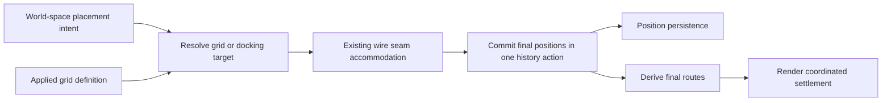

# Structural grid, placement, and routing

> **Status:** Design and implementation proposal, 2026-09-17. No application
> changes delivered. Owner-approved direction is recorded in
> [ADR-030](../../adrs/030-structural-grid-and-spatial-workspace.md); proposed
> defaults and implementation choices are identified below.
>
> **Evidence:** Source inspection and existing tests against `main` commit
> `ef4c2a3`, 2026-09-17. This is the canonical detailed design for ADR-030.

## 1. Objective and boundaries

Give the canvas a real coordinate-based grid that supplies rendering, node
placement targets, and useful routing information. Nodes anchor by the top-left
corner of their body. Strict placement uses major intersections; Flex includes
minor and sub intersections and a short animated settle. Theme editing supplies
grid appearance and can author spacing presets. Zoom changes presentation while
world geometry remains stable.

Preserve Litria's existing ability to open wire corridors by parting adjacent
nodes and moving neighboring chains. Routing may adjust a grid placement, even
off major lines in Strict. These are real saved positions, part of the triggering
undo action. No automatic resnap may close the corridor afterward.

Build for 2D now. The future target is an inhabitable VR/AR workspace, with nodes,
wires, and grid around the user and selectable environments. It is not limited
to a board in a room. This requires portable project data and explicit geometry
boundaries; it does not require installing a 3D library, adding speculative depth
fields, or replacing the current router in this feature.

This brief includes the requested implementation sequence. No separate build
plan, code modification, dependency change, or release is part of this planning
pass.

## 2. Accepted direction and proposed details

### Accepted in the owner discussion

- Three grid levels: major, minor, and sub.
- Strict and Flex are the two v1 snap modes; the anchor is the node body corner.
- Grid appearance is editable through themes and scales visually through zoom.
- The existing world origin and Home navigation refer to the same coordinate
  structure as placement and routing.
- Snap establishes intended placement; routing can move adjacent nodes and
  chains to preserve usable connections. Routing has the final say on clearance.
- Preserve the existing routing method as far as possible; limited tuning is
  acceptable, but a new grid must not remove node-parting behavior.
- Final coordinates are authoritative across views, saving, and undo.
- 2D implementation now, with a future spatial workspace and renderer/input
  independence designed into the boundaries.

### Proposals that are not yet owner-ratified settings

| Question | Recommended starting position | Decision needed by |
|---|---|---|
| Exact intervals | Use existing major/minor spacing as a compatibility reference; prototype sub spacing and node/gutter fit before freezing defaults. `100 / 20 / 5` is illustrative only. | Slice 1 |
| Square or rectangular grid | Support independent X/Y major steps in the definition, with a square default unless visual trials justify rectangular spacing. | Slice 1 |
| Flex behavior | Always settle to the finest permitted intersection; local emphasis and target stability make coarser levels readable. Arbitrary free placement is not a third v1 mode. | Slice 1 |
| Initial mode | Flex is the less disruptive proposed default. Existing positions are retained exactly on upgrade/open regardless of mode. | Slice 1 |
| Neighbor docking vs Strict | Major-grid candidates win ordinary proximity snapping. Preserve deliberate docking as a separately identified intent only if the owner accepts that additional exception; routing accommodation is already accepted. | Before Slice 3 |
| Theme spacing edits | A theme stores a reusable structural preset. Applying its spacing to this workspace is an explicit operation; changing theme appearance alone never changes placement geometry. | Before Slice 2 |
| Selection/group anchor | Snap the top-left bounds of the moving set using one translation; preserve internal offsets. A selected node dragged alone uses its body corner. | Before Slice 3 |
| Motion | Start around 120–180 ms, ease out without bounce, with immediate settlement for reduced motion. Tune in the desktop interface. | Slice 4 |

The docking choice is consequential: with 180-unit-wide nodes, a flush neighbor
need not land on a 100-unit major intersection. Two simultaneous hard promises
of unrestricted flush docking and major-only placement cannot both hold. Resolve
that interaction explicitly rather than letting whichever helper runs last win.
No new modifier key is reserved here; existing edit/additive/subtractive bindings
remain governed by ADR-013.

## 3. What the code actually does today

Values below are observations at the reviewed commit, not newly declared
constants. The linked modules remain authoritative for existing values.

| Area and evidence | Observed behavior | Consequence for this feature |
|---|---|---|
| [CanvasGrid.jsx](../../../src/components/CanvasGrid.jsx), [WorkspaceStage.jsx](../../../src/components/WorkspaceStage.jsx) | Grid is already in world space inside the Konva stage, with 20/100 spacing, fixed ±5000 extent, hard-coded background/line colors, and two theme opacity inputs. It is on the layer sampled by glass nodes. | Replace its private geometry and finite extent; retain the background sampling role. This is not a CSS-background replacement. |
| [useViewport.js](../../../src/behaviors/useViewport.js), [viewportNavigation.js](../../../src/utils/viewportNavigation.js), [StatusBar.jsx](../../../src/components/StatusBar.jsx) | World/screen conversions already exist. Home centers world `(0,0)`. The status bar reports the viewport center in world units. | Reuse transforms. A visible on-canvas origin marker is new UI; current Home includes a pinned search item, not a verified rendered origin pin. |
| [PuzzlePiece.jsx](../../../src/components/PuzzlePiece.jsx), [pieceDimensions.js](../../../src/utils/pieceDimensions.js) | Stored x/y and drag coordinates are top-left; canonical body dimensions are 180×110. Rendering applies `piece.scale`. | No center-to-corner data migration is needed. Resolve actual scaled bounds consistently. |
| [useSnap.js](../../../src/behaviors/useSnap.js), [interactionHelpers.js](../../../src/app/interactionHelpers.js) | Snapping aligns neighbors, not background lines. Single and multi-piece paths differ; group movement uses a bounds delta. Snap-with-seam protects wired faces, with a deliberate overlap-drop exception in existing tests. | Add candidate arbitration and grid targets without losing the existing docking/seam behavior accidentally. |
| [useCanvasInteractionController.js](../../../src/behaviors/useCanvasInteractionController.js) | Piece drag-end calls `applyDragEndSnap`, then `computeWireSeams`, then `movePiecesAction` with all affected IDs. | Extend this ordering into a common placement-settle path. |
| Same controller, [useGroupMenuActions.js](../../../src/app/useGroupMenuActions.js) | Group pill/outline drag-end has a separate snap/history path with no `computeWireSeams` call. Memberless groups translate seed bounds through a direct state/DB callback. Scaling also changes geometry without seam maintenance. | Group, empty-group, and scale operations need explicit parity work and transaction coverage. Single-node success is insufficient. |
| [useWireDropOnPill.js](../../../src/app/useWireDropOnPill.js), [connectionDomain.js](../../../src/app/connectionDomain.js) | Selecting a collapsed pill's member creates the connection and persists its sides without the controller's wire-birth seam pass. | Route manual connection completion through a common orchestration contract while preserving collapsed-member protections and the syntax/picker workflow. |
| [wireNudge.js](../../../src/utils/wireNudge.js) | Face-burial and transit seams can move adjacent chains. One-wire seam is 20; transit width grows by each additional wire's corridor step. Endpoint and formal-group protections apply; cascade is bounded at six per chain/endpoint path. | Preserve these algorithms and limits initially. Do not claim that arbitrary groups or unbounded clusters already part. |
| [wireSpacing.js](../../../src/utils/wireSpacing.js), [orthogonalRouter.js](../../../src/utils/orthogonalRouter.js) | Corridor separation is 16, terminal separation 20, clearance 10. Routing searches a sparse obstacle-induced orthogonal graph with length and turn costs. | Grid spacing must not blindly replace these independently tuned values. This is not a global optimizer over all possible node arrangements. |
| [wireRoutes.js](../../../src/app/selectors/wireRoutes.js), [useWorkspaceRenderSelectors.js](../../../src/app/useWorkspaceRenderSelectors.js) | Obstacle routing, distributed terminals, previous-route stability, and direct drag-time wires are already separated from wire drawing. | Preserve this compute/draw seam and cheap drag behavior. |
| [workspaceSelectors.js](../../../src/app/selectors/workspaceSelectors.js), `wireRoutes`, `wireNudge`, `useSnap`, [useAdjacency.js](../../../src/behaviors/useAdjacency.js) | Several wire anchor, obstacle, adjacency, and snap calculations use base dimensions while rendering supports scaled nodes. | Add a shared scaled-rectangle contract before trusting new placement/clearance checks. This is observed dimensional inconsistency, not a reproduced UI failure. |
| [gridLayout.js](../../../src/utils/gridLayout.js), [useCanvasUiActions.js](../../../src/app/useCanvasUiActions.js), `WorkspaceStage` | Folder expansion uses a separate content grid, including 20/16 gutters. Chevron handlers calculate layout and mutate positions from the renderer. `gridLayout` imports dimensions through `PuzzlePiece`. | Keep folder layout's purpose; move mutation orchestration out of rendering and import dimensions from the pure utility. |
| [spawnPosition.js](../../../src/utils/spawnPosition.js), [usePieceUiActions.js](../../../src/app/usePieceUiActions.js), [useScaffoldActions.js](../../../src/app/useScaffoldActions.js) | Creation uses a viewport-centered collision search with random fallback; scaffold batches use folder-grid positions. | Cover creation separately from drag, using deterministic eligible placement for new top-level nodes while preserving folder arrangement. |
| [themeDomain.js](../../../src/app/themeDomain.js), [useThemeActions.js](../../../src/app/useThemeActions.js), [themeDefaults.js](../../../src/theme/themeDefaults.js), [manifest.js](../../../src/project/manifest.js) | Appearance is a global preference despite the `projectAppearance` name. Theme normalization keeps id/name/version/tokens; token values are strings. Live/Calm overrides grid opacity. | New structured presets require explicit normalization, cloning, and migration. Numeric token patches cannot be assumed to survive. |
| [useProjectPersistence.js](../../../src/project/useProjectPersistence.js), [dbStorage.js](../../../src/project/dbStorage.js) | Workspace state is SQLite. Position changes flow through a debounced outbox, which observes live piece state including previews. The current loader restores a saved viewport. | Do not implement against the old JSON manifest plan or assume its Home-on-open flag is current. Avoid persisting animation frames. |

## 4. Ownership and proposed contracts

Evaluate placement against the existing [domain register](../../Orchestration.md).
No existing domain clearly owns a project grid definition used by placement,
rendering, and routing. **Propose `GridDomain` at `src/app/gridDomain.js`**, with
`createGridDomain`, commands, and selectors. Its acceptance/registration is a
first implementation step; this brief does not claim it already exists.

| Owner | Responsibility |
|---|---|
| GridDomain, proposed | Applied workspace grid definition, validation, hydration, explicit structural changes, geometry revision. No piece writes, DOM, theme selection, or camera state. |
| Pure geometry helpers in `src/utils/` | Derived intervals, lattice indices, snap candidates, visible line ranges, and scaled node rectangles. Ordinary data in/out; no React/Konva imports. |
| InteractionDomain | Drag lifecycle, input-independent placement intent, target choice, settle coordination, cancellation, history grouping. |
| PieceDomain / GroupDomain | Actual node coordinates and group seed/layout mutations through their existing commands. |
| Existing routing selectors/utilities | Obstacles, terminals, seams, routes, and stability. Dimension-specific implementation remains replaceable. |
| ThemeDomain / `src/theme/` | Grid appearance and reusable preset definitions; consistent theme migration/clone/reset behavior. |
| PreferencesDomain | Personal Strict/Flex choice, through the registry and existing global/project resolution. |
| Project persistence | Save/load grid geometry with workspace arrangement; readiness, failure reporting, read-only handling. |
| Presentation | Pointer-to-world translation, zoom detail, target feedback, finite transitions, and canvas drawing. |

Use an orchestration hook such as proposed `src/app/useGridActions.js` to compose
state and adapters. Keep App.jsx to hook invocation and dependency wiring. The
current domain/architecture guards already cover `src/app`; verify coverage and
the domain contract when registering the new owner. Do not create an uncovered
`src/spatial/` hierarchy just for future naming.

### Applied grid definition

Proposed fields are a schema version, 2D coordinate-system identifier, fixed
origin `(0,0)`, major step per axis, minor divisions per major interval, and sub
divisions per minor interval. Derived intervals are calculated once; do not
persist three independently editable spacings that can disagree. Track a runtime
revision for geometry/candidate caches.

World units are independent of pixels. Positive X is right and positive Y is
down for the current canvas. A future 3D adapter can map axes and units explicitly.
There is no v1 movable origin, node rotation, or depth storage.

Validate finite positive spacings and bounded positive integer division counts
in the domain and storage boundary. Clamp display work separately; never silently
change the stored geometry to make drawing cheaper. Define symmetric rounding
and deterministic tie-breaking around negative coordinates and normalize negative
zero. Invalid saved data falls back diagnostically without moving nodes or
overwriting an unknown newer schema.

### Grid geometry is not a node occupancy guarantee

Nodes can span several cells. The corner is an anchor, not a cell-size promise.
Candidate placement checks actual scaled bounds. For ordinary moves, choose a
nearby legal candidate deterministically; bound the search and show when no valid
placement is available instead of jumping far away or silently overlapping.
Deliberate docking/overlap semantics must pass through the agreed intent rule.
Existing overlaps and off-grid positions remain valid loaded data; opening the
project never performs a cleanup rearrangement.

## 5. Placement, routing, and animation

Introduce a pure placement-resolution helper, proposed
`src/app/placementResolution.js`, used by the controller. It accepts movement
intent, before/current snapshots, actual bounds, applied grid, snap mode,
candidate docking information, connections, and protected membership. It returns
the intended target, resolved positions/deltas, all affected IDs, and a reason
when placement cannot proceed. History, saving, and animation remain outside it.

### Drag behavior

- Pointer movement stays responsive. Preview one clearly identified destination
  with local guides and world coordinates; do not run the full router per frame.
- Strict targets major intersections. Flex includes all levels, using the finest
  permitted level for exact settlement. Coarser emphasis must not create an
  undisclosed different snapping rule.
- Use screen-space capture/target stability tolerances, converted by the input
  adapter; use world-space geometry for the actual candidate. Zoom does not alter
  which grid coordinates exist. Reveal local guides when the target's level is
  otherwise hidden.
- Capture the grid revision and mode at drag start; apply setting changes after
  the gesture, or cancel explicitly. No mid-drag lattice change.
- Multi-selection and group motion apply one delta to the anchor, retaining all
  relative offsets. Strict does not independently quantize every member.
- Cancellation restores the pre-gesture snapshot without a new history entry;
  if live preview positions have reached the current outbox, restoration must
  enqueue the correct final coordinates. Handle escape, lost pointer, project
  switch, and malformed drag-end coordinates.

### Routing retains authority

Keep face-burial and transit seams, chosen-side authority, distributed terminals,
obstacle clearance, multi-wire separation, and previous-route stability.
Do not round resulting displacements back onto the lattice.

For example, two wires currently need `20 + 16 = 36` units of transit corridor;
splitting it can move each side 18 units. That cannot be represented exactly by
the illustrative 5-unit sub grid. A precise route-driven off-grid result is
allowed in both modes. Prefer grid-compatible outcomes only when they preserve
the existing clearance and movement cost; never widen every seam to a major step.

Formal group interiors remain protected. Moving a group as a user gesture is
allowed; freeform splitting its members for a wire is not currently supported.
Keep endpoint protection and the existing bounded cascade. Future group gutter
widening is a separate extension through GroupDomain, not an incidental effect
of enabling the grid.

Grid lane preferences are a later, measured enhancement to the existing sparse
router. Add bounded local candidate lanes or use grid fit as a tie-break among
equivalent valid routes. Retain obstacle-edge and terminal coordinates and exact
non-grid escape routes. Do not replace the sparse graph with an infinite dense
lattice, force ports to grid intersections, or accept a longer blocked route for
visual alignment. Cache invalidation must include grid revision only where a
route actually reads it; appearance, hover, and zoom must not invalidate geometry.

### One settlement and one undo

Validate the resolved arrangement before committing: required corridors remain
open, moved rectangles do not introduce unintended overlaps, and protected
endpoints/members remain respected. Preserve deliberate docking and pre-existing
overlap intent. Failure uses a bounded existing fallback or a clear rejected
placement; it must not start a repeated snap/seam loop.

The before snapshot must include nodes and any group seed state the action may
move. The after snapshot includes all seam-displaced neighbors, not only the
selection. Rebuild adjacency against final geometry in both do and undo. Reuse
`movePiecesAction`/history grouping; do not recompute a fresh snap or seam during
undo/redo. Check action merging so a second gesture cannot discard the first
gesture's affected nodes or finalization contract.

Route creation, single/multi-piece drops, collapsed pills, expanded outlines,
memberless groups, and relevant layout/scale commands need deliberate entry into
this contract. Avoid casually running it during hydration, discovery, theme
changes, hover, or camera movement. Discovery retains ADR-025's rule that it does
not move nodes. Folder auto-layout retains its internal layout authority.

### Slide into the resolved result

Commit the final domain coordinates once. Pass a finite transition descriptor
(before positions, final positions, start time, duration) to the presentation
layer. Interpolation is a temporary animation of that committed move, not an
alternative saved layout. Nodes, attached wire endpoints, group outlines, hit
feedback, and selection visuals must agree during the transition.

Continue the cheap moving-wire presentation until settlement completes, then
show the final route. Do not stream animation-frame coordinates into PieceDomain
or the outbox, run A* every frame, or reopen seams on animation completion. A new
drag, undo, navigation transition, or project close cancels stale animation and
uses authoritative state. Reduced motion skips interpolation. Live/Calm remains
an intensity setting; it is not a substitute for reduced-motion handling.

## 6. Rendering, Home, and themes

### Visible grid

`CanvasGrid` consumes the applied definition and derived visible world bounds.
Generate lines for the viewport plus a small margin, including negative
coordinates. Use integer indices to avoid cumulative floating-point drift.
Render each location once at its strongest applicable level. Keep an explicit
line-count budget at minimum zoom and extreme coordinates.

Fade sub then minor lines as their on-screen spacing becomes too small; at very
low zoom, decimate displayed major lines without changing the major snap lattice.
Stroke widths are presentation values adjusted for zoom/device pixel ratio.
Cache static grid drawing so dragging nodes does not repaint its geometry.

Keep the real background fill and grid on the layer sampled by glass. Target
guides, origin labels, selection, and semantic overlays belong on a separate
layer so they do not ghost through frosted nodes. Replace hard-coded grid/fill
colors with semantic theme defaults. Replace `Number(value) || fallback` on grid
opacities with finite-value validation so an explicit zero works.

Home remains world `(0,0)` and may gain a small visible origin marker/axes.
Existing menu/search navigation continues to call the same world-origin target.
The status bar keeps its viewport-center meaning; a drag coordinate label is a
separate node-target readout. Do not silently change the existing project-open
viewport restoration policy while implementing this feature.

### Theme and preference editing

Add declarative grid parameter metadata, proposed `src/theme/gridParams.js`,
following the existing material parameter pattern. Parameters should include
major/minor/sub colors and visibility/opacity, restrained line weight, origin
and target treatment, and the structural preset editor. Lines/dots or additional
styles are optional polish, not a dependency for the real geometry.

Extend theme normalization to retain a versioned `gridPreset` object, rather
than putting objects into the string-token map. Define clone, rename/delete,
reset, old-theme migration, invalid-input behavior, and Live/Calm treatment.
Existing major/minor opacity tokens should remain compatible during migration;
add sub-level tokens without breaking custom themes.

Theme library edits and application of geometry are distinct operations in the
same editing workflow:

1. Edit/preview visual tokens immediately through ThemeDomain.
2. Edit the reusable preset's spacing and integer subdivisions.
3. **Apply spacing to this workspace** copies validated structure to GridDomain,
   with an undoable structural change. Existing node coordinates stay put.
4. Optional **Align selection to grid** is a separate undoable placement action,
   using the same seam rules. Do not offer silent whole-project rearrangement.

If changing structural spacing requires route reevaluation because routing lane
preferences have been enabled, it may change wires but must not move nodes. A
route-driven node movement still needs a qualifying placement/connection action.

Register Strict/Flex through `PREF_KEYS` and the preference registry, with global
default and optional personal project override. A compact canvas control may
mirror it; it must not create a second state owner. Keep it independent of the
existing default/edit interaction mode and additive/subtractive submodes.
Definition editing belongs in the theme library; contextual Settings provides a
window onto it, respecting ADR-019's exhaustive Preferences home.

## 7. Persistence and compatibility

**Proposed storage:** a dedicated, versioned workspace-grid record in
`.litria/workspace.db`, returned with `ProjectState`. This is applied arrangement
geometry alongside the node positions, not a personal preference and not the
theme library. The current DB is local workspace state; this proposal does not
claim it already synchronizes between teammates. Future export/sync must carry
positions and the applied definition together.

Implementation touchpoints are [schema.rs](../../../src-tauri/src/db/schema.rs),
[types.rs](../../../src-tauri/src/db/types.rs),
[commands.rs](../../../src-tauri/src/db/commands.rs),
[lib.rs](../../../src-tauri/src/lib.rs), `dbStorage`, and `useProjectPersistence`.
Use a singleton record with validated structure and an additive transactional
migration, following ADR-026. A new table requires an actual transactional schema
step; the existing column-addition helper is not by itself a complete migration.
Allocate the next version at implementation time.

Fresh workspaces capture a validated preset/default once. Old workspaces lacking
a record receive a stable compatibility definition without repositioning nodes.
Load it before enabling placement; mark hydration so initialization does not
write back defaults over saved data. Read-only workspaces can render fallback
geometry without attempting migration or save. Invalid/future versions must not
be silently overwritten.

Grid saves use the normal persistence failure surface and project identity
guards. Serialize/coalesce writes so rapid edits or undo cannot let an older
save win. Project close/switch must await or report pending structural writes,
just as node movement uses the existing outbox/teardown contract. Applying
spacing alone is one structural record change; any later operation that changes
both structure and positions atomically needs a dedicated DB transaction.

Do not introduce geometry keys into `editor_state` as a shortcut, resurrect the
old JSON workspace manifest, or rely on global appearance to reconstruct an
existing arrangement. `src/project/manifest.js` remains a relevant edit for theme
normalization only.

## 8. File-level change map

Proposed new filenames are suggestions. Existing paths below were inspected or
traced as callers; edit only as each implementation slice needs them.

| Action | Files | Work |
|---|---|---|
| Add | `src/app/gridDomain.js`, `src/app/useGridActions.js` | Applied grid owner and orchestration; inject persistence rather than importing UI. |
| Add | `src/utils/gridGeometry.js`, `src/utils/spatialGeometry2d.js` | Validation/derived intervals/candidates and scaled bounds; explicit 2D contract. |
| Add | `src/app/placementResolution.js` | Pure candidate/seam resolution reused by placement entry points. |
| Edit | `src/app/interactionDomain.js`, `src/behaviors/useCanvasInteractionController.js`, `src/app/interactionHelpers.js`, `src/behaviors/useSnap.js` | Grid inputs, intent arbitration, preview/settle lifecycle, group parity. Preserve docking and current structural modes until their explicit decisions. |
| Edit | `src/app/useWireDropOnPill.js`, `src/app/connectionDomain.js` as needed | Share wire-birth accommodation for manual creation paths; preserve side persistence and syntax integration. |
| Edit | `src/app/pieceDomain.js`, `src/app/groupDomain.js`, `src/history/actions.js`, `src/app/useGroupMenuActions.js` | Reuse commands; extend transactional seed movement and mixed affected-set history where necessary. |
| Edit | `src/behaviors/useAdjacency.js`, `src/app/selectors/workspaceSelectors.js`, `src/app/selectors/wireRoutes.js`, `src/utils/wireNudge.js` | Consistent scaled rectangles, anchors, obstacles, and seam validation. Preserve existing routing semantics. |
| Later targeted edit | `src/utils/orthogonalRouter.js`, `src/utils/wireSpacing.js`, `src/app/useWorkspaceRenderSelectors.js` | Optional grid candidate/tie-break support and cache revisions after baseline placement works. Existing spacing values keep their meaning. |
| Edit | `src/components/CanvasGrid.jsx`, `src/components/WorkspaceStage.jsx`, `src/app/useWorkspaceStageBindings.js` | View-bounded themed drawing, origin, guides, and pure prop wiring. Retain glass background layer. |
| Add/edit | Proposed `src/behaviors/usePlacementTransition.js`; `src/components/PuzzlePiece.jsx`, `src/components/ConnectionLine.jsx`, `src/components/Minimap.jsx` | One finite presentation transition; audit all position consumers and cancelation/hit feedback. Minimap may show final positions immediately, provided its behavior is explicit. |
| Edit | `src/theme/themeDefaults.js`, `src/project/manifest.js`, `src/app/themeDomain.js`, `src/app/useThemeActions.js`; add `src/theme/gridParams.js` | Semantic tokens, structured presets, migration, edit/apply split, validation and errors. |
| Edit | `src/preferences/registry.js`, `src/components/PreferencesPanel.jsx`, `src/app/usePreferencesSurface.js`, `src/drawers/DrawerContentSettings.jsx` | Registered snap preference and theme-grid editor/query surfaces. Audit store/domain validation for any new preference shape. |
| Edit as needed | `src/components/CanvasHud.jsx`, `src/app/useCanvasHud.js`, `src/components/StatusBar.jsx`, `src/utils/viewportNavigation.js`, `src/app/useViewportNavigation.js` | Optional mirrored mode control, target coordinates, and common origin consumption; retain camera policies. |
| Edit | `src/utils/spawnPosition.js`, `src/utils/gridLayout.js`, `src/app/usePieceUiActions.js`, `src/app/useScaffoldActions.js`, `src/app/useCanvasUiActions.js` | Grid-aware top-level creation and rigid folder placement; move group-layout mutation out of stage handlers. |
| Edit | `src/project/dbStorage.js`, `src/project/useProjectPersistence.js`, `src-tauri/src/db/{schema,types,commands}.rs`, `src-tauri/src/lib.rs` | Applied-grid persistence, hydration, migration, IPC registration, failure/read-only behavior. |
| Audit/extend only if needed | `src/project/positionOutbox.js`, persistence failure/flush coordination | Final-position persistence, interruption correctness, pending structural save lifecycle. Preserve the existing durable move outbox. |
| Audit/edit for new pending writes | `src/app/useWindowCloseGuard.js`, `src/project/projectDomain.js` | Include grid-save completion/failure in project transitions through injected adapters; retain existing save/teardown policy. |
| Documentation/guards during implementation | `docs/Orchestration.md`, `scripts/app-shell-guard.mjs`, `scripts/architecture-guard.mjs`, `scripts/domain-contract-guard.mjs`, `scripts/settings-key-guard.mjs` | Register the accepted new owner, verify scan coverage and preference keys, add only justified shell composition imports. Do not weaken guards. |

### Remove or replace, once replacement behavior is covered

- Private `GRID_SMALL`, `GRID_LARGE`, and fixed `EXTENT` authority in CanvasGrid;
  replace with the applied definition and viewport-derived drawing range.
- Hard-coded grid paint and zero-discarding opacity fallbacks.
- Any assumption that neighbor snapping alone implements placement; retain its
  useful docking/seam helpers under explicit candidate arbitration.
- Parallel drag-end settlement logic that bypasses seam/history consistency,
  once a common path covers pieces, groups, and seeds.
- Dimension imports from JSX in the touched pure layout utility, and duplicated
  unscaled rectangle math in the affected geometry paths.
- Inline group-grid mutation orchestration from WorkspaceStage, after callbacks
  are supplied by the owning hook/domain.
- Random placement fallback for the new grid-constrained creation path; define
  deterministic bounded fallback/reporting instead.

Do not remove Konva, the glass background layer, `gridLayout`'s folder engine,
the sparse orthogonal router, wire seams, group protections, dynamic terminals,
history, the position outbox, or existing Home/viewport transforms.

## 9. Implementation sequence

Each slice should be independently reviewable. Use source/tests from the current
base when implementation begins; this plan is not evidence that the tree will
remain unchanged.

### Slice 1 — geometry contract and baseline consistency

Define and register the proposed GridDomain and pure geometry contracts. Agree
the initial spacing/Flex defaults. Characterize current seam behavior, then adopt
scaled bounds in snapping, anchors, obstacles, and adjacency without changing the
routing algorithm. Remove the touched pure utility's JSX dimension dependency.

**Accept when:** scale-one fixtures are unchanged; mixed-scale fixtures have
matching rendered/model bounds; negative-coordinate snapping is deterministic;
existing seam, side-authority, routing, and history tests still pass. Settle the
docking decision before activating the next interaction slice.

### Slice 2 — persistent grid and theme definition

Implement structural serialization and transactional SQLite migration, hydration,
read-only handling, and failure propagation. Extend theme definitions/presets
and registered snap preference; create the edit/apply boundary with undo for
structural changes. Keep existing arrangements stationary.

**Accept when:** old and fresh workspaces reopen correctly, invalid/future data
does not destroy saved state, two projects retain different applied grids while
sharing a theme, zero opacity survives, and undo/project switching cannot lose
the effective definition. Node coordinates remain byte-for-byte unchanged by
theme/mode/spacing changes.

### Slice 3 — placement and routing settlement

Add grid candidates and a common settlement path for single/multi-piece drags,
group outlines/pills, and seed-positioned groups. Preserve subtree movement and
edit-mode group operations. Include both direct and pill-picker manual wire
creation paths. Include node creation and geometry-changing layout/scale
commands deliberately; preserve folder-owned internal spacing. Commit final
positions plus seam movement through one history action.

**Accept when:** major/fine targets are correct, group offsets remain intact,
multiple neighbors part as before, multi-lane seams retain exact width, and undo,
redo, save/reopen, and cancel restore all affected coordinates. No later snap
closes a corridor. Formal-group protection and fallback remain explicit.

### Slice 4 — visible grid, controls, and slide

Replace finite grid drawing, add zoom-dependent detail, origin/target feedback,
theme editing, and the mode control. Introduce finite settlement animation and
reduced-motion handling. Keep background sampling and transient guides separate.

**Accept when:** displayed intersections match snap targets at every zoom;
negative/distant positions have a grid; lines remain readable; glass remains
correct; connected endpoints track movement; interruption leaves no stale
transitions; animation adds no persistence traffic or per-frame A* work.

### Slice 5 — measured routing assistance and completion

Measure current routes on representative arrangements first. Add bounded grid
lane preferences only where they improve consistency without changing valid
short routes, protections, terminal freedom, or route stability. Complete
creation/layout parity and the compatibility checks below. If grid-aligned node
placement already supplies the benefit, keep the existing route search unchanged
and record that finding rather than making a speculative algorithm change.

**Accept when:** baseline clearances, wire separation, side authority, fallback,
and node-parting behavior are preserved; unrelated moves do not churn routes;
minimum-zoom and dense-canvas measurements stay within the measured desktop
budget. No VR/XR runtime work is included.

## 10. Verification plan and observed baseline

Existing suites to extend include `interactionHelpers.regression`, `snapSeam`,
`wireNudge`, `wireRoutes`, `wireSpacing`, `wireStability`, `workspaceSelectors`,
`groupDomain`, `groupDropHandlers`, `groupStructureOps`, `positionOutbox`,
`wireDropOnPill`, `themeDomain`, `builtinThemes`, `materialParams`, and preferences suites in
`test/domains/`.

Add meaningful geometry/domain tests for grid round trips, three levels, negative
ties, invalid intervals, scaled bounds, candidate occupancy, rigid-set movement,
geometry revisions, theme preset migration, project isolation, and one-action
settlement. Rust tests cover new/fresh/old DB records, migration rollback,
read-only fallback, validation, and save/load. Controller integration tests must
exercise the group/seed/scale paths; source-string assertions alone do not prove
behavioral parity.

Mandatory scenarios:

- A Strict drop opens a one-wire seam and stays off-major afterward; undo/redo
  and reopen preserve both the selected node and moved neighbors.
- Two or more wires widen a seam using existing spacing; grid quantization never
  rounds it closed. Cascaded chains remain coherent; cap/group/endpoint failures
  use the existing fallback.
- A scaled node's snapped corner, collision rectangle, ports, and obstacle agree.
- Multi-selection, collapsed/nested groups, expanded outlines, and empty groups
  resolve the correct shared anchor and history action.
- Zoom, pan, Home, appearance switching, and grid visibility do not move nodes or
  run seam accommodation. Applying spacing preserves coordinates.
- Drop followed immediately by undo, a new drag, a project switch, or app close
  cannot persist an animation intermediate or a previous project's grid.
- Loaded off-grid nodes and existing docking arrangements stay where saved.
- Background glass sampling excludes target guides and origin labels.

**Executed during this planning pass:** 94 existing tests passed across nine
files, using `node --test --test-reporter=dot` on
`interactionHelpers.regression.test.mjs`, `snapSeam.test.mjs`,
`wireNudge.test.mjs`, `wireRoutes.test.mjs`, `wireStability.test.mjs`,
`wireSpacing.test.mjs`, `positionOutbox.test.mjs`, `themeDomain.test.mjs`, and
`builtinThemes.test.mjs`. Exit status 0. This establishes a narrow current-code
baseline; it does not verify any proposed grid behavior or headset experience.

For implementation milestones, follow the repository verification policy:
`npm run check:architecture`, `npm run test:domains`, and `npm run build`;
`cargo test` and warning-free `cargo build` when Rust changes. Measure drag and
render performance and perform visual desktop checks for Slice 4. No application
build, Rust build, new tests, or XR runtime checks were required for these two
documentation artifacts.

## 11. Future spatial workspace contract

Keep shared identities, connections, actions, history, and authoritative spatial
state independent of drawing and input. Define 2D geometry explicitly so a later
3D implementation can supply appropriate bounds, anchors, collisions, and route
search rather than pretending today's rectangles solve volume routing.

The future experience may have suspended clusters, surfaces in different
orientations, or freely placed nodes. Node orientation, depth, 3D corner meaning,
3D grid-plane selection, desktop projection, room navigation, and cross-device
layout synchronization remain future design questions. They are not satisfied
by adding a Z field or importing React Three Fiber.

Separate project origin from viewer/headset pose and room anchoring. Separate
environment scenery/materials from project layout: changing a station into a
lab must not silently rearrange nodes or turn scenery into routing obstacles.
If users later choose architecture that constrains placement, make that an
explicit layout feature. Theme/material identities can carry into future
renderers, with renderer-specific implementation of their appearance.

This is the extension boundary to preserve now. Full room-scale routing will
need new work; the current 2D implementation should provide the shared project
operations and a clear integration point for that work.
