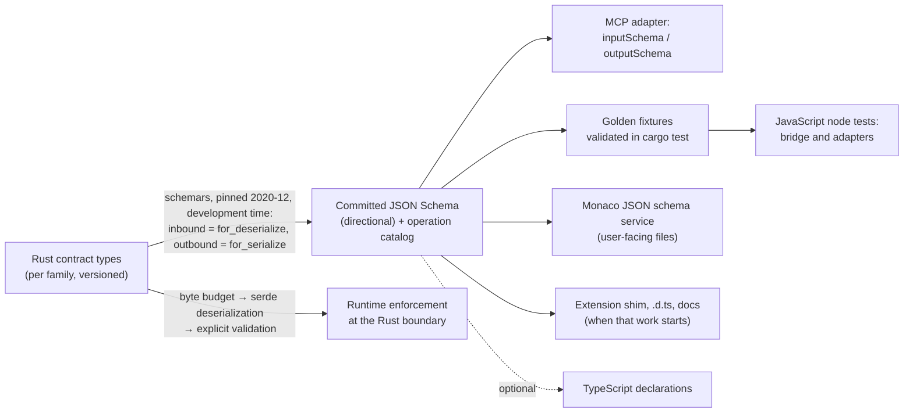

# Contract schemas: one source for Rust, JavaScript and MCP

**Status:** Proposed design brief (2026-09-29; revised the same day after peer review by Codex, see §11). Canonical detailed design for [ADR-033](../../adrs/033-contract-schema-source-of-truth.md). Not implemented; no dependency added. The recommended pipeline is accepted only on the evidence of the S0 spike (§9).
**Owner direction (2026-09-29):** "Schema gets its own ADR." Ruled after a review of an externally drafted API brief found that three accepted or drafted designs each need cross-boundary contracts, and the repository has no schema tooling.

## 1. Problem

Three designs need typed contracts that cross a language boundary:

| Consumer | Boundary | What it needs from a schema | Status |
|---|---|---|---|
| Project API and MCP adapter ([ADR-031](../agent-integration/031-agent-integration-and-lifecycle.md), [canonical brief §7](../agent-integration/brief-agent-integration.md#7-project-api-and-mcp-contract)) | Rust trust boundary ↔ external agent over MCP; Rust ↔ JavaScript bridge to live owners | JSON Schema `inputSchema`/`outputSchema` per tool, validated inputs, conforming structured results, versioned request/result/outcome types | Accepted direction, unimplemented |
| Run ([ADR-029](../../adrs/029-managed-project-runs.md), [build plan S1](../run-application/run-application-build-plan.md#s1-shared-contracts-and-domain-boundaries)) | Rust run service ↔ `RunDomain`; `.litria/run.json` on disk; supervisor protocol | "Typed target/launch-plan/preview/result/event schema in Rust and shared serialization fixtures for the frontend"; `schemaVersion`; rejection of unknown kinds and oversize input | Accepted, S1 pending |
| Extension broker ([extension sandbox design](../ideas/extension-sandbox-design.md)) | Rust broker ↔ extension isolates and sandboxed frames | Op envelope and registry, TypeScript shim and `.d.ts` for authors, manifest schema, "defined once, in an IDL, and everything is generated from it" (its open question 4: which IDL) | Draft, not planned |

Each design names a schema; none says where the schema comes from. Without a decision, each arc invents its own pipeline, or keeps a hand-written JSON Schema beside its Rust structs. The second option drifts silently: nothing fails when a Rust field is renamed and the published schema is not.

## 2. Repository baseline

Verified 2026-09-29 against `d702dc2` (the files cited are unchanged at `origin/main` `0c3f1d3`).

- **The frontend is plain JavaScript:** 191 `.js` and 69 `.jsx` files under `src/`, no `tsconfig`, and `jsconfig.json` sets only a path alias (no `checkJs`). One file opts into `@ts-check`. Tests run under `node --test`. Generated TypeScript declarations would inform editors; they would gate nothing.
- **Rust:** edition 2021, Tauri 2.11.5, serde 1.0.228, serde_json 1.0.149 (lockfile).
- **IPC types** are hand-written serde structs in the `*types.rs` files, almost all `rename_all = "camelCase"`. Internally tagged unions exist (`scaffold_types.rs`, `tag = "kind"`). No type under `src-tauri/src` uses `deny_unknown_fields`.
- **An existing structured error contract:** [`CommandError`](../../../src-tauri/src/errors.rs) carries `category`, `code` and `message` (serialize-only).
- **`schemars` is already in the build graph:** 0.8.22 is a build-time dependency of `tauri-build`, `tauri-plugin` and `tauri-utils`. Versions 0.9.0 and 1.2.0 appear in `Cargo.lock` only as inactive optional dependencies of `serde_with` (`cargo tree -i` prints nothing for them).
- **Integers crossing into JavaScript:** several IDs cross as JSON numbers (`i64` row IDs in `db/types.rs`, `u64` LSP request IDs). JavaScript numbers are exact only up to 2^53−1. The ADR-032 workspace epoch is already a string.
- **CI:** `.github/workflows/rust-tests.yml` runs `cargo test` on pull requests (Linux, macOS), but only when a changed path matches its `paths` filter. The filter covers `src-tauri/**` plus an explicit list of outside files the crate compiles in. `release.yml` runs `cargo test` on Windows. `architecture-guard.yml` runs the guards, `test:domains` and the build on every pull request, unfiltered. A contract artifact outside `src-tauri/` would therefore skip the Rust drift check unless its path is added to the filter.
- **Monaco JSON schema service:** it already validates `package.json` and `tsconfig.json` against bundled JSON Schemas by `fileMatch` ([monacoSetup.js](../../../src/editor/monacoSetup.js)). It is a ready consumer for a generated schema of a user-facing file such as `.litria/run.json`.

## 3. External constraints

From MCP revision 2026-07-28, the revision the canonical brief targets ([tools](https://modelcontextprotocol.io/specification/2026-07-28/server/tools), [JSON Schema usage](https://modelcontextprotocol.io/specification/2026-07-28/basic/index#json-schema-usage)):

- **Dialect:** `inputSchema` and `outputSchema` default to JSON Schema 2020-12. Implementations MUST support 2020-12 and are RECOMMENDED to use it.
- **`$ref` resolution:** implementations MUST NOT automatically dereference `$ref` values that resolve to network URIs. A schema that fails to validate because of an unresolved external `$ref` SHOULD be rejected. Validators SHOULD bound composition keywords (depth, subschema count).
- **Validation duties:** servers MUST validate all tool inputs. When a tool declares an `outputSchema`, its structured results MUST conform.
- **Errors:** tool execution errors are results with `isError: true`. Application error codes belong outside the JSON-RPC reserved range (−32768 to −32000).
- **Precedent:** MCP's own schema is authored in TypeScript as the source of truth, and its JSON Schema is generated from it.

## 4. Options evaluated

Registry metadata was checked on 2026-09-29. It establishes identity, licence and maintenance, not compatibility. The S0 spike owns compatibility evidence ([dependency-change policy](../../../Agents/docs/dependency-change-policy.md) Rule 2).

| Option | Source of truth | Produces | Evidence | Assessment |
|---|---|---|---|---|
| **A. Rust types → schemars** | Rust contract types | JSON Schema; draft is selectable, and serde attributes are honoured | schemars 1.2.2, MIT, MSRV 1.74, released 2026-07-27. The 0.8 line is already in the graph via Tauri. The official Rust MCP SDK (rmcp 3.5.0, 2026-09-28) takes `schemars ^1.0` as an optional dependency for tool schemas. | **Recommended** |
| B. Rust types → ts-rs | Rust | TypeScript declarations | ts-rs 12.0.1, MIT, 2026-01-31 | TypeScript only. MCP would still need JSON Schema from a second derivation, and the frontend is not type-checked. |
| C. Rust → specta / tauri-specta | Rust | Multiple exporters from one derive. TypeScript and Swift are stable. JSON Schema (Draft 7, 2019-09, 2020-12), OpenAPI, Zod and others are marked partial. tauri-specta adds typed Tauri command bindings. | Upstream README exporter table checked 2026-09-29. specta and tauri-specta latest are 2.0.0-rc.25 (2026-05). | A credible Rust-first alternative. Not chosen for S0: its JSON Schema exporter is marked partial and its 2.x line is a release candidate. schemars is stable, already in the graph and used by rmcp. Revisit if S0 exposes a schemars gap. Typed `invoke` bindings for existing commands remain a separate question. |
| D. typeshare | Rust | TypeScript, Swift and Kotlin types | typeshare-core 1.13.4 | Cross-language model types; no JSON Schema. |
| E. Hand-authored JSON Schema → typify | JSON Schema | Rust types | typify 0.8.0 | Viable: generating Rust from a definition would not weaken Rust's enforcement. Not preferred because the boundary is already Rust-owned. This path adds a source format, a generator, and mapping between generated and hand-written types, without a capability the Rust-first path lacks. Hand-written 2020-12 tagged unions are also error-prone. |
| F. TypeSpec | TypeSpec | JSON Schema, OpenAPI | @typespec/compiler and @typespec/json-schema 1.16.0 | Viable on the same terms as E. Not preferred: it adds a Node-hosted source language, a Rust-generation step and the same mapping machinery around a boundary Rust already owns. |
| G. WIT (the sandbox draft's candidate) | WIT | WebAssembly Component Model bindings | — | Litria's contract hosts are Tauri IPC, stdio JSON-RPC and an in-process JS engine; none is a Wasm component. |
| H. OpenAPI plus a generator (Forge/Fern) | OpenAPI | HTTP SDKs | Reviewed 2026-09-29 | Not adopted; deferred until a public HTTP API is planned. ADR-031 has none, and Litria's transports are not HTTP. |
| I. Status quo: hand-written serde plus fixtures (Run S1's current wording) | Rust, plus hand-kept JSON | — | — | Sufficient for Run alone. Once MCP needs JSON Schema, a hand-kept copy drifts. |

## 5. Recommended pipeline

Principles:

1. **Schemas are directional.** An inbound schema describes what Rust accepts and is generated for deserialization, which is schemars' default contract. An outbound schema describes what Rust emits and is generated with `for_serialize()`. The two can legitimately differ for one type: defaulted fields are optional on input, and fields skipped when empty may be absent on output. A type used in both directions therefore yields two artifacts where they differ; the Rust type remains the single authoritative definition.
2. **The schema describes; the Rust boundary enforces, in three layers.**
   - An operational byte budget on the raw encoded request, applied before an arbitrarily large payload is parsed.
   - Typed deserialization, which rejects unknown input fields.
   - Explicit validation of every constraint the schema declares, plus operational limits that JSON Schema cannot express.

   A runtime JSON Schema validator is not the enforcement mechanism. Tests prove that the boundary's complete verdict matches the schema's verdict.
3. **One derivation.** Every other artifact derives from the committed JSON Schema, never from a second path out of Rust or by hand. TypeScript declarations, when wanted, come from the schema (for example json-schema-to-typescript 16.0.0), not from ts-rs.
4. **Generate at development time, commit, embed, and check for drift in `cargo test`.** The running application serves the committed artifacts; it never regenerates schemas at startup. Whether a chosen MCP SDK itself depends on schemars is a separate dependency question and does not change what is served.
5. **The committed schema is the contract; fixtures are sampled evidence.** Because the frontend is not type-checked, shared golden fixtures demonstrate conformance in both test suites. They sample the contract rather than define it. JavaScript tests exercise the real adapter code with the transport or owner mocked, so a JavaScript-side mistake fails a test.

## 6. Contract conventions

These are proposed; S0 validates them.

- **Dedicated contract types.** Contract types are boundary types, not DB rows, domain state or internal enums with a derive added. Mapping code sits at the boundary, which keeps a schema change a deliberate act.
- **Field naming:** camelCase, the existing convention.
- **Unions:** tagged with a `kind` discriminator. No untagged unions on inputs.
- **Inputs:** `deny_unknown_fields`, and no `#[serde(flatten)]`, because serde does not support `flatten` together with `deny_unknown_fields`.
- **Directional generation:** inbound artifacts use the deserialize contract and outbound artifacts use `for_serialize()`. Missing, `null`, defaulted and omitted fields are tested in both directions (S0).
- **Numbers and identifiers:** identifiers, revisions, epochs, cursors and tokens are opaque strings. No integer that can exceed 2^53−1 crosses into JavaScript as a JSON number.
- **Wire versions:** every family carries its own wire-contract version. The Project API uses `apiVersion` and Run uses `schemaVersion`. The extension broker's message-format version is to be defined by that design. It is distinct from the manifest's `engines.litria`, which is an application-compatibility range; the sandbox design's open question 6 owns that range's semantics. Each family's design document owns its compatibility rules.
- **Compatibility is a reader rule.** Inputs are read strictly; outputs are read tolerantly.
  - Adding an optional output field is compatible only because every reader of outbound data ignores unknown fields, and a test proves it.
  - A new union variant is not an ignorable field. A reader that meets an unfamiliar `kind` must surface it as unknown or unsupported, never map it to a known outcome such as success.
  - Adding a variant to an outbound union therefore needs a version change or a documented unknown-variant rule for that union.
- **Bounds come in two kinds.**
  - *Schema-expressible constraints* (string `maxLength`, `maxItems`, enums, patterns) are declared in the schema and enforced by the explicit validator. A declared constraint without enforcement is a test failure. The validator must measure the way JSON Schema does: `maxLength` counts Unicode characters (code points), whereas Rust's `String::len()` counts bytes.
  - *Operational limits* (encoded request bytes, total returned bytes, work and time budgets) are enforced at the transport or boundary, before or during parsing. They are documented, but are not all expressible in JSON Schema. A string's `maxLength` and a request's byte budget are different measurements.
- **Legacy translation:** a new boundary adapter that calls an existing command translates the legacy representation and its `CommandError` explicitly into contract types. It never passes a legacy shape through.
- **Self-contained schemas:** `$schema` pinned to 2020-12 through `SchemaSettings::draft2020_12()`, because schemars documents that its default "is liable to change". References use local `$defs` only, with no remote `$ref`, and composition stays shallow.
- **Deterministic output** (stable ordering), so diffs are reviewable.
- **Errors and outcomes are contract types from the same source.** Their taxonomies belong to their designs: the Project API's outcomes to the canonical brief §7, the broker's errors to the sandbox design. Adapters map them to transport shapes (MCP `isError`; JSON-RPC error objects outside the reserved range) rather than redefining them. `CommandError` is precedent, not a mandate.

## 7. Operation catalog

Each contract family exports a catalog beside its schemas. For each operation it lists:
- the operation name;
- the request, result and error/outcome types;
- the version;
- for external principals, the required capability.

Transports read the catalog. The MCP adapter lists tools from it; the extension shim and author declarations are generated from it; documentation tables render from it. The catalog is defined in Rust next to the types; its exact form (trait, table or macro) is an S0 choice.

**Handlers are registered through the catalog.** Ordinary type checking alone does not prove that operation names, types and capability metadata agree. Registration is typed, and binds each handler to its catalog entry. Three conditions must fail at compile time or in a test:
- a catalog entry without a handler;
- a handler without a catalog entry;
- a handler whose request or result type differs from its entry.

Dispatch stays hand-written, but it cannot drift from the catalog.

This also answers the extension sandbox design's open question 4 at the contract layer. Its "IDL" becomes the Rust contract types plus the exported catalog, and its commitment that "everything is generated from it" holds for everything except the hand-written Rust dispatch. That dispatch is bound to the catalog by typed registration.

## 8. Scope

**In:** new cross-boundary contracts. These are the Project API (external requests and the Rust ↔ JavaScript bridge to live owners), Run S1 schemas including `.litria/run.json`, and extension broker operations when that work begins.

**Out:**
- A wholesale retrofit of the existing Tauri commands. A command may adopt the pipeline when its contract changes for another reason. Until then, new adapters translate legacy shapes explicitly (§6).
- MCP's own protocol envelope, which the specification and SDK own.
- The SQLite schema, which its migrations own.
- LSP messages, which the LSP specification owns.

## 9. S0 spike

**Goal:** prove the pipeline on real shapes before the ADR is accepted. S0 must be able to catch mistakes in the Rust types, the committed artifacts, catalog registration and JavaScript handling. A successful regeneration alone proves none of these.

**Tasks:**

- Define contract types for `litria_project_context` and `litria_files_read` (request and result), one `kind`-tagged outcome union, and the error type, in an isolated module on a spike branch. Shapes follow the canonical brief illustratively; the spike does not settle the Project API contract.
  - Include at least one defaulted field, one optional field, and one field omitted from output when empty, so the inbound and outbound schemas genuinely differ.
- Generate inbound (deserialize contract) and outbound (`for_serialize()`) 2020-12 schemas with `SchemaSettings::draft2020_12()`. Commit them with the catalog.
- Build the catalog with typed handler registration (§7).
- Choose the artifact location (§10.1). In the same change, add the artifact, fixture and generator paths to `rust-tests.yml`'s `paths` filter, following its existing `include_str!` entries.
- Write golden fixtures:
  - **Valid requests and results** for each operation.
  - **Invalid inputs:**
    - unknown field;
    - unknown `kind`;
    - missing required field;
    - `null` where not permitted;
    - over-length string, both ASCII and non-ASCII (so a validator that counts bytes rather than characters is caught);
    - integer beyond 2^53−1;
    - encoded request over the byte budget.
  - **Inputs relying on defaults.**
  - **Outputs** with an omitted-when-empty field, an unfamiliar additive field, and an unfamiliar union variant.
- Inspect the generated output: `$schema` present, local `$defs` only, `additionalProperties: false` on inputs, the tagged-union shape, and byte-identical regeneration.
- Build a minimal MCP adapter proof, needing no agent runtime and no full Project API:
  - the tool list built from the catalog publishes schemas byte-identical to the committed artifacts;
  - every `$ref` is local and resolves;
  - representative success and error results conform to the outbound schema;
  - error results map to `isError`.

  Use the selected MCP SDK if one exists by then; otherwise build a thin serializer over the committed artifacts.

**Tests:**

- **Rust boundary verdict:** each input fixture runs through the complete boundary (byte budget, deserialization, explicit validation). The boundary's accept or reject verdict must equal the inbound schema's verdict (jsonschema 0.58.2 as a dev-dependency is the candidate). Deserialization alone is not expected to reject bound violations; the explicit validator is.
- **Rust outbound:** representative values serialize to documents that validate against the outbound schemas.
- **Drift:** regeneration is compared against the complete committed file set. Missing, stale or extra files fail, and a deliberate change to a contract type fails.
- **Catalog:** a missing handler, an orphan handler and a type mismatch each fail (compile-time or test).
- **JavaScript:** `node --test` cases, under the `test:domains` glob or with the script extended. They exercise the real adapter's request building and result handling with the transport (`invoke`) or owner mocked, not a stub adapter.
  - A deliberately wrong field name, or a wrong identifier conversion, fails a test.
  - An unfamiliar additive output field is ignored.
  - An unfamiliar variant surfaces as unknown, never as a known outcome.
  - No JavaScript schema validator is added.

**Evidence to record** (dependency-change policy Rule 6, [security policy](../../../Agents/docs/security-policy.md)):
- exact versions and licences;
- the `cargo tree` delta;
- the build-time delta;
- whether schemars 1.x alongside Tauri's build-time 0.8 causes any conflict;
- anything schemars could not represent faithfully, and the convention that avoids it.

**Acceptance:** every test passes, the CI path coverage is in place, and the evidence is recorded.

**Reopens the decision:** schemars misrepresents a serde shape a contract needs in either direction; regeneration cannot be made deterministic; or the dependency review rejects it. A reopened decision re-examines specta's exporters (§4, option C) before any schema-first option.

## 10. Open questions

1. **Artifact location:** repository root `contracts/` (nearer the JavaScript and Monaco consumers) or under `src-tauri/` (nearer the owner)? Either way, S0 adds the chosen paths to Rust CI's filter.
   > **Resolved by S0 (2026-09-30):** `src-tauri/contracts/<family>/v<apiVersion>/`. Rust CI's existing `src-tauri/**` filter already covers the artifacts, fixtures and generator, so `rust-tests.yml` needed no change. JavaScript reads the files by relative path.
2. **TypeScript declarations:** produce them now for editor assistance, or wait for a possible narrow `checkJs` adoption? Either way they are optional and derived from the schema.
3. **Catalog form:** trait, table or macro. Whichever is chosen must support typed registration (§7).
   > **Resolved by S0 (2026-09-30):** an `Operation` trait per operation, plus a table of type-erased entries built by `entry::<O>()`. `Dispatcher::register::<O>` makes a request or result type mismatch a compile error; `check_complete` fails on a missing or orphaned handler.
4. **`CommandError`:** does it evolve into the shared base error type, or remain the legacy commands' contract that adapters translate?
5. **Drift check scope:** should it classify changes as additive or breaking against the reader rules (§6), or only report that the artifacts changed?
6. **Production inclusion** *(added by S0)*: S0's contract types are test-only. A family compiled into the application needs either schemars as a normal dependency, or `cfg_attr(test, derive(JsonSchema))` with every `schemars(...)` attribute gated the same way. Decide with the first real family.
7. **Lockfile coupling** *(added by S0)*: dev-dependencies share the one `Cargo.lock` with the shipped build, so a validator's minimum versions can raise shipped transitive crates (§11, S0 record). Accept such bumps case by case, or choose a validator that does not force them.

(Serving is settled in §5: the application embeds the committed artifacts. Whether a chosen MCP SDK depends on schemars is a dependency question for that SDK's review.)

## 11. Verification record

2026-09-29. Evidence checked:
- the repository files and commands named in §2 (`git grep`, `cargo tree -i` offline, workflow files);
- crates.io and npm registry metadata for the §4 candidates;
- MCP 2026-07-28 specification pages (tools; basic JSON Schema usage);
- schemars documentation for `SchemaSettings` and supported serde attributes.

No code was written, no dependency was added and no generator was run. The claims in §4 and §6 about generated output remain unverified until S0.

2026-09-29, revision after peer review by Codex. Each point was re-verified before it was adopted:
- **Directional contracts:** schemars' `SchemaSettings` defaults to `Contract::Deserialize` and provides `for_serialize()` and `for_deserialize()` (docs.rs).
- **CI path filters:** `rust-tests.yml` is filtered by `paths`, while `architecture-guard.yml` is unfiltered (workflow files).
- **specta:** its exporter table lists a partial JSON Schema exporter for Draft 7, 2019-09 and 2020-12 (upstream README).
- **`engines.litria`:** the extension manifest example uses it as an application version range (`>=0.9.0`), and open question 6 of the sandbox design leaves its semantics open.

Changes adopted:
- directional schemas;
- three-layer enforcement, with S0 testing the full boundary verdict instead of requiring serde itself to reject bound violations;
- two kinds of bounds (schema constraints versus operational limits);
- reader-side compatibility rules;
- separation of wire versions from `engines.litria`;
- typed catalog registration;
- explicit legacy translation;
- stronger JavaScript and MCP proofs;
- CI path coverage;
- corrected rationales for options C, E, F and H;
- the runtime-generation question removed as already settled.

Added during the re-verification: the character-versus-byte measurement hazard for `maxLength`.

### S0 record — 2026-09-30

Run on branch `feat/adr033-s0-contract-schemas`, a worktree off `origin/main` `0c3f1d3`. Environment: Windows 10, rustc 1.97.1, Node 24.14.0, schemars 1.2.2, jsonschema 0.58.2.

**What was built.** Everything is test-only, behind `#[cfg(test)] mod contracts`:
- `src-tauri/src/contracts/`:
  - `boundary` — byte budget, then serde, then explicit validation;
  - `catalog` — the `Operation` trait, `entry::<O>()`, typed `Dispatcher::register` and `check_complete`;
  - `artifacts` — directional generation, the drift check and shape checks;
  - `fixtures` — verdict and outbound conformance tests;
  - `mcp` — the minimal adapter proof;
  - `project_api` — the illustrative family, at `apiVersion` 0.
- `src-tauri/contracts/project-api/v0/`: 8 generated artifacts (catalog, error schema, and request / result.in / result.out for each of the two operations). Also 26 hand-written fixtures with a manifest; one more fixture is built at test time.
- `test/support/project-api-adapter.mjs`: a prototype adapter, since no production JavaScript consumer exists yet.
- `test/domains/contractFixtures.test.mjs`.

**Results.** 19 Rust contract tests and 9 JavaScript tests pass. The standard checks:
- `cargo build` has zero warnings;
- `cargo test` passes 362, with 3 ignored (pre-existing);
- `npm run check:architecture` passes all seven guards;
- `npm run test:domains` passes 1325 of 1325;
- `npm run build` passes.

**Mistakes the suite catches.** Each was planted, run and reverted, then the source was verified clean by content:

| Planted mistake | Caught by |
|---|---|
| Validator measures `maxLength` in bytes (`str::len`) | Verdict test: the 1024-character non-ASCII fixture is schema-valid but boundary-rejected |
| Contract type changed without regenerating | Drift check: stale `litria_files_read.request.schema.json` |
| Validator skips a declared bound (`maxBytesPerDocument`) | Verdict test: schema rejects, boundary accepts |
| `deny_unknown_fields` removed | Six tests, including closed-object, dispatch, MCP error and drift |
| Stale extra artifact left in the directory | Drift check: `extra` |
| Handler registered with the wrong result type | Compile error E0308 |
| MCP error result carries `structuredContent` | MCP proof |
| JavaScript adapter sends `path` for `paths` | Request fixture comparison |
| JavaScript adapter converts an identifier to a number | Identifier test |
| JavaScript adapter lets an unfamiliar `kind` through | Unknown-outcome test |
| JavaScript operation name typo | Catalog-name and request tests |
| JavaScript field casing (`Source`) | Request fixture comparison |

**Observed generator behaviour:**
- **serde attributes honoured:** `rename_all`, `rename_all_fields`, `tag`, `deny_unknown_fields` (as `additionalProperties: false`), `default` (the field is not required) and `skip_serializing_if` (optional on output).
- **Bounds emitted:** `length`, `inner(length)` and `range` appear as `minItems`/`maxItems`/`minLength`/`maxLength`/`minimum`/`maximum`. Enums and tagged unions appear as `const`-discriminated `oneOf`, with local `$defs` only.
- **One directional difference in this family:** `dirty` is required outbound only. The `project_context` result schemas are identical in both directions.
- **Defaults need `Serialize`:** schemars emits a field's `default` only when the default value's type implements `Serialize`. `ReadSource` derives it for that reason.
- **Output order is deterministic.** schemars 1.x writes schema keywords in a fixed order, and plain maps are sorted, because serde_json in the target graph has no `preserve_order`. Tauri's build-time schemars 0.8 enables `preserve_order` only in the build-script graph, which resolver 2 keeps separate. `.gitattributes` (`eol=lf`) keeps the committed bytes identical on Windows checkouts.
- **Validator agrees with the spec:** jsonschema measures `maxLength` in code points; the fixture with 1024 four-byte characters is accepted.

**Refinements S0 made to §5–§9:**
1. Both directions are written for every result type, identical or not. That is simpler for consumers than files that exist only when the two differ.
2. Operational-limit fixtures are expected to be schema-valid and rejected by the boundary with `limitExceeded`. Every other fixture requires identical verdicts.
3. MCP mapping:
   - a contract failure becomes `isError: true`, with the error JSON as text and no `structuredContent`;
   - an unknown operation becomes JSON-RPC −32602.
4. The result fixtures the JavaScript suite reads are asserted equal to what Rust serializes, so JavaScript is tested against real output.
5. The owner stand-in must honour its typed request. A compiler warning about an unread field exposed a stand-in that ignored `source`.
6. To regenerate: `LITRIA_UPDATE_CONTRACTS=1 cargo test contracts::`, then review the diff.

**Dependency evidence** (dependency-change policy Rule 6; security policy):
- **Added** as dev-dependencies only: schemars 1.2.2 (MIT) and jsonschema 0.58.2 (MIT, `default-features = false`). The lockfile gains 33 entries, all MIT, Apache-2.0, MIT OR Apache-2.0, or MIT-0. It drops the inactive `schemars 1.2.0` that `serde_with` listed.
- **Age gate:** jsonschema 0.58.2 was published 2026-09-28T10:42Z and checked about 40 hours later, past ADR-021's 24-hour gate. schemars 1.2.2 dates from 2026-07-27.
- **Normal build graph:** gains no crate (`cargo tree -e normal` lists neither schemars 1.x nor jsonschema).
- **Forced bumps in the shipped graph.** One `Cargo.lock` serves every build, so jsonschema's minimum versions raised three crates the application uses:
  - `regex-automata` 0.4.13 → 0.4.18, because `fancy-regex` needs ≥0.4.16;
  - `regex-syntax` 0.8.8 → 0.8.11, because `jsonschema-regex` needs ≥0.8.9;
  - `zmij` 1.0.12 → 1.0.23, because `jsonschema-value` needs ≥1.0.23.

  The first two reach the app through `regex` (via `tauri-utils` and `urlpattern`); `zmij` reaches it through `serde_json`. All are semver-compatible. They were exercised by `cargo build` and `cargo test` only, not by a launched application. **They need an owner ruling** (§10 question 7).
- **`cargo audit`:** the branch and `main` lockfiles give identical results: 0 vulnerabilities and the same 9 allowed warnings.
- **Build time:** on the development machine, the first test build after adding the crates finished in about 1.5 minutes, incrementally over a warm cache and including the recompiled library test. The normal build compiles no new crate, but the three bumps rebuilt their dependents once.
- **Not exercised:** a launched application (development or release) with the bumped crates. Linux and macOS will be covered by `rust-tests.yml` on the pull request.

S0 meets the acceptance criteria in §9. Whether that accepts ADR-033 is the owner's ruling.
