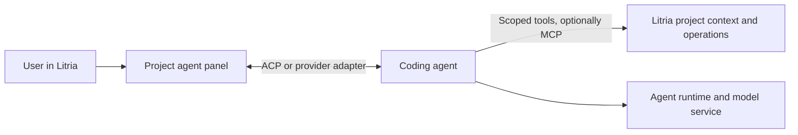
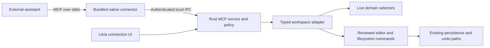

# MCP integration for Litria

> **Superseded direction (2026-09-19, owner finalization):** [ADR-031](../agent-integration/031-agent-integration-and-lifecycle.md) and the [canonical agent integration brief](../agent-integration/brief-agent-integration.md) now own the accepted direction. Reuse an existing runtime, provide project capabilities through MCP and the Project API, retain user-level login with project-specific sessions, and stop agent work on Litria closure by default. Conflicting delivery/ownership recommendations below are historical; source findings remain evidence, not implementation claims.

**Status:** Research and proposed design; no implementation or architecture decision accepted.
**Date:** 2026-09-19.
**Scope:** Product fit, implementation boundaries, security, interoperability, and connection experience. Repository source inspection and primary-source documentation review; no MCP runtime or client compatibility tests were performed.

## Clarified product direction — 2026-09-19

The user clarified the intended workflow: **connect an agent → point it at a project → work with the agent on that project**.

This supersedes the original server-first delivery recommendation below. The recommended product is now an agent session in Litria, with MCP supplying Litria-specific context/tools where useful. A broad MCP service catalog and setup flows for external assistant applications are not the first milestone. The original research remains relevant to the tools boundary, but does not by itself define the desired agent experience.

### Recommended experience

1. Open a project and choose **Connect agent**. Offer a small list of tested coding-agent integrations, not a raw endpoint field.
2. Detect a compatible installed runtime. Reuse its supported sign-in flow/account status where available; otherwise guide sign-in or explicitly approved installation. Do not promise that arbitrary subscriptions or installed chat apps are compatible.
3. Default the target to the current project and explain the selected access mode. The project selection, agent session, and enforced filesystem scope are distinct pieces of state.
4. Open an agent panel with conversation, progress, tool activity, approvals, changed files, and Stop. Clicking a changed file locates it in the editor/canvas. Supply selection context on demand.
5. Remember the agent/account choice and project-to-conversation association. Resume when supported. Switching projects opens or resumes that project's conversation rather than retargeting an active turn.

The user should experience one connection flow. Protocols, process setup, generated configuration, and local tool wiring belong behind the UI. A local agent process may still use a remote model; the connection screen should describe the real data destination.

### Agent sessions and MCP have different jobs

**Terminology clarification (2026-09-19):** two protocols use the acronym ACP. This proposal means **Agent Client Protocol**, the editor-to-agent interface. **Agent Communication Protocol** addresses agent interoperability and now identifies itself as part of A2A. Agent count does not determine whether MCP or Agent Client Protocol fits: MCP supplies tools/context, while Agent Client Protocol supplies the editor-to-agent session. If the user keeps the conversation in an external assistant and only gives it project access, a Litria MCP server can be sufficient for that integration; an agent panel inside Litria requires an interactive session interface. [Agent Communication Protocol](https://agentcommunicationprotocol.dev/introduction/welcome), [Agent Client Protocol](https://agentclientprotocol.com/get-started/introduction).

**Agent Client Protocol (ACP)** is designed for communication between editors and coding agents. It is the first common interface to evaluate for Litria's agent adapters. ACP session creation accepts a working directory and MCP server configurations; conversation updates, tool activity, permission requests, and cancellation have dedicated protocol messages. Resume and other optional features depend on advertised capabilities. [ACP introduction](https://agentclientprotocol.com/get-started/introduction), [session setup](https://agentclientprotocol.com/protocol/session-setup), [prompt turns](https://agentclientprotocol.com/protocol/prompt-turn).

Use a small internal agent-session interface with ACP adapters for compatible agents and provider-specific adapters when justified. Agent support and authentication must be verified for each released runtime; ACP is not a guarantee that every agent or account works identically.

For example, official OpenAI documentation describes Codex App Server as an embedding interface for authentication, conversations, approvals, and streamed events. It also currently labels the app-server command and WebSocket transport experimental and unsupported for production workloads. Treat it as a candidate to qualify, not an unconditional production recommendation. Prefer a local transport for an initial evaluation. [Official OpenAI documentation](https://learn.chatgpt.com/docs/app-server).

MCP can let the agent ask about the selected nodes, dependency graph, diagnostics, and other Litria context. It is not required for the basic conversation UI, and it should not be used as a substitute for the agent's interactive session interface. Litria can inject its own tool connection into supported agent sessions rather than ask the user to configure it manually.

### The key integration decision: who performs edits?

Do not assume an agent routes all filesystem changes through Litria merely because it has a Litria MCP connection. Many agent runtimes have their own file and shell tools. Selecting a working directory is not an OS-enforced sandbox.

- **Brokered edits:** where the integration supports it, route reads/writes through Litria's editor-aware adapters and existing mutation paths. ACP defines optional client filesystem capabilities for editor state and tracked writes. These capabilities still do not prove that all shell/direct-file paths are mediated. [ACP filesystem methods](https://agentclientprotocol.com/protocol/file-system).
- **Runtime-owned edits:** qualify the agent's actual sandbox and approval controls. Reconcile external file changes into Litria, handle dirty-buffer conflicts visibly, and avoid claiming that ordinary editor undo can reverse every agent operation. This requires explicit implementation work; existing watchers/reconciliation are not assumed sufficient.

The first supported agent must have one documented, tested edit path and an honest permission model. A Review mode should prevent direct changes if advertised; a Work mode can permit ordinary edits within the chosen scope without repeated prompts. Keep sensitive operations and scope expansion explicit. Do not expose a mode that the selected agent/runtime cannot enforce.

### Revised first milestone

Build one complete vertical slice: **choose a supported agent → authenticate → bind an open project → send a task → stream progress → handle approvals → show real file changes → stop/resume safely**. Select one agent based on verified account, runtime, sandbox, and integration support before broadening the catalog.

Add Litria-aware MCP tools to enrich that experience. An independently installable external MCP connector can remain a later interoperability feature. The original security requirements for source disclosure, credentials, stale state, project isolation, and arbitrary execution still apply, including to the agent's own built-in tools.

## Original recommendation — superseded as delivery order by the clarification above

Start by making **Litria an MCP server for existing assistants**, exposing a deliberately small view of its live project context. Add reviewed project changes after the read path is reliable. Build outbound MCP connections when Litria has an actual consumer for them, such as an embedded assistant or a defined user-driven workflow.

The distinctive value is Litria's understanding of a project: the selected files, folder groups, import relationships, symbols, diagnostics, and the difference between saved code and an open editor buffer. An assistant that can answer “what depends on these selected files?” or propose a change against the code currently in the editor is more useful than another generic filesystem server.

For the first connection experience, ship a native connector with Litria. Users choose their assistant and project access, approve the connection, and see a successful context read. For later connections to outside services, prefer hosted MCP endpoints with browser sign-in. Arbitrary local server installation should be an advanced feature with an explicit execution trust model.

## 1. What MCP provides, and the two integration directions

MCP defines how an AI application discovers and uses tools, resources, and prompt templates from a server. The host owns the user experience and model interaction; a client inside that host communicates with a server. MCP does not supply an agent loop, model subscription, billing system, or OS sandbox. [Protocol overview](https://modelcontextprotocol.io/specification/2026-07-28).

| Direction | Concrete Litria experience | Additional responsibilities | Recommendation |
|---|---|---|---|
| Assistant → Litria | Ask an existing assistant about the current canvas or request a reviewed change | Scoped project API, local connector, live-state bridge, permissions | First release |
| Litria → external MCP server | An embedded assistant reads an issue tracker or uses an external service | MCP client, account management, OAuth, tool policy, plus a model/agent or other consumer | Separate follow-on |
| External assistant → Litria → external services | Litria acts as a general gateway | Delegated identity, upstream/downstream consent, credential isolation, additional audit obligations | Defer |

These directions can coexist eventually. They should share policy primitives, not automatically share credentials or grants. Enabling an issue tracker in Litria must not expose it to every assistant paired with Litria.

## 2. Current protocol baseline

On the research date, the official `latest` specification resolves to **2026-07-28**. This matters because older examples teach a different lifecycle:

- Current requests carry protocol version and client capabilities individually; `server/discover` replaces reliance on an initial session handshake.
- Protocol sessions and resumable HTTP SSE streams were removed. Application state must have explicit identifiers and authorization.
- Roots, sampling, and protocol logging are deprecated for new implementations. Tasks and richer UI are optional extensions.
- Earlier clients need an explicit compatibility path. [Current changes](https://modelcontextprotocol.io/specification/2026-07-28/changelog).

Use the SDK for protocol adaptation and test both 2026-07-28 and 2025-11-25. Add older revisions only when a chosen supported client requires them. Avoid making optional features prerequisites for a basic context read.

The official SDK directory currently lists Rust as Tier 1. `rmcp` documents support for the current revision and earlier versions and uses Tokio. That makes Rust the natural first choice for Litria, subject to a released-version compatibility spike. Pin a tested release and narrow its features; a README claim is not release qualification. [SDK directory](https://modelcontextprotocol.io/docs/2026-07-28/sdk), [Rust SDK](https://github.com/modelcontextprotocol/rust-sdk).

Standard transports are newline-delimited JSON over **stdio** and **Streamable HTTP**. The latter can return JSON or request-scoped SSE; “avoid legacy SSE” does not mean rejecting SSE responses from a modern HTTP server. [Transport overview](https://modelcontextprotocol.io/specification/2026-07-28/basic/transports), [HTTP binding](https://modelcontextprotocol.io/specification/2026-07-28/basic/transports/streamable-http).

## 3. What the repository already provides

The following are source observations, not claims that MCP support already exists.

| Existing surface | Useful seam | Limit that the MCP design must address |
|---|---|---|
| [Domain register](../../Orchestration.md) | Explicit ownership of pieces, selection, groups, connections, editor, syntax, and project lifecycle | MCP must compose domain APIs, not grow business logic in `App.jsx` |
| [Filesystem write manager](../../../src/app/filesystemWriteManager.js) | Filesystem changes reconcile filenames, tabs, groups, syntax, persistence, and the scaffold view | A direct Rust write from MCP would bypass these effects |
| [Editor sessions](../../../src/editor/EditorSessionContext.jsx), [save coordinator](../../../src/editor/saveCoordinator.js) | Open buffers and saved baselines; save success is explicit | The filesystem alone is not the editor's current content |
| [Syntax adapter](../../../src/lsp/syntaxAdapter.js) | Uses authoritative open models and injected IO for closed files | Audit the actual callback wiring and writer exceptions before exposing mutations |
| [Diagnostic store](../../../src/lsp/diagnosticStore.js) | Existing per-file error/warning counts | Full diagnostic messages need an adapter over the LSP/editor data; this store only holds counts |
| [Rust path guards](../../../src-tauri/src/path_guard.rs), [project operations](../../../src-tauri/src/project_ops.rs) | Relative-path checks and canonical root containment | The root is supplied by the caller; containment does not authorize access to that root |
| [LSP transport](../../../src-tauri/src/lsp/transport.rs) | Environment allowlist, subprocess lifecycle, stderr handling | LSP uses `Content-Length` framing; MCP stdio does not |
| [Tauri capabilities](../../../src-tauri/capabilities/default.json), [CSP](../../../src-tauri/tauri.conf.json) | Restricted frontend exposure, Rust-owned opener, no external frames in production | They do not sandbox an MCP executable or authorize a new Rust endpoint |
| [Preferences registry](../../../src/preferences/registry.js), [app database](../../../src-tauri/src/db/app_db.rs) | Existing settings presentation and machine-local persistence | Secrets and grants require separate trusted storage; project configuration cannot approve itself |

The inspected runtime and dependency manifests have no MCP implementation, OAuth account flow, credential-vault integration, or model-provider runtime. The [extension sandbox proposal](extension-sandbox-design.md) is future design and cannot be counted as an existing defense. The Cargo manifest describes the existing LSP stack as Tokio-free; an MCP runtime needs an explicit lifecycle owner without forcing an LSP rewrite.

Two product semantics are especially consequential: **folder groups represent real folders**, and **import wires represent source relationships**. Moving files into a group is a filesystem change. Editing an import relationship can be a code change. Neither should receive the permission classification of moving a node on screen.

## 4. Proposed architecture and ownership

Propose a new `McpDomain` for connection state, grants, approvals, and activity. A possible home is `src/mcp/`, with transport, authorization, local IPC, and later OAuth under `src-tauri/src/mcp/`. Register the domain and extend guard coverage when implementation is accepted. Existing domains retain ownership of project content, selection, history, and filesystem mutation.

The Rust service validates the caller and request before dispatch. A narrow application adapter queries live JS domain state or submits an approved command to its owner. It is not an `invoke_any_command` endpoint. Tauri capabilities govern frontend access to native functions; their documented boundary does not cover arbitrary Rust logic or subprocesses. [Tauri capability boundaries](https://v2.tauri.app/security/capabilities/#security-boundaries).

For the local connector, prefer a same-user named pipe on Windows and a Unix-domain socket in a restricted user runtime directory on macOS/Linux. Add a pairing credential and restrictive endpoint permissions; a client-supplied application name is only a label, not authenticated identity. The connector owns its stdio lifetime; the app owns the local endpoint and project grants. Neither side can spawn arbitrary programs through this channel.

The bridge is additional engineering, but keeps port selection, localhost browser access, and user-installed Node/Python out of the normal setup flow. It must have a stable installed path, a compatibility handshake with the app, bounded messages, and packaged tests on all supported platforms. Same-user malware remains outside the protection this arrangement can promise.

An optional direct local Streamable HTTP endpoint can follow if demand justifies it. It needs authentication, explicit loopback binding, Host validation, and rejection of invalid Origin headers; CORS is not authorization. A cloud-hosted client cannot reach the user's loopback address. A relay or tunnel is a separate remote-access product with its own identity and privacy design, not a setup workaround. [HTTP security requirements](https://modelcontextprotocol.io/specification/2026-07-28/basic/transports/streamable-http#security--endpoint).

### Request and lifetime contract

Bind each application grant to a paired installation, approved project root, allowed operations, and grant revision. Bind each open workspace handle to the authenticated caller and a runtime project-instance ID. Do not authorize through a handle alone, a supplied root path, or “whatever project is active now.”

Every dispatched request carries an internal deadline, project-instance identity, and relevant snapshot/document versions. Re-check the grant and project generation before returning data or committing an effect. Closing a project invalidates its handles, pending approvals, cached snapshots, and queued work. Switching projects must never silently transfer access.

If the frontend is unavailable, return a clear unavailable/stale-context result. Never fall back to editing the database or files behind its back. Cancellation stops future work where possible; it cannot reverse a completed filesystem or remote operation.

## 5. A useful, bounded first tool surface

These names describe a proposal, not existing exports.

| Proposed operation | Result | Initial access |
|---|---|---|
| `get_workspace_context` | Approved project identity, selected file IDs, editor metadata, snapshot version | Context read |
| `query_project_graph` | Bounded imports/dependents around specified files; hidden relationships included when authorized | Context read |
| `find_symbols` | Matching indexed symbols with source locations and index freshness | Source/context read |
| `get_diagnostics` | Available diagnostics or counts, explicitly identifying missing/stale language data | Source/context read |
| `read_source` | Limited range from saved source; optional explicit buffer mode | Saved-source read; separate grant for unsaved buffers |

Use stable object-shaped structured results plus a concise text representation for compatibility. Provide pagination, byte limits, and explicit truncation. Include relative paths, source origin (`disk` or `buffer`), and freshness. A missing language server means “diagnostics unavailable,” not “no errors.”

Resources can expose the same snapshots for clients that support attaching them; tools provide a practical fallback. Both paths use identical authorization and exclusions. Prompt templates such as “explain this selection” are optional conveniences. Tool annotations describe expected behavior but cannot enforce it or establish trust. [MCP tools](https://modelcontextprotocol.io/specification/2026-07-28/server/tools).

Later operations can include focus/navigation, layout changes, and a `propose_changes` workflow. Keep these distinct:

- Navigation may open or focus files without editing them.
- Layout changes affect positions and require their own undo behavior.
- Project edits include rename, move, folder membership, imports, and source changes.
- Process execution, publishing, and deployment are separately authorized capabilities; omit generic shell execution from the first release.

For project edits, create a reviewable plan with file diffs, affected paths, document versions, and a content hash. The user approves that exact plan in Litria. Any altered arguments, changed source, or project switch invalidates it. Apply through the editor/FSM paths and report actual outcomes: applied to buffer, saved to disk, pending persistence, or failed. Do not claim a multi-file transaction is atomic unless the underlying implementation guarantees it.

The Rust policy service records approval against the exact operation. An MCP argument such as `approved: true` is never evidence of user consent.

## 6. Security design

The essential distinction is between **Litria enforcing access to its own API** and **Litria executing somebody else's program**. Restricting visible MCP tools does not constrain the host filesystem or network available to a third-party subprocess. Official MCP guidance identifies malicious local startup commands, token misuse, metadata-driven network access, and state-handle theft as separate risks. [MCP security guidance](https://modelcontextprotocol.io/docs/2026-07-28/tutorials/security/security_best_practices).

The following controls are proposed specifically for Litria; they have not been implemented or audited.

| Risk | Litria control | Residual risk / limitation |
|---|---|---|
| Caller chooses a different root | Resolve roots from Rust-owned grants; validate every path and operation; include project generation in approvals | Existing path guards alone are insufficient; audit symlink/junction races at the actual file operation |
| Secret disclosure through legitimate reads | Deny credential files and Litria internal stores by default; apply exclusions to reads, searches, graph snippets, resources, and diagnostics | Filenames and graph structure can also be sensitive; secret detection cannot find every secret |
| Unsaved work leaks or is overwritten | Explicit buffer-read permission; versioned snapshots; exact diff review; editor-owned apply path | An external assistant may separately have filesystem access beyond Litria's control |
| Untrusted content steers an assistant | Treat code comments, issue text, tool descriptions, and results as data; keep permissions outside model decisions | Filtering and model instructions do not eliminate prompt injection |
| Repository config starts a program | Imported config is an inert proposal; never execute while scanning or opening a project | A user-approved local executable still has its actual OS privileges |
| Tool behavior changes after approval | Bind approval to server identity/configuration and reviewed tool schema; new or materially changed tools start unapproved | A remote implementation can change behavior without changing its schema |
| Credentials leak | Rust-owned OS credential vault; references only in app DB; redact logs and diagnostic exports | An unlocked user session or compromised app can still access allowed secrets |
| Requests exhaust the UI or memory | Cap payloads, schema complexity, concurrency, outstanding approvals, and execution time | Limits need validation against real project sizes and slow providers |
| Reconnect repeats a mutation | Explicit operation IDs and status receipts for Litria writes; no blind replay of unknown outcomes | Third-party services may provide no usable idempotency mechanism |
| Project A influences actions in project B | Partition grants, account bindings, caches, handles, approvals, and tool catalogs | The user's chosen external host controls its own conversation isolation |

Prompt injection can enter through repository files as well as remote servers. Source labeling, narrow tools, and review of sensitive actions reduce exposure; neither structured JSON nor “read-only” annotations make returned text trustworthy. [OWASP prompt-injection guidance](https://raw.githubusercontent.com/OWASP/CheatSheetSeries/master/cheatsheets/LLM_Prompt_Injection_Prevention_Cheat_Sheet.md).

### Data handling

Start with a project-specific read grant and conservative exclusions: credential material, `.env` variants with secrets, `.git` internals, `.litria` state, dependency/build trees, and user-excluded paths. Treat `.env.example` separately if deliberately shareable. The current scaffold-tree ignore list is not a disclosure policy. Apply the filter before constructing summaries or snippets, not after data has entered a model request.

Explain once during pairing that project data given to an assistant may be sent to that assistant's model provider. A local transport does not imply local inference. Disconnect prevents future access but cannot retract information already transmitted or retained in chat history.

For an in-app assistant, distinguish data disclosure from remote mutation: even a read-only search sends its query to another party. Gate new destinations and sensitive outgoing arguments independently of whether the tool writes anything. Do not automatically forward one connection's returned content to another service. With an external assistant, Litria can limit what it releases but cannot enforce that host's subsequent handling.

Render external descriptions and results as text or constrained Markdown. Do not automatically fetch embedded images, resource links, or external schema references; each would create another disclosure/network path. Rich MCP Apps need an isolated rendering design and must never inherit the privileged main webview's native access.

Record connection identity, project, tool, approval decision, timing, and outcome in a bounded activity history. Avoid recording full source, tokens, callback URLs, or raw tool arguments by default. Diagnostic export should preview what it contains and scrub secrets.

For later outbound connections, store account metadata and grants in machine-local app data, credentials in the OS vault, and only portable nonsecret suggestions in project config. Separate “connected account,” “enabled in this project,” and “allowed action.” A shared project must not choose a user's privileged account or inherit their write approval.

### Local executable trust

Repository [security policy](../../../Agents/docs/security-policy.md) requires no silent downloads, exact pins for managed artifacts, and visible consent for project-owned execution. A generic hidden MCP launcher cannot quietly inherit the trusted language-server installation path.

Offer three clearly labeled classes: bundled Litria connector; reviewed managed artifact with exact version and verified integrity; user-supplied executable. A future managed installer needs an update/revocation policy and compatibility tests. A user-supplied server needs a full command/argument review before first launch or changed configuration, a clean environment with explicit secret injection, and a real OS sandbox if Litria promises restricted access. Working directory and environment filtering are not a sandbox.

The existing visible-terminal rule needs an explicit design decision for project-authored stdio servers: a PTY can corrupt protocol framing. Until a supervised pipe-based process UI and any policy amendment are accepted, defer that class. Never auto-run `npx -y ...@latest`, install scripts, or commands found in `.mcp.json` on project open.

Registry inclusion and package provenance are useful origin signals, not proof of safe behavior. Keep a small tested connector catalog with publisher, endpoint, auth type, compatibility status/date, and known limitations. The public registry currently identifies itself as preview; it should not be a required live dependency for startup. [Registry FAQ](https://modelcontextprotocol.io/registry/faq).

## 7. Remote service authorization

For Litria acting as a client, use authorization-code OAuth with PKCE S256 in the system browser. A desktop installation is a public client: do not embed a reusable confidential client secret in the executable. A short-lived loopback callback listener is a reasonable default where the provider supports it. Bind it before opening the browser, validate the pending state and exact callback, and close it on completion/cancel/timeout. [Native OAuth standard](https://www.rfc-editor.org/rfc/rfc8252).

The MCP authorization path discovers protected-resource metadata and its authorization server. Bind tokens to the intended resource, persist issuer identity, validate the authorization response issuer as specified, and keep accounts isolated. Request scopes needed for the operation and ask for additional access when needed. Do not send one server's token to another endpoint or use token passthrough. [MCP authorization](https://modelcontextprotocol.io/specification/2026-07-28/basic/authorization).

For registration, use existing provider-specific registration when available; otherwise use supported Client ID Metadata Documents (CIMD), then legacy Dynamic Client Registration where supported. Litria can host a small static HTTPS client metadata document without operating a credential proxy. DCR is deprecated but may be needed for compatibility; native registrations must identify the application type correctly. Some servers will still require administrator or manual setup. [Registration rules](https://modelcontextprotocol.io/specification/2026-07-28/basic/authorization/client-registration).

Do not assume discovery URLs are safe because the initial server URL looked reasonable. Apply a network policy to metadata, registration, token exchange, redirects, and MCP requests. Validate HTTPS and destinations, prevent credential forwarding across redirects, and block unapproved local/private targets. Corporate/private servers need a deliberate scoped exception, not globally disabled protection. Validate browser destinations and invoke the OS opener without a shell. [Metadata and URL threats](https://modelcontextprotocol.io/docs/2026-07-28/tutorials/security/security_best_practices).

`rmcp` documents OAuth discovery, refresh, CIMD, and configurable HTTP plumbing. Its OAuth HTTP client and the authorized MCP transport are separate surfaces: both must receive Litria's proxy/TLS/redirect policy. Test refresh races and token persistence; do not mistake SDK support for a complete desktop account system. [SDK OAuth support](https://github.com/modelcontextprotocol/rust-sdk/blob/main/docs/OAUTH_SUPPORT.md).

Support API tokens only as an advanced path for services that need them. Store them in the same vault, never URL query strings or project files. If the vault is unavailable, offer explicit session-only use or a clear failure; never silently fall back to plaintext. Disconnect should revoke local use immediately and attempt provider revocation where supported, explaining when provider-side access remains.

## 8. Connection flow for users

Use a **Connections** surface in existing settings, starting with **Connect an assistant** and adding **Connect a service** when its consumer ships. Show “MCP” in secondary details. Keep it separate from the canvas's existing import connections, and do not create fake file nodes for external services.

### Connect an assistant to Litria

1. Choose the assistant from supported options; offer manual configuration as a fallback.
2. Show the selected project and a short access summary: “Read project structure and saved source.” Unsaved buffers, edits, and execution remain separately selectable.
3. Open the assistant's supported installation flow using the bundled connector. Keep client-owned trust confirmation intact.
4. Pair the incoming connector with that project in Litria. Persistent grants are machine-local, revocable, and tied to the reviewed connector identity/configuration.
5. Verify a real context round trip from the chosen client. Show “Connected to [project]” only after discovery and an authorized read succeed; otherwise distinguish “configured” from “connected.”

Pairing/install links carry public setup data or an expiring single-use pairing nonce, never reusable bearer tokens. Keep the long-lived pairing credential out of command arguments, clipboard snippets, URLs, and checked-in config. A same-user attacker remains a limitation; do not label an arbitrary self-reported client name “verified.”

| Client setup mechanism verified in documentation | Proposed Litria use | Qualification needed |
|---|---|---|
| Claude desktop supports MCP bundles, including native binaries, on macOS/Windows | Package the connector for a guided install | Bundle/app version compatibility, architecture, OS signing, upgrade behavior |
| Cursor supports MCP installation links | Generate a link to the installed connector configuration | URI handling, path quoting, profile behavior, trust prompt |
| VS Code supports guided server addition and user/workspace configuration | Guided install with per-project enablement | Local vs remote extension/agent environment, profile, current config schema |
| Other local clients | Copyable config or documented CLI command | Verify their format before advertising support |

Sources: [MCP bundle format](https://github.com/modelcontextprotocol/mcpb), [Cursor installation links](https://cursor.com/docs/mcp/install-links), [VS Code server management](https://code.visualstudio.com/docs/agent-customization/mcp-servers). These are setup mechanisms, not evidence that a Litria connector has been tested with them.

Prefer client-supported registration over editing another app's files. A fallback config editor must show the change, preserve unrelated entries/comments where supported, back up the file, write atomically, and support removing only the Litria entry. No requirement for the user to install Node, Python, or a package manager for the bundled connector.

### Connect a service from Litria

1. Choose a tested service or paste an MCP endpoint URL.
2. Validate and discover it. Show the actual provider domain and requested access; server branding is not sufficient identity proof.
3. Open browser sign-in; return automatically to Litria when the callback completes.
4. Show the connected account, choose project availability, and enable an initial restricted tool set. If the provider only offers broad OAuth scopes, say so; hiding write tools does not narrow its token.
5. Run a non-mutating check and show usable capabilities. Ask for higher-risk permissions at the relevant action.

This path depends on a useful in-app consumer. Connecting a service does not itself create an assistant. Device-code login or custom callback schemes are provider-dependent alternatives, not universal fallbacks.

### Avoid approval fatigue without hiding consequences

Remember an explicit project read grant, so each normal query does not produce a modal. Display recent access unobtrusively. Group a source change into one reviewable diff. Request new approval for a changed project scope, identity, command, or sensitive capability. Unknown third-party tools begin without automatic approval; their own `readOnlyHint` is not enough.

Keep **Pause**, **Disconnect**, and **Remove account** distinct. Show recoverable states with one useful next action:

| State | User-facing action |
|---|---|
| Litria is closed or the selected project is unavailable | Open Litria / open the approved project |
| Waiting for sign-in | Continue in browser / cancel |
| Access expired | Reconnect account |
| Permission is insufficient | Review additional access |
| Server is unreachable | Retry; retain existing configuration |
| Server needs review after changing | Review changes |
| Connector/app versions disagree | Update connector with an explanation |

Measure time to the first successful context read, completion rate, reconnect success, approval count per task, and failure categories. A proposed usability target is under one minute for an already-installed local assistant; this is a target to test, not an observed result. Any telemetry should be opt-in and exclude project content and credentials.

## 9. Integration headaches to budget for

| Issue | Design response |
|---|---|
| 2025 vs 2026 protocol behavior | Pin SDK; explicitly test both lifecycles and transports; isolate compatibility code |
| Live editor state differs from disk and SQLite | Use domain/editor snapshots with document versions; distinguish buffered, saved, and stale results |
| Rust service crosses into JS-owned state | Bounded typed requests, correlation IDs, timeouts, generation checks, and one lifecycle owner |
| Project switch or frontend crash during a request | Invalidate pending work and refuse stale replies; no implicit retargeting |
| Windows paths and GUI launch environment | Native packaged helper; argument arrays; Unicode/space tests; stable path; no shell wrappers |
| App updates, quarantine, and signing | Test installed builds and helper replacement, not only `cargo run`; README currently reports unsigned builds |
| WSL, SSH, containers, and cloud agents | Treat them as separate execution environments; a local IPC endpoint is not automatically reachable |
| OAuth provider differences | Tested provider profiles plus standards-based discovery; diagnose redirect/client registration failures explicitly |
| Corporate TLS, proxies, and VPNs | Configure both OAuth and MCP HTTP clients; retain certificate validation |
| Many tools and large results | Small initial catalog, pagination, targeted graph queries, later progressive tool discovery |
| Dynamic tools, caching, and revocation | Invalidate on tool changes, account/project switch, permission changes, and expiry; never reuse another account's cache |
| Lost stream after a mutation | Surface uncertain completion; query operation status where available before retrying |
| Long tasks or rich remote UI | Defer optional tasks/apps until there is a product need and separate lifecycle/isolation review |

Tool definitions can themselves consume substantial model context. Start small; add selective discovery as the catalog grows. [Client best practices](https://modelcontextprotocol.io/docs/2026-07-28/develop/clients/client-best-practices). For private workspace data, use the protocol's private caching semantics and short/zero freshness where appropriate, with stricter local grant revocation. [Caching specification](https://modelcontextprotocol.io/specification/2026-07-28/server/utilities/caching).

## 10. Suggested delivery order and evidence gates

This is sequencing guidance for a future build plan, not an approved schedule.

1. **Compatibility spike:** released Rust SDK, native stdio helper, authenticated IPC, one context query, one desktop client and one CLI client. Prove installed operation on Windows/macOS/Linux and both selected protocol revisions. Measure runtime/binary cost before choosing dependency features.
2. **Read-only release:** project grants, source exclusions, live snapshots, connection management, activity, and an actual guided setup. Useful even without an in-app model integration.
3. **Reviewed changes:** exact diff approval, stale-edit rejection, editor/FSM reconciliation, undo/recovery, and honest persistence receipts. Navigation can precede source mutation.
4. **Outbound services:** after selecting an assistant/workflow consumer, add credential storage, OAuth, a small tested remote catalog, account/project separation, and policy enforcement on every tool call.
5. **Advanced local servers and extensions:** only after process supervision, cross-platform sandbox claims, supply-chain policy, and optional rich-UI isolation have evidence.

Before release, the critical failure cases are unauthorized roots; secret disclosure through every read surface; spoofed pairing; cancellation and project-switch races; symlink/junction escape; malformed/oversized JSON and schemas; unavailable vaults; OAuth issuer/redirect mismatch; refresh races; replayed approvals; duplicate mutations; and cleanup after app/connector crashes. Real client and installed-platform checks complement SDK conformance tests.

For writes, explicitly test open dirty buffers, external disk edits, rename reconciliation, read-only workspace persistence, partial failures, and the manager's exception register. The MCP route must not acquire exemptions from existing filename and write-order rules.

## 11. Decisions still open

- Which desktop and CLI assistants define the first supported compatibility matrix?
- Is the initial source grant saved-project read, or selected-file read with explicit expansion? The latter minimizes disclosure but needs a clearer workflow for graph traversal.
- Does the product want an embedded assistant soon, or is connecting existing assistants sufficient for the near term?
- What stable installed-helper location and release signing policy will be supported across packaging formats?
- Which OS credential-vault implementation works reliably across the supported Linux environments as well as Windows/macOS?
- Is an HTTP endpoint needed for a specific local client that cannot use stdio? If so, qualify its authentication flow separately.

These do not prevent a scoped read-only prototype. The central recommendation is to make project access precise and observable, while moving transport, runtime, configuration, and token handling out of the user's normal connection flow.
