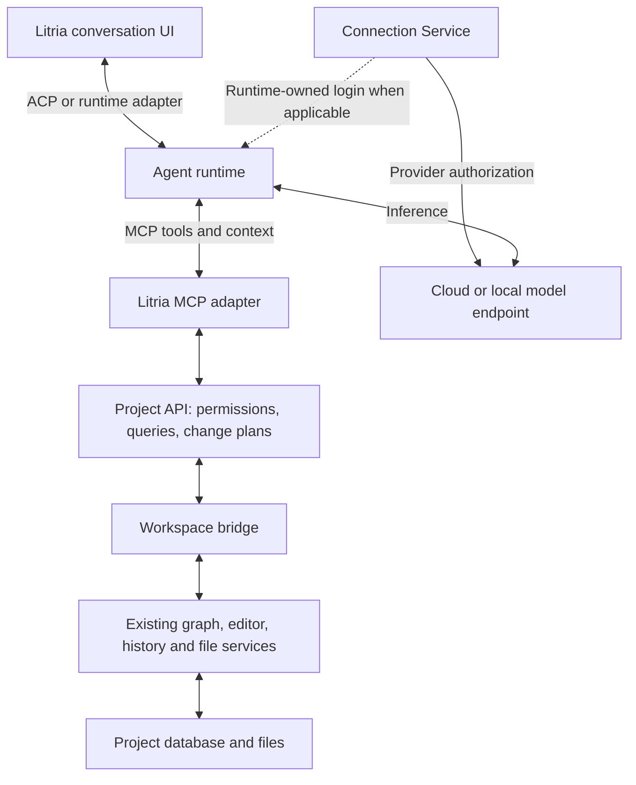

# Project API, MCP, and provider connections

> **Superseded direction (2026-09-19, owner finalization):** [ADR-031](../agent-integration/031-agent-integration-and-lifecycle.md) and the [canonical agent integration brief](../agent-integration/brief-agent-integration.md) now own the accepted direction. In particular, R6's recommendation for exclusively API-mediated runtime access is no longer the default; qualified native tools may coexist with MCP under their own permissions. Runtime-owned authentication is preferred, and saved connections/history do not permit work after Litria closes. The earlier schemas and R1-R9 review remain design evidence; no write or compatibility finding is declared resolved by this supersession.

Status: Proposed design — 2026-09-19. No runtime implementation or provider compatibility certification is implied.

Review update — 2026-09-19: the architecture remains a reasonable direction, but the write/recovery and runtime contracts are not build-ready. [Section 12](#12-adversarial-design-review--2026-09-19) records unresolved findings and proposed tightening; these are recommendations, not accepted implementation decisions.

Owner direction: connect an agent, point it at a project, and work together. Design the project API and MCP layer first; support users' own models and frontier providers; prefer browser sign-in with automatic validation and return to Litria.

This is the detailed proposal for that backend boundary. The [earlier integration research](brief-mcp-integration.md) supplies background. ACP remains the conversation/control interface; its chat UI and runtime-specific implementation are outside this design. Proposed requirements below need acceptance and implementation before becoming product claims.

## 1. Recommended shape

Build a **provider-independent Project API** and expose its operations through a small **MCP server**. Keep model credentials in a separate **Connection Service**. Every supported agent uses the same project contract, regardless of who supplies inference.

The product flow is:

**Connect → sign in if needed → use the current project → review project access → start working.**

Remember a successful connection across projects. Remember project permissions only when the user chooses to. Routine reads need no repeated approval; proposed edits appear together in one review. Users can allow ordinary edits for a session without also allowing deletion, commands, or access to other projects.



The API is initially a typed application service, not a new public REST server. Rust owns the external trust boundary; a narrow bridge reaches the live JavaScript domains. Existing domains retain their state ownership. There is no reason to move the whole editor or graph into Rust to provide this API.

Three authorizations stay separate:

| Boundary | What it authorizes | Owner |
|---|---|---|
| Provider connection | Use a particular account, workspace and inference endpoint | Provider adapter or official agent runtime |
| Agent connection | A particular local runtime may call Litria | Litria connection manager |
| Project grant | That connection may read or change specified project resources | Litria Project API |

Successful provider login grants no filesystem access. A project grant supplies no provider credential. MCP transports tools; it does not itself supply the agent reasoning loop or model authentication. A user-supplied model therefore needs a compatible agent runtime or Litria's future provider-neutral agent loop.

## 2. Fit with the existing repository

The [domain register](../../Orchestration.md) remains authoritative. Repository observations below were checked by source inspection on 2026-09-19.

| Information or action | Existing owner | API implication |
|---|---|---|
| Persisted pieces, groups, layout and project metadata | [Workspace schema](../../../src-tauri/src/db/schema.rs), [DB types](../../../src-tauri/src/db/types.rs) | Read through typed adapters; never expose SQL or raw table mutation. |
| Live pieces, selection, groups and connections | Registered workspace domains | Read live selectors; the database can lag the current view. |
| Symbols, imports and derived relationships | [Syntax domain](../../../src/app/syntaxDomain.js) and its adapter | Return source-derived relationships with freshness information; persisted connection rows alone are insufficient. |
| Open documents and unsaved text | [Editor session](../../../src/editor/EditorSessionContext.jsx) | Effective document text comes from the live editor. Disk is a separate version. |
| Saves and file creation/move/deletion | [Save coordinator](../../../src/editor/saveCoordinator.js), [filesystem write manager](../../../src/app/filesystemWriteManager.js) | All agent writes must preserve their error handling and downstream reconciliation. |
| Path containment | [Rust path guard](../../../src-tauri/src/path_guard.rs) | Useful validation, but caller-supplied roots are not project authorization. Race resistance needs further work. |

The existing [manager-backed writer](../../../src/app/useFilesystemWriteManager.js) deliberately uses the latest manager and project root. An asynchronous agent request cannot safely call that writer after a project switch without an explicit project-generation check and pinned execution context.

The current database schema has no agent grant store or operation receipt ledger. A copied project can also copy its database `instance_id`. Neither existing IDs nor the database's schema version provide an authorization identity or document revision.

## 3. Project identity and grants

Use distinct identities rather than overloading a project ID:

| Record | Proposed meaning |
|---|---|
| `ProviderConnection` | Provider, account/workspace display metadata, endpoint, auth strategy, credential reference and state. No raw secret in frontend state. |
| `RuntimeProfile` | Exact runtime executable/version, adapter, supported model interfaces and verified sandbox capabilities. |
| `AgentConnection` | A local authenticated channel to one runtime instance, linked to its selected provider connection where applicable. |
| `WorkspaceRegistration` | Machine-local identity bound to a canonical root and filesystem identity; separate from the portable project database ID. |
| `WorkspaceEpoch` | Fresh generation each time a workspace is opened/rebound. Prevents delayed requests from following mutable current-project state. |
| `ProjectGrant` | Connection, workspace registration, epoch, resource policy, allowed actions, approval mode, expiry and revocation generation. |

V1 gives each MCP bridge one workspace binding. The user selects the project in Litria; the model cannot supply an arbitrary root, open a different project, or list recent projects. An opaque project/document/plan ID is a locator, never a bearer credential.

Project scopes cover context reads, file reads, proposing changes, content edits, file creation, file moves/deletion, and layout changes independently. Command execution is a separate future capability. Restrictions apply to every query, search result, graph edge, resource URI, cache and mutation, including derived content that might disclose a restricted file.

Suggested access presets:

| Preset | Behavior |
|---|---|
| Read only | Read permitted context and files; no mutations. |
| Review changes — default | Read and prepare changes. Litria requires user approval of the concrete plan before applying it. |
| Allow ordinary edits this session | Allow specified content edits and file creation inside the grant. Moves, deletion, sensitive paths and commands retain separate approval rules. |

Approval records bind to the immutable plan hash, connection, workspace, versions and expiry. They live in the trusted control plane. A tool argument such as `approved: true` cannot approve anything. A later scope increase requires user action, not an agent-written configuration file.

Closing/switching a project fences the old epoch before binding the next one, cancels pending reads/plans, and drains or records active writes. Every request checks the grant on admission, before returning data, and immediately before each irreversible mutation. A write already committed when revocation arrives is reported honestly; revocation cannot undo it.

## 4. Project API contract

Version the domain contract independently as `apiVersion: 1`. Maintain one schema source for Rust, TypeScript and MCP adapters; validate at the trust boundary. Reject unknown mutation fields and unsupported operation kinds. Additive response fields are compatible; changed operation semantics require a new contract version.

Transport authentication supplies the trusted request context. Agents cannot set the principal, root, epoch, effective permissions or execution permit. The service accepts a cancellation/deadline context and returns structured domain outcomes.

### Initial MCP tools

Use a small catalog with stable names and bounded results:

| Tool | Purpose |
|---|---|
| `litria_project_context` | Project summary, selected nodes, language support, effective capabilities, policy summary and freshness. No full-project dump. |
| `litria_graph_query` | Bounded neighborhood, nodes, groups and source relationships; optional canvas positions. |
| `litria_files_read` | Selected documents/ranges, effective text, source and revision tokens. |
| `litria_files_search` | Bounded text/path search over permitted project content. Literal search first; regex only with enforced work limits. |
| `litria_diagnostics_list` | Available diagnostics, severity, document version, producer and timestamp. |
| `litria_changes_prepare` | Validate a proposed change, build a diff and record a short-lived immutable plan. Does not edit the project. |
| `litria_changes_apply` | Apply an authorized plan with idempotency protection and return an operation receipt. |
| `litria_operations_get` | Read plan/application state after approval, cancellation, a lost reply or reconnection. |

The public catalog is stable, not dynamically rewritten for individual connections. `project_context` describes effective capabilities; authorization is checked again when a tool executes. Optional MCP resources can expose the same filtered snapshots later; tools provide the complete initial workflow so resource support is not a prerequisite.

### Graph and document reads

Return semantic information first: relative path, language, node kind, symbol summaries, relationship kind and provenance. Include layout positions only when requested or relevant to the user's selection. A canvas position, a folder location and a source-code range are separate fields.

Each graph projection has a `snapshotId`, source revision vector, completeness flags and an expiry. Pagination is pinned to that projection and bound to the grant/epoch. An expired cursor requires a fresh query. The API must not stitch page two from a different graph and imply consistency.

A revision vector can include layout, editor, filesystem observation and syntax-index revisions. It reports what was observed; it does not claim an atomic snapshot across SQLite, disk and Monaco. Stale syntax is labeled with its indexed document version. Missing language support produces an unavailable/partial result, not invented relationships or an empty “no errors” result. The existing diagnostic count store alone cannot supply full diagnostic messages.

For a file open in the editor, `files_read` defaults to its current buffer. Otherwise it reads disk. A caller can explicitly request the saved version if authorized. Full document revision tokens accompany range reads. Untitled documents stay out of project scope until explicitly attached by the user.

Illustrative domain result; MCP framing is added by the adapter:

```json
{
  "apiVersion": 1,
  "document": {
    "id": "doc_7",
    "path": "src/auth.ts",
    "source": "editor",
    "revision": "rev_42",
    "diskRevision": "disk_19",
    "dirty": true,
    "text": "export function authenticate() {}\n"
  }
}
```

Revision tokens are opaque and bound to document identity and epoch. Internally they track the buffer version and strong content fingerprints as needed; modification time alone is insufficient. Preserve encoding/newline information. V1 text edits support UTF-8 text; unsupported encodings, binary files, oversized files and non-regular files return explicit outcomes.

### Proposed initial resource budgets

These are tunable design defaults, not measured product limits: 200 graph nodes per page, graph depth capped at three, 20 documents per read, 256 KiB total returned text, 50 files/1 MiB of inserted text per change plan, and a ten-minute plan lifetime. Never silently truncate an edit. Return pagination/remaining-work information for reads and an actionable limit error for mutations.

Bound input frames, decoded output, query work, schema depth, queues and concurrent requests before allocating large buffers. Fair scheduling prevents one connection from starving the UI. Parsing/tool deadlines are separate from time spent awaiting user approval.

## 5. Edits, creation and durability

The required mutation path is:

**Prepare → show or automatically authorize the exact plan → revalidate → apply through existing owners → record the outcome.**

Start with `text.edit` and `file.create`. Add file rename/move/delete and canvas layout operations behind explicit capabilities after their reconciliation and recovery behavior passes qualification. Agents can still create and edit useful projects without the first release exposing every domain command.

`text.edit` specifies an existing document, expected revision, exact edits and a destination: `buffer` or `save`. Ranges use zero-based lines and UTF-16 characters; end positions are exclusive. Reject overlapping/out-of-range edits and invalid character boundaries. No fuzzy patching or silent rebasing.

`buffer` updates the live editor, opening an existing document without stealing focus if necessary. It remains dirty; success means applied to the editor, not saved. `save` persists the approved version through the editor/save/FSM path and checks both the current buffer revision and saved-file baseline. Saving pre-existing human edits is an additional effect that must be visible and explicitly covered by approval; the ordinary-edit preset does not silently grant that effect.

`file.create` uses a project-relative target and must require that the target is absent. It never becomes an implicit overwrite. Moving a node on the canvas is different from moving a file into a real folder; future tools must preserve this distinction. Import relationships change through source edits or qualified syntax operations, not arbitrary writes to connection rows.

Example proposal, using the document above:

```json
{
  "operations": [
    {
      "kind": "text.edit",
      "documentId": "doc_7",
      "expectedRevision": "rev_42",
      "destination": "buffer",
      "edits": [
        {
          "range": {
            "start": { "line": 0, "character": 16 },
            "end": { "line": 0, "character": 28 }
          },
          "text": "signIn"
        }
      ]
    }
  ]
}
```

Preparation returns `planId`, `operationId`, affected resources, computed diffs, persistence effects, expiry and approval state. Plans are immutable and bound to their requester. The UI can approve and apply the same operation directly; the agent need not repeatedly ask for approval. An automatic-edit grant allows the agent to call `changes_apply` with `planId` and `idempotencyKey`. Reapplying the same plan returns its existing operation, never a second edit.

### Concurrency and failure rules

- Serialize agent mutation execution per workspace. Ordinary UI/editor writes join the relevant document/structural coordination or use equivalent final revision checks. An agent-only queue does not solve races with typing, autosave or external filesystem writers.
- Revalidate expected revisions at application, including when a document was opened/closed while a plan awaited approval. Treat source/destination existence and identity as preconditions for structural changes.
- Bind every bridge request and final native write to the pinned workspace lease. Do not resolve an old request through a “current project” reference. Reject bridge replies from the wrong window, epoch or request.
- If a revision changed, return `conflict` with fresh metadata. Preserve the user's work and prepare a new plan. Do not reuse approval for a changed diff.
- All disk writes pass through the FSM; model edits pass through the editor engine. Extend the native boundary to validate a one-use operation permit against the approved action, resource, root and content fingerprint. Raw Tauri filesystem commands are not the external API.
- Catching a change just before writing reduces races but does not alone eliminate external-writer or symlink races. Qualification must establish the platform-specific handle/identity strategy and its limits before promising overwrite or containment guarantees.
- Database read-only/safety mode disables V1 agent mutations, including buffer mutations, with a visible reason. Do not let a partially writable project masquerade as a fully functioning workspace.

### Receipts, retries and undo

Persist operation intent before irreversible actions and retain per-operation/per-file outcomes in an app-private ledger. Proposed receipt retention is 30 days; expired plans remain non-executable even after receipt compaction. Key deduplication by authenticated principal, workspace registration and idempotency key, with a payload hash. The same key with different content is an error. After authentication, check an existing receipt before attempting to execute a plan again.

Receipt states include `prepared`, `awaiting_approval`, `applying`, `applied`, `partial`, `conflict`, `cancelled` and `needs_review`. Each file reports whether its buffer changed, disk save completed and metadata reconciled. “Applied” requires every requested effect to be confirmed; indexing can be separately pending.

SQLite transactions cannot make filesystem writes and editor state a single atomic transaction. Preflight all operations, stop on failure, report completed work, and retain enough local recovery metadata to reconcile uncertain outcomes after a crash. If effect completion cannot be proven, use `needs_review`; do not retry the write automatically. Multi-file application has no advertised all-or-nothing guarantee in V1.

Buffer receipts explicitly say that text is memory-only unless editor recovery independently guarantees persistence. A durable receipt is not a durable document. Do not duplicate source text into generic logs or the receipt ledger. Any recovery content store needs its own access, retention and sensitive-data policy.

Group applicable changes in existing history facilities, but do not promise every file operation is undoable. “Revert agent change” is a new version-checked inverse plan; it cannot overwrite subsequent human edits. Cancellation stops work that has not committed and reports what already happened.

Expected domain failures use stable codes such as `permission_denied`, `project_closed`, `conflict`, `read_only`, `approval_required`, `capability_unavailable`, `limit_exceeded` and `outcome_unknown`, with a safe message and next action. MCP tool failures set `isError`; malformed protocol requests use protocol errors. Never infer success from a closed stream or a missing response.

## 6. MCP transport and lifecycle

Prefer a bundled **stdio MCP bridge** for local agents. The agent launches Litria's bridge; the bridge connects to the running application over an authenticated local IPC channel. It contains no independent database/editor implementation. Local named-pipe/socket access controls plus a short-lived, one-use bootstrap credential bind it to the intended connection and grant. Provision the credential through a protected channel or helper-only environment, never a command-line argument, project file or model prompt.

The bootstrap expires after pairing. The app owns the resulting revocable channel. EOF/crash revokes the channel, while operation receipts remain queryable after deliberate reconnection. Use exact bundled executable paths, typed argument arrays and a sanitized environment; project configuration cannot substitute a launcher or token helper.

MCP stdio uses newline-delimited JSON and reserves stdout for protocol messages. Litria's LSP process lifecycle patterns can be reused, but LSP message framing cannot. [MCP stdio specification](https://modelcontextprotocol.io/specification/2026-07-28/basic/transports/stdio).

Keep protocol compatibility inside the adapter. The 2026-07-28 revision introduces `server/discover`, per-request metadata and `resultType`, and removes protocol sessions and HTTP stream replay. Support a tested legacy revision, such as 2025-11-25, where required by selected clients. Do not equate protocol request IDs with business idempotency keys. Do not base new functionality on deprecated roots/sampling. [MCP revision changes](https://modelcontextprotocol.io/specification/2026-07-28/changelog).

Use an official SDK where feasible, pinned only after client/OS qualification. Emit its correct protocol envelope around the domain examples above, including version-dependent structured results and cache metadata. Treat tool annotations as hints, never enforcement. Authenticated project data is private; cache keys include principal, workspace, epoch, visibility policy and revision. Revocation invalidates relevant caches. [MCP tools](https://modelcontextprotocol.io/specification/2026-07-28/server/tools).

One lifecycle owner coordinates bridge/runtime shutdown: fence new work, signal cancellation, flush receipts, wait with timeout, terminate and reap. Remove handles under a short lock and perform slow shutdown outside it. A disconnected/unresponsive workspace bridge fails closed; disk-only fallback must not lose unsaved editor authority.

V1 requires Litria and the chosen workspace to remain open. External clients may be added with a user-initiated pairing flow. Remote/cloud-hosted agents, public listeners and tunnels are deferred: they require a separately designed authenticated network boundary. A cloud model used by a local runtime does not require exposing the project API publicly.

If Streamable HTTP becomes necessary, validate Origin and Host, require authentication, restrict local listeners to loopback, and use the MCP authorization profile for remote access. Keep provider bearer tokens out of Litria MCP authentication. These proposed controls build on the [HTTP transport](https://modelcontextprotocol.io/specification/2026-07-28/basic/transports/streamable-http) and [MCP authorization](https://modelcontextprotocol.io/specification/2026-07-28/basic/authorization) requirements.

## 7. Provider flexibility and browser sign-in

Expose a single connection experience backed by explicit strategies:

`runtime_managed` · `provider_oauth` · `official_helper` · `api_key` · `local_no_auth`.

Provider adapters own endpoint format, authentication, model listing, capability discovery, refresh and error mapping. The Project API does not know which provider was chosen. A future Litria agent loop can map its tools to a provider's function-call format without changing their semantics; an external agent consumes MCP directly.

Current official documentation supports the following **candidate integration routes**, checked 2026-09-19. None has been exercised from Litria:

| Choice | Proposed user experience | Important distinction |
|---|---|---|
| Codex runtime | Connect → official browser login → return automatically | Subscription authorization stays inside Codex. It is not a generic OpenAI API credential. |
| OpenAI API from a Litria-owned loop | Add API key once → validate → choose model | Use the supported Platform credential path; do not promise generic ChatGPT OAuth for arbitrary API requests. |
| Anthropic API | Prefer Claude Console browser login through the official `ant` helper once qualified; API key alternative | This is Console/API access, separate from Claude.ai subscription login. |
| Claude Code runtime | Use the unmodified runtime's own supported sign-in | Its subscription credentials must remain owned by that runtime; runtime integration terms and behavior need qualification. |
| Custom hosted model | Endpoint + model + optional key; provider-specific auth adapters can extend this | “OpenAI-compatible” does not prove support for every tool/streaming feature. |
| Local model server | Choose configured/detected endpoint and model; no key if that server permits it | Verify tool support and endpoint reachability independently. No model downloads as a side effect of Connect. |

Codex documents browser login and API-key login separately. It also supports explicit OS credential-store or memory-only modes; avoid a mode that silently falls back to plaintext. General OpenAI API access uses Platform credentials. [OpenAI authentication](https://learn.chatgpt.com/docs/auth).

The Codex app-server offers `account/login/start`, a browser URL, completion notifications and runtime-managed auth. Its documentation currently labels the app-server command and WebSocket transport experimental and unsupported for production workloads. It is an adapter candidate with a release gate, not a guaranteed production dependency. [Codex app-server](https://learn.chatgpt.com/docs/app-server).

Anthropic's `ant auth login` opens Claude Console OAuth and binds credentials to a selected API workspace. Named profiles isolate workspaces; environment credentials can override them. The helper currently documents file-based credential persistence, and `auth status` is informational rather than a health check. [Anthropic CLI authentication](https://platform.claude.com/docs/en/cli-sdks-libraries/cli/authentication).

The documented `ant auth print-credentials --access-token` interface supplies a refreshed bearer token for another HTTP client. A qualified Litria adapter could invoke that exact helper through a private pipe, retaining the access token only in backend memory. Do not read or scrape its credential files. [Anthropic CLI scripting](https://platform.claude.com/docs/en/cli-sdks-libraries/cli/scripting).

Anthropic distinguishes end-user sign-in to unmodified Claude Code from a third-party application's collection or routing of Claude.ai subscription credentials. Its documented restrictions mean Litria must not turn a Claude subscription login into a generic Claude API connection. Qualify any offered runtime integration against the current conditions. [Claude Code credential policy](https://code.claude.com/docs/en/legal-and-compliance).

These differences belong in adapter capabilities and concise connection labels. The user should not need to understand OAuth to connect, but should be able to see which account, workspace and billing route will be used.

## 8. Credential service and lifecycle

For Litria-owned credentials, Rust holds the secret and the frontend holds only an opaque reference plus account/status metadata. Use the platform credential vault where available; if unavailable or locked, offer a visible memory-only session or retry. Never silently write a plaintext substitute. A pasted key necessarily passes through the masked input and IPC once; clear it promptly and exclude the input/request from analytics, crash breadcrumbs and logging.

Runtime/helper-owned credentials have their own storage policy. Do not claim that Litria's vault protects an external helper's credential file. Show the storage owner in connection details; prefer a dedicated Litria profile/config scope through supported interfaces. Helper-file storage remains a qualification/privacy decision, with API-key-in-vault available as an alternative.

The backend resolves credentials only for the selected adapter, endpoint and account. There is no model-callable `getSecret` tool. No provider keys in MCP arguments/results, project preferences, `.litria`, source files or generic child-process environments. When a runtime requires a key, use its supported protected input channel and document any unavoidable runtime exposure.

For official-helper auth, pin and verify the helper, sanitize credential/base-URL override environment variables, select the profile explicitly, and bound/redact subprocess output. Never log the output of a token command. Do not execute an arbitrary project-supplied “credential command.” Detect existing tools first; installation remains an explicit product action under the repository's [security policy](../../../Agents/docs/security-policy.md).

For providers that support Litria as an OAuth client, use a native public-client authorization-code flow with PKCE, an external browser, transaction-bound state and a validated callback. Use a loopback redirect with an ephemeral port where the provider supports it. No embedded login webview or bundled client secret. Official-runtime login stays with that runtime instead of copying its OAuth client identity. [Native-app OAuth guidance](https://www.rfc-editor.org/rfc/rfc8252).

Additional proposed invariants:

- Bind transactions to provider/issuer, intended account scope, callback and connection generation; reject mismatched, replayed or late callbacks. Validate issuer/audience/resource when applicable. Redact callback query strings and auth URLs containing transient secrets.
- Serialize refresh per connection. Persist a rotated refresh token atomically before retiring its predecessor; never let a late refresh resurrect a disconnected connection. Let official runtimes/helpers own refresh when they own credentials.
- Require HTTPS for remote credential-bearing endpoints. Explicitly configured local endpoints can use loopback HTTP. Private LAN endpoints require deliberate configuration and a visible trust decision; block metadata-service destinations and unapproved redirects. Validate actual resolved destinations, including IPv6 and DNS changes.
- Changing an endpoint or account creates a new binding and requires deliberate credential association. Never forward an existing provider credential automatically to a custom endpoint or through a cross-origin redirect.
- `Disconnect from Litria` revokes local use and project grants. `Sign out of provider` invokes supported token/logout revocation and states if it affects a shared CLI profile. Deleting a local API-key reference does not revoke the key at the provider.
- Revocation prevents future authorized work; it cannot erase content already sent to a provider or read by an agent.

## 9. Connection flow and recovery

Keep **connection readiness** and **project access** as separate states. Suggested connection states are `disconnected`, `authorizing`, `validating`, `ready`, `expired`, `unavailable` and `needs_attention`. Keep useful saved metadata when a provider is temporarily unavailable.

1. **Connect.** Offer “Use an agent” and “Use a model provider.” The second route uses a qualified Litria-owned loop when available; do not display it as operational before that loop exists. Show existing connections first and custom endpoints under an advanced option.
2. **Authenticate.** Use the selected route's browser flow by default when supported. Keep a small “Waiting for sign-in” view with cancel/retry. API-key fallback opens the official credential page and accepts one masked paste; do not ask users to edit JSON or environment variables.
3. **Validate.** Check the account/workspace and inference endpoint with a harmless authenticated metadata request where supported. Check the intended model and runtime tool capabilities separately. Do not upload project source or issue a paid generation merely to test login. If metadata validation is unavailable, show “Configured; validation pending” until an authorized first request succeeds.
4. **Attach the current project.** Preselect it; show the root/name, selected provider, data destination and access preset. Clearly state when project context will be sent to a cloud provider. Connection alone sends no project data.
5. **Start.** Bind the grant, pair the MCP bridge, negotiate supported protocol, and run the small project-context query. Show Ready only when both the provider/runtime and project connection are usable.

The browser success page can say “You're connected. Return to Litria.” The backend completion event advances the UI; the user should not have to press Validate or paste a callback URL. Returning focus is best-effort and should not interrupt work in another application.

| Situation | Expected behavior |
|---|---|
| Browser cancelled or callback timed out | Stay on the connection card; cancel the old transaction before Retry. Offer an officially supported alternate flow only. |
| Token expired | Refresh through the owning adapter; request sign-in only when refresh cannot recover. |
| Signed in, model not permitted / billing unavailable | Preserve login and name the distinct availability problem. Do not repeatedly send the user through OAuth. |
| Provider unavailable or rate-limited | Back off and preserve the task. Do not switch provider/account automatically. |
| Local server not running | Keep endpoint/model configuration and offer Retry; no automatic install or launch of unknown executables. |
| Project closed, changed, or bridge lost | Stop project calls; require a new valid binding. Keep connection credentials for future projects. |
| Save failed or edit conflicted | Keep the proposed work and dirty buffers; show per-file outcomes and a repair/review action. |

Provider/model capability records should cover tool calls, streaming, structured output, context limits and cancellation behavior. Let users type a model ID when listing is unavailable. A weak/incompatible local model may remain useful for chat; do not advertise verified project editing until it passes tool-call qualification. Model/account changes never silently widen a project grant or send existing conversation history to a new provider.

## 10. Security model and residual risks

| Risk | Proposed control and its limit |
|---|---|
| Prompt injection in source, diagnostics or README files | Treat retrieved content as untrusted data; enforce grants and approvals outside the model. Filtering cannot reliably detect every malicious instruction. |
| Reading another project through paths, IDs or links | Authorize each resource against a server-selected root, reject traversal/absolute/UNC/device paths and Windows alternate streams, handle symlinks/reparse points and hard-link identity deliberately. Existing canonicalization alone does not close all races. |
| Secrets disclosed through search/graph/context | Default deny `.git`, `.litria`, environment secrets, credential/key files and configured sensitive paths across all read surfaces. Apply policy to results and derived edges, not just file-open. Source can still contain unknown secrets; exclusion rules are not a confidentiality guarantee. |
| Agent bypasses MCP with native shell/filesystem tools | Require enforceable runtime restrictions for a “Litria-controlled edits” profile. MCP grants and `cwd` are not an OS sandbox. Qualify native-write runtimes separately and reconcile their external changes; they cannot inherit this API's approval/undo guarantees. |
| Project hooks or scripts execute implicitly | Audit writes, runtime startup, plugins and language-server hooks. Generic shell/build execution is outside initial MCP scope and must use the existing visible terminal/consent policy when added. |
| Local process impersonates an agent | Authenticated IPC, short-lived pairing and OS channel permissions reduce accidental/untrusted access. They do not protect against arbitrary malware running with equivalent user privileges. |
| OAuth callback, token or endpoint confusion | Transaction binding, PKCE where owned, fixed provider metadata, endpoint binding and protected token handling. External helper storage remains an independently visible risk. |
| Retry duplicates a write | Durable intents, immutable single-use plans and idempotency receipts. Unknown crash outcomes require reconciliation rather than blind replay. |
| UI freezes or tool output overwhelms context | Bounded work/results/queues, pagination, deadlines and backpressure. Large projects may need several reads rather than one complete export. |

Keep a local action trail containing connection label, operation IDs, relative resources, approval basis and outcomes. Exclude credentials, prompt/source bodies and provider response bodies by default. Any support export requires explicit selection and redaction. A locally running MCP server does not imply locally running inference or zero provider retention.

## 11. Proposed ownership and integration gates

Propose these boundaries before implementing or changing the domain register:

| Component | Owns | Does not own |
|---|---|---|
| Rust `ProjectAccessService` | Grants, root/epoch binding, request validation, execution permits, operation ledger and scheduling coordination | Independent graph/editor state |
| JS `WorkspaceBridge` service | Whitelisted, versioned access to injected domain selectors/commands; editor and FSM coordination | Authentication, secret storage or direct cross-domain state writes |
| Rust `McpAdapter` and bundled bridge | MCP versions, framing, structured results and connection lifecycle | Project business rules or provider inference |
| Rust `ConnectionService` with provider/runtime adapters | Auth state, credential ownership, endpoint binding and qualified helper lifecycle | Permission to read a project |
| Proposed JS `IntegrationDomain` | Pure connection/access presentation state and commands through adapters | Raw secrets or authoritative authorization decisions |

Names are proposals. App.jsx wires owners; it does not accumulate request routing or login handlers. Register accepted domains and guard coverage when code is introduced. Audit existing chokepoint exceptions and effect-equivalent paths, including Save As, syntax edits, structural moves, raw invoke wrappers and native runtime writes.

Release gates, rather than claims of current support:

- **Project read gate:** compare tool results with the live editor/graph, exercise missing/stale language data, sensitive-path filtering, copied project IDs, cursor expiry, concurrent sessions and project switches.
- **Mutation gate:** demonstrate CAS conflicts with typing/external edits, dirty-file saving, duplicate/reordered requests, revision changes during approval, mid-batch failure, revocation races and crash recovery at each commit boundary. Verify no write can follow the new current-project root.
- **Filesystem gate:** adversarial traversal, symlink/junction swaps, hard links, target replacement, reserved names, case-sensitive/case-insensitive volumes and destination-exists races on each claimed OS. State remaining external-writer guarantees precisely.
- **Credential gate:** exercise browser success/cancel/timeout, refresh rotation, concurrent refresh, disconnect during callback, wrong workspace, environment precedence, vault unavailable, endpoint changes, redirect/DNS attacks and log/crash redaction. Helper ownership/storage must match the UI.
- **Runtime/provider gate:** record exact versions, real login/model/tool behavior, native tool permissions, cancellation and shutdown. Demonstrate a cloud provider and a user-supplied/local model against the same API. No arbitrary “compatible endpoint” support promise from one happy-path test.
- **Protocol gate:** run the actual supported MCP client/version matrix on each claimed OS, including protocol discovery, legacy negotiation, tool errors, output bounds, private caching and lost-response recovery. Do not infer interoperability from compiling an SDK.

No code tests or paid provider calls were run for this proposal. Verification here is repository/source review and official-documentation research. Implementation will require the repository's [verification](../../../Agents/docs/verification-policy.md), [security](../../../Agents/docs/security-policy.md) and [dependency qualification](../../../Agents/docs/dependency-change-policy.md) checks.

The design can proceed without settling every provider adapter: the stable investment is the scoped Project API, honest document versions, recoverable mutations and a connection strategy interface. Provider browser flows remain replaceable adapters around that boundary.

## 12. Adversarial design review — 2026-09-19

Review scope: the proposal above, targeted current-code inspection and revalidation of official auth documentation. No runtime integration, fault-injection exercise or completed implementation security audit is claimed. The findings below identify where an invariant has been named without specifying or proving its mechanism.

The separation of Project API, MCP and provider authentication still holds. The main correction is to treat workspace isolation, conditional writes, operation ownership and runtime qualification as prerequisites to agent writes, rather than details to fill in while building the MCP tools.

### R1 — Project identity must reach the database, not just file paths

**Priority: resolve before agent writes.**

The [Rust database module](../../../src-tauri/src/db/mod.rs) stores one process-wide `PROJECT_DB`; `with_workspace_db` does not take a workspace identity. [Database calls](../../../src/project/dbStorage.js) such as `dbUpdatePiece` supply a row ID and fields. Fencing the file root does not fence that later metadata update.

Failure scenario: an operation starts in A, file work finishes, the user opens B, and delayed A reconciliation reaches the now-current DB. The existing IDs cannot prove the intended workspace. A mutex serializes access but does not establish which project a queued request belongs to. This is a risk in reusing the current boundary, not an assertion that an agent integration already exists.

**Tighten:** carry a checked workspace identity/epoch through filesystem, database, editor and reconciliation calls. Resolve and validate the DB binding under the same lock that selects the connection. Include pending metadata work in project teardown. Old requests must fail against B even if their IDs also exist there. Define timeout behavior without treating a timeout as proof that the old work stopped.

Also choose a multi-process rule. Recommended V1: one writable Litria owner for a canonical workspace, enforced across processes; a second instance is refused or read-only. A process-local write mutex cannot enforce this.

**Required proof:** pause between file commit and metadata update, switch/reopen projects, resume the old call and verify B is untouched. Repeat with a second Litria process and with A and B containing equal row IDs.

### R2 — Native create/update and replacement guarantees are missing

**Priority: resolve before agent disk writes.**

[`write_project_file`](../../../src-tauri/src/project_ops.rs) accepts root, path and content, with neither an expected revision nor create-only semantics. A preflight “absent” check followed by this general writer can overwrite a file created in between.

More seriously, [`replace_file`](../../../src-tauri/src/write_ops.rs) retries a failed rename by removing the existing target and renaming again. If that second rename fails, the original can already be gone; the error cleanup also removes the temporary file. Source inspection establishes this possible loss path. It was not reproduced during this review. The helper name must not be treated as proof of unconditional atomic replacement.

**Tighten:** specify separate native `create-if-absent` and `replace-expected-version` operations, including path/identity validation, parent creation, permissions/encoding preservation and commit semantics. Do not use destructive delete-then-replace fallback for agent updates. Choose platform-appropriate replacement/no-clobber primitives and preserve recoverable data on ambiguous failure. Keep unknown external-writer and link-race guarantees explicit; an application mutex does not cover another process.

**Required proof:** target appears between preparation and creation; disk content changes before replacement; rename/access fails at each replacement step; process terminates around commit; symlink/junction identity changes. Verify the prior file or recoverable replacement remains available and the receipt never reports an unconfirmed save.

### R3 — Existing success values are too weak for truthful receipts

**Priority: resolve before enabling the affected mutations.**

The [FSM](../../../src/app/filesystemWriteManager.js) starts structural DB updates with `.catch(() => {})` and returns success without awaiting them. Its `batch` explicitly continues after an individual failure, whereas this proposal requires stopping. The [syntax adapter](../../../src/lsp/syntaxAdapter.js), in the closed-file branch of `writeResultText`, ignores the returned writer boolean, notifies syntax and returns true. The injected manager-backed writer can return false.

Failure scenario: the agent is told an edit/move succeeded although disk save or metadata persistence failed; an automated retry then acts on an inconsistent view. The DB failure observer may inform the UI, but that does not turn the operation's returned value into confirmed completion.

**Tighten:** introduce typed, awaited outcomes for each effect: buffer applied, disk committed, metadata persisted, indexing pending/failed. Make the agent coordinator explicitly fail-fast without silently changing unrelated UI batch behavior. Do not mark a receipt `applied` by translating the current FSM boolean. Gate future structural tools until their full pipelines produce reliable outcomes.

**Required proof:** force false, rejection and delayed completion independently from file, database and syntax adapters. Check that later plan steps stop when required and receipts match the actual file/editor/DB state.

### R4 — The editor bridge needs an explicit atomic operation

**Priority: define before building the read/edit contract.**

The [Monaco workspace](../../../src/editor/monacoWorkspace.js) owns live models, while [editor session callbacks](../../../src/editor/EditorSessionContext.jsx) dispatch React state updates. The current portable [engine capability interface](../../../src/editor/engineCapabilities.js) exposes focus detection, not a versioned document patch API. The proposed `WorkspaceBridge` is therefore a new contract, not an existing capability waiting to be wired up.

Failure scenario: a backend checks revision 42, a user types revision 43 while the IPC call is outstanding, and the frontend applies the previously computed text. Checking only a React snapshot or only checking in Rust leaves a gap.

**Tighten:** define an editor-owned port with an authoritative snapshot and `applyIfCurrent(documentIdentity, expectedRevision, edits, permit)` semantics. Compare the live model revision and apply its edits synchronously in the same editor execution turn; establish what acknowledgment means after session/syntax synchronization. Specify document identities across close/reopen, opening a previously closed file, dirty saved baselines and model disposal. Disk saves need their own native conditional commit, separate from buffer application.

The bridge protocol must name request IDs, window/workspace epochs, permit expiry, deadlines, cancellation and late-response handling. Do not hold a Rust mutation/DB lock while waiting for JS that might invoke Rust under that lock. Define the point after which an action counts as already in progress when cancellation/revocation arrives.

**Required proof:** type during every asynchronous boundary, switch tabs, close/reopen the document, reload the webview and deliver delayed/duplicate replies. No edit may use stale text, target a replacement model or apply after its request has expired without a recorded in-progress outcome.

### R5 — Approval, retry and recovery need a state machine

**Priority: define before building apply/reconnect.**

Listing states and saying “idempotent” does not settle who may move an operation between them. In the current proposal both the UI and the agent can apply an approved plan. A reconnect also creates a new transport identity, while receipts are described as belonging to a principal. The stable ownership relation is unspecified.

**Tighten:** give each logical proposal one operation ID and deduplicate preparation as well as application. Specify allowed transitions for approval, rejection, expiry, application, failure and cancellation; include terminal rejected/expired/failed outcomes that the earlier list omitted. Use a unique durable plan-to-operation mapping and an atomic transition into `applying`; only the winner can consume execution permits. A different idempotency key must not execute the same plan twice.

Separate reconnect authorization from possession of an operation ID. A newly authenticated channel can inspect earlier receipts only after Litria rebinds it to the same approved integration/workspace identity. Freeze the plan hash, grant generation, revisions and permitted effects when claiming work.

Specify durable phases per effect: intent recorded, effect started, effect completion confirmed, reconciliation confirmed. A restart must distinguish verified completion from an uncertain effect. Matching a file's eventual content hash is evidence of its current state, not always proof of which actor performed the write. Unknown outcomes remain blocked for review; never replay them automatically. Keep sensitive recovery content separate from ordinary receipts and decide its retention/access model before promising rollback.

**Required proof:** user approval and agent retry race; the same plan arrives with different request IDs/keys; the process stops before and after each phase; a revoked connection reconnects; a caller guesses another operation ID. At most one execution starts and receipt access remains authorized.

### R6 — Runtime choice is a missing product dependency

**Priority: settle before committing to the first end-to-end integration.**

MCP permission enforcement covers calls through Litria. An agent with native file reads can bypass secret exclusions even if native writes are disabled. A runtime can also load repository instructions, hooks, plugins or files before the MCP grant exists. A “read-only” runtime sandbox alone does not establish the privacy promise in this proposal.

Similarly, selecting a model endpoint supplies inference, not tool scheduling, approval suspension, cancellation, transcript management or a project-aware agent. The proposed future Litria-owned loop is a real dependency for model-only connections unless a chosen external runtime supplies those functions.

**Tighten:** select one initial runner and describe its complete execution/context policy. Recommended V1 claim: Litria-controlled project access only for a qualified mode whose project reads and writes use the Project API and whose independent hooks/tools cannot bypass it. Authenticate in a neutral trusted working directory before attaching the project. Bind model/provider and transcript reuse to the approved connection; switching provider is a deliberate data-sharing decision.

If no external runtime can provide this mode, explicitly scope the minimal Litria-owned tool loop before advertising BYO-model project editing. External/native-tool integrations can remain a separate trust mode with narrower guarantees. This does not require implementing ACP chat now; it requires choosing the runtime constraints that the backend must serve.

**Required proof:** attempt native reads of an excluded file, native writes, shell execution, project hook execution and pre-grant context collection using the actual runner. Observe network/context behavior, not just reported capabilities. Run the same small tool task with a supported cloud model and local model before expanding support claims.

### R7 — Browser login needs a packaged-product proof

**Priority: resolve before advertising each connection route.**

Official evidence still supports the candidate routes, but neither has been exercised inside Litria. OpenAI's app-server page retains an experimental/production-support caveat. Anthropic's CLI documentation describes local-development OAuth, credential files and environment precedence. Its quickstart shows macOS, Linux/WSL and Go installation routes; that alone does not establish a native Windows desktop packaging/callback path. [OpenAI app-server](https://learn.chatgpt.com/docs/app-server), [Anthropic auth](https://platform.claude.com/docs/en/cli-sdks-libraries/cli/authentication), [Anthropic installation](https://platform.claude.com/docs/en/cli-sdks-libraries/cli/quickstart).

**Tighten:** specify one exact adapter recipe per offered OS: runtime/helper version, supported distribution/license conditions, credential owner, private profile/config directory, callback and cancellation interface, validation request, refresh/logout semantics and interaction with existing CLI accounts. A dedicated named profile is insufficient if login also changes the user's global active profile. Avoid that through a supported isolated configuration mechanism and prove it. Do not reuse undocumented client IDs or scrape caches to reduce UI friction.

Define readiness as separate observations: authenticated account, usable inference endpoint, selected model availability, runtime/tool protocol support, and attached project. A successful model-list call does not prove a model will execute tools correctly. Do not claim a free metadata check verifies generation billing or tool behavior when the provider cannot establish that.

**Required proof:** fresh-machine installation through an explicit install action, existing CLI login, wrong workspace, expired/revoked credentials, locked vault, browser failure, concurrent sign-ins and disconnect during refresh. No project data is sent merely to validate credentials. Unsupported browser routes retain a clear key/endpoint fallback; they do not block the core Project API.

### R8 — “Sensitive” and “ordinary” need enforceable definitions

**Priority: finalize before exposing real project content or automatic edits.**

The proposal names secret exclusions and sensitive actions but leaves their precedence and coverage open. File contents can emerge through search snippets, graph labels, diagnostic messages, diffs and error strings. A project-controlled policy file must not be able to relax the user's grant. Editing an executable configuration or startup hook may change future execution without calling an explicit execute tool.

**Tighten:** define one export/access policy across all data surfaces, including metadata and caches, with deny-by-default behavior for unsupported resource types and a clear precedence rule: user/application restrictions cannot be widened by repository content. Separate ordinary source edits from changes to credentials, agent/runtime configuration, hooks and execution policy. The API can enforce path/action rules; it cannot guarantee that arbitrary source code contains no secret or harmful logic.

**Required proof:** excluded-path content or names through every query/diff/error surface; policy changes during pagination; misleading repository configuration; edits that would activate a hook. Verify refusal and user override behavior without adding an approval prompt to every ordinary read.

### R9 — Complete the wire contract and budget for smaller models

**Priority: define the minimum contract before implementation; tune defaults with measurements.**

The examples are illustrative DTOs, not complete schemas. Important choices remain: graph node/edge identities, file-versus-canvas coverage, query filters, edit ordering, repeated edits to the same document, creation placement, all error/state responses and resource capability reporting. The eight-tool catalog is reasonable, but its behavior is not yet sufficiently specified for independent Rust/JS/client implementations.

A 256 KiB byte ceiling may still overwhelm a small local model. It also does not bound memory if a file is fully read before the cap; the current native reader uses `fs::read_to_string`. Tool schemas and retained conversation consume context too.

**Tighten:** define the shared request/result/error schemas for the first useful tools, including consistency and ordering rules. Use bounded file reads and work limits before allocating results. Let the runtime set a smaller context budget, reserve room for the conversation/tool schemas/output, and prefer short summaries plus explicit expansion. Server ceilings remain authoritative regardless of client requests. Select the exact SDK/client protocol matrix through a spike rather than promising two MCP revisions from documentation alone.

**Required proof:** small-context local model, oversized file, large/dense graph, stale index, Unicode edits and expired pagination. The agent must receive enough coherent context to make a valid small edit without a full-project export.

### Recommended evidence before committing to the full build

Approve the architecture direction separately from implementation readiness. The next useful engineering exercise is a narrow vertical prototype with one workspace, one runner and a few tools: read live context, read a document, prepare a change, approve/apply it and inspect its outcome. Start with buffer editing, then add one conditional disk update and one create-only operation after the native-write contract is established.

The prototype should deliberately interrupt the workflow: type while a plan waits, switch projects, race approval with retry, fail the disk/DB step, kill the process around commit and reconnect. Include the runtime bypass and credential-isolation exercises for the selected connection route. These checks should drive the final contract; they are not evidence obtained in this review.

Move/delete, graph layout writes, arbitrary commands, remote transport and additional providers can wait. The first slice succeeds when its limited promises survive these failures, rather than when every tool name appears in a menu.
