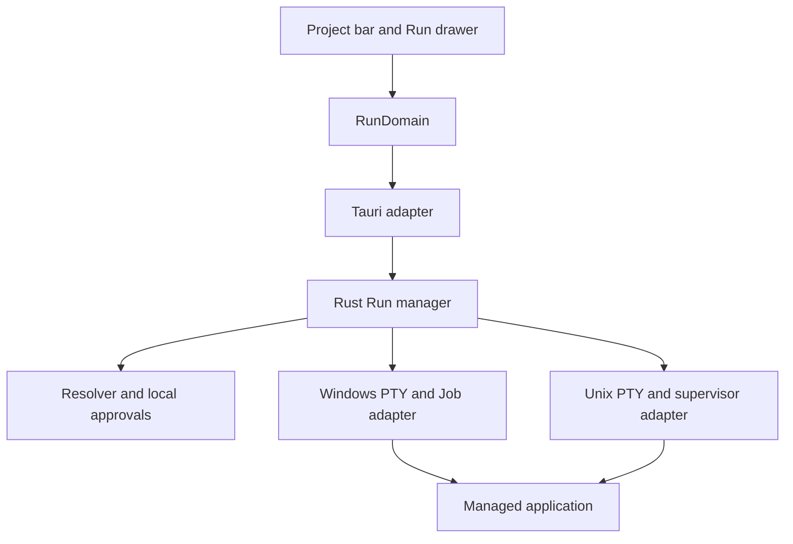

# Brief: Run Application

Status: Accepted design, 2026-09-16. Owner decisions are recorded in
[ADR-029](../../adrs/029-managed-project-runs.md). No implementation slice
has started. The [build plan](../run-application/run-application-build-plan.md)
owns tasks, tests and delivery order. This is the canonical detailed design.

## 1. Objective and accepted decisions

Give the current project a visible, managed application/development-server
run with a known command, editable choices, output and reliable cleanup.
Users should not need to construct the common launch command in a terminal.

Litria already compiles and runs on Windows, macOS and Linux; the owner
confirmed that baseline during this discussion. This arc preserves it and
adds native evidence for the new behavior. It is not a platform-porting arc.

| Decision | Accepted behavior |
| --- | --- |
| Primary action | Run the current project's application or development server. |
| Discovery | Cover scaffolded project types through recipe metadata; recognize existing manifest/script targets; offer custom commands; never execute code merely to discover candidates. |
| First run | Show resolved command, script contents where applicable, working directory and provenance, with Run and Edit. |
| Later runs | One click while the resolved definition still matches local approval. |
| Scaffold exemption | A matching local creation receipt may omit initial review; repository content cannot self-approve. |
| Ambiguity | Compact target chooser that also serves as command review; remember the selected target. |
| Unsaved work | Save All and Run / Run Saved Files / Cancel; optional explicit, reversible project preference. |
| Output | Dedicated Run tab in the existing drawer; hide is independent of stop. |
| Environment | Explicitly selected environment files, references in configuration, defined precedence; no secret vault in v1. |
| Configuration | Local by default, explicit Share with Project action; approvals and machine-specific settings remain local. |
| Project switch | Stop and Switch / Stay; no background run retained across projects in v1. |
| Quit/crash | Clean up the managed run on normal exit and unexpected Litria process death. |
| Browser | Offer validated HTTP(S) URLs; no automatic opening by default. |
| Composition | One selected target executes in v1; the schema can grow compound targets later. |

There are no outstanding product rulings for this brief. Concrete library
versions, native implementation details and test results still require
engineering verification; acceptance does not turn those into proven facts.

## 2. Scope and integration boundaries

V1 includes local foreground applications and development servers, their
runtime selection, editable launch definitions, scoped approvals, selected
environment files, PTY input/output, Stop/Restart and lifecycle cleanup.

V1 excludes debugger integration, run-current-file inference, test-runner
UI, automatic dependency installation, remote/container/WSL execution,
compound orchestration, a secret vault, and deliberately detached daemons.
The custom command route is available for other local targets that satisfy
the same ownership and review contract.

The separately owned scaffold recipe integrity arc (ADR-028;
`docs/adrs/028-scaffold-recipe-integrity.md`) owns recipe identity,
compatibility, tool versions and generated output. Its document and code
were still independently in progress when this brief was drafted.

Run consumes that registry through a versioned adapter. The adapter projects
stable recipe IDs, declared runnable targets, prerequisites and output
expectations into Run candidates. It does not duplicate framework lists,
pins, manager compatibility or CLI argument knowledge. Coordinate any
registry extension with the scaffold owner after its contract is available.
The core runner can use explicit fixture targets before that integration;
v1 scaffold coverage is not complete until the integration is tested.

An add-on/backend is offered only if its actual generated entry point is
runnable. A library, files-only blueprint or unfinished integration may
legitimately have no default application. Show that state and offer Edit;
do not fabricate an entry point or silently install something.

## 3. User flows

### 3.1 Project bar and Run drawer

The project bar exposes Run with a target menu while idle. During a run it
continues to show the selected target, Stop, Restart and an accessible text
state even when the drawer is hidden. Disable duplicate starts while an
operation is in flight. Display Starting, Running, Stopping, Exited or
Failed according to Rust events; do not infer success from a button click.

The Run drawer contains the target, command/source disclosure, output,
exit/result summary, optional URL actions and configuration access. Reuse
terminal rendering where appropriate, while retaining an independent run
identity and owner. Closing or changing drawer tabs never stops the run.
Keyboard input is forwarded only from the focused active Run surface;
history/replay is not an executable terminal session. Resize is scoped to
the active run. Hiding never sends input, exit commands or flow-control
pauses that stop child output draining.

Apply [UI governance](../../ui-governance.md), protected-zone rules and
existing accessibility/shortcut conventions. Review/chooser overlays are
separate from protected drawer internals. Run state is not conveyed by
color alone. Focus returns to the invoking control after cancellation.

### 3.2 Run and command review

1. Capture active project identity and selected target intent.
2. If files are dirty, resolve the save choice first. Save All must await
   the editor's actual success result, including Save As. Cancellation or
   failure ends the request without launching. Run Saved Files leaves
   buffers dirty; an unsaved-only entry point cannot use that option.
3. Rust discovers/resolves candidates from saved files and local settings.
   No candidate yields an explanation plus Configure. Multiple plausible
   candidates yield the chooser, without silently preferring one ecosystem.
4. A new or changed plan shows executable/arguments, the package script and
   relevant hooks, cwd, runtime identity and source location. Environment
   source paths and execution-affecting variable names are shown without
   their values. Edit changes target intent and resolves a fresh preview.
5. On Run, Rust checks the preview and project binding again, atomically
   reserves the run, establishes native ownership and starts it. The
   creation exemption uses the same validation path.
6. Show the Run tab and consume authoritative events. Opening a project or
   discovering a target never starts it automatically.

The unsaved preference defaults to Ask. Remembering Save All or Run Saved
Files requires an explicit choice and can be reset per project through the
existing PreferencesDomain. Registered preference keys follow ADR-019;
run target definitions are not preference blobs.

### 3.3 Restart

Perform save, edit, prerequisite and command-review choices before stopping
the existing run. Cancelling any of these leaves it running. Saving can
still trigger the application's own watchers; the UI does not promise
otherwise. If a prerequisite cannot be checked until the old process has
stopped, disclose that limit before proceeding.

The backend validates the expected current run ID, reserves the replacement
operation, stops and reaps the old run, then revalidates the plan before
launch. A new change during teardown requires fresh review; it must not
start a stale command. Cleanup failure blocks the replacement. A launch
failure after successful stop is shown as Failed with a retry action; it
does not pretend the old application remains alive.

### 3.4 Switching, closing and quitting

All project replacement paths participate: project picker, launcher,
recent-project action, open-folder action and window close. Resolve any
existing dirty-file decision before the irreversible stop/switch commit so
cancelling a save does not unnecessarily kill a working run. The active-run
choice is Stop and Switch or Stay. Commit project state only after required
saves and stop succeed.

Gather discard/close decisions without discarding buffers until all
transition gates have accepted. Choosing Stay or encountering stop failure
must not discard dirty buffers as a side effect of an abandoned switch.
An explicitly completed save is a real disk write and is not rolled back.

Normal quit follows the existing save/exit gate, then awaits the same
bounded Run cleanup used by Stop. Known stop failures offer retry and keep
the ordinary transition blocked. OS-forced termination or an unexpected
process crash activates native ownership/supervision; do not rely solely
on React unmount, an unload handler or a Rust destructor.

No automatic restart occurs when Litria reopens after a crash. Previous
incomplete records are shown as interrupted. Do not kill a PID found in an
old record: identity must come from a still-owned live native object.

## 4. Architecture and ownership

The accepted planned domain is registered in
[Orchestration](../../Orchestration.md#27-accepted-domains-awaiting-implementation).

| Component | Responsibility | Boundary |
| --- | --- | --- |
| `src/run/runDomain.js` | Target choice, configuration/review workflow, commands/selectors and frontend state projection | Plain domain contract; injected adapters, no UI or other-domain implementation imports |
| Run hooks/storage adapter | Subscribe/query Rust; integrate exposed save/project transition APIs | App composes adapters; no independent process owner |
| Project-bar controls and Run drawer | Render state, gather user intent, show output and errors | No command construction or lifecycle booleans outside the domain |
| Rust `run` service | Discovery, schema validation, resolved plans, approvals, run registry, output and lifecycle | Authoritative execution boundary |
| Native process adapter | Platform spawn, interruption, ownership, exit observation and worker cleanup | Actual `#[cfg]` modules; no Windows API imports in Unix builds |
| Unix supervisor entry mode | Own managed target and clean it on parent death | Packaged, non-UI entry path; private inherited control/lifetime channels |
| Existing storage/write owners | App-local records, preferences and explicit shared file writes | No bypass of filesystem policy or failure reporting |

Interactive `TerminalDomain` remains independent. Reuse narrowly scoped
PTY/decoder helpers only after their contracts are appropriate for both
consumers. Never launch by writing command text into the user's shell or
reuse the terminal manager's replace-session behavior.

The new directory is not yet covered by the current domain/architecture
guard lists. Build-plan S1 extends both and tests that coverage before any
Run implementation is activated. Shell imports require their normal
composition-manifest rationale; protected-zone/editor-engine rules remain
in force.

## 5. Configuration, storage and portability

### 5.1 Three separate records

| Record | Owner/location | Contents |
| --- | --- | --- |
| Local run configuration | Rust, app-local SQLite | UUID, canonical project binding, target intent, local overrides and selected target |
| Shared project configuration | Explicit `.litria/run.json` file | Versioned portable targets, relative paths and optional platform overrides |
| Approval/creation receipt | Rust, app-local SQLite | Install/project/target binding, resolved-definition digest, provenance, schema version and review metadata |

Use existing app storage facilities and migrations. Keep all three separate
from a project's synced workspace state. Rust-generated persistent entity
IDs use a directly declared UUID implementation per implementation policy;
do not reuse timestamp/counter or UUID-like helpers.

Share with Project shows the exact portable document before writing it.
The filesystem write owner performs an atomic, conflict-aware write;
local UI state changes only after success. The action never stages/commits
Git changes, copies an env file, modifies `.gitignore` automatically or
shares an approval. Shared targets are untrusted input when opened elsewhere.
If an existing ignore rule excludes `.litria/run.json`, disclose that the
portable file is currently ignored and provide explicit Git guidance; do
not claim it is committed/shared remotely or change ignore rules silently.

### 5.2 Schema contract

The v1 schema is implemented and validated once at the Rust boundary, with
shared fixtures for frontend editing/serialization. The fields below are
design names, not declarations that code already exists:

- `schemaVersion`: required; unsupported future versions produce a visible
  error rather than reinterpretation.
- `targets`: bounded list of UUID-identified named targets.
- `kind`: `single` in v1. Reserve a tagged union for future composition;
  reject unsupported kinds, never flatten or run them partially.
- `launch`: tagged `packageScript`, `pythonModule`, `pythonScript`,
  `cargoBinary` or `command` intent with type-specific validated fields.
- `cwd`: project-relative directory in a shared target.
- `runtime`: logical selection intent; absolute machine paths are local.
- `envFiles`: ordered references with `path` and `required` behavior.
- `forwardEnv`: explicit variable names selected locally; sharing may
  declare required names but never copies ambient values or local consent.
- `platforms`: optional explicit target overrides for Windows/macOS/Linux.
- `readiness`: optional declared strategy; absence does not prevent a
  healthy process from running.

No inline environment-value or secret-value map is persisted. Commands can
contain arbitrary strings, so automatic secret detection cannot certify
their safety: the editor directs credential values to selected env files,
and the sharing preview exposes literal command arguments for review.

Resolve schema default -> matching platform override -> explicit local
override. Local overrides are labelled; shared-file changes cannot silently
erase them. Track the revision of each source. Defaults and policy flags
cannot grant approval, turn on installs or bypass schema validation.

Relative shared cwd/env paths must resolve within the canonical project
root, including symlink checks. An explicitly chosen external cwd/env file
is a local-only setting with review; it cannot be serialized as a portable
project escape. Respect actual filesystem case/symlink semantics, and reject
unrepresentable paths visibly rather than spawning a lossy substitution.

### 5.3 Configuration failures

Invalid JSON, duplicate target IDs, missing required env files, deleted
entry points, unsupported platforms, permission errors and revision
conflicts are actionable failures. Preserve the user's prior configuration
and dirty edits. Do not fall back to an arbitrary `start` script, shell or
runtime after an explicit target stops resolving.

An unavailable approval store prevents remembered trust. An explicit
one-time review/run may proceed if native ownership and other checks pass,
with a visible notice that approval was not saved. A failed configuration
save is never reported as successful.

## 6. Discovery, resolved plans and approvals

### 6.1 Discovery sources

Read only bounded inert metadata during discovery. Never import Python,
execute JS, evaluate a build file, run package-manager hooks or start a
language server just to discover a Run target.

- Prefer a user's explicit local target selection when it still resolves.
- Adapt available recipe run metadata to the actual files on disk. Recipe
  intent is a candidate; a valid local creation receipt is a separate fact.
- Offer declared runnable `package.json` scripts and known manifest entry
  points using the actual manager/runtime binding. Do not equate `dev`,
  `start`, `build`, `test`, Tauri and Electron commands unconditionally.
- Python discovery uses declared modules/scripts, scaffold metadata and
  explicit existing-project configuration. A folder full of `.py` files is
  not an instruction to choose one to execute. Bind the chosen interpreter
  and venv without sourcing an activation script.
- Rust manifests may expose one or multiple binaries/workspace members;
  present the selection where ambiguous. Metadata extraction is read-only;
  `cargo run` is execution and may build project/dependency code.
- Monorepo/package/workspace paths are explicit candidates. Never silently
  launch every package. Missing runnable intent leads to custom configuration.

The recipe registry remains the source of supported generated combinations.
Do not introduce a second matrix in this document or Run code.

### 6.2 Runtime resolution and prerequisites

Present compatible known candidates from an explicit saved selection,
project binding, bundled runtime or detected system tools. Preserve an
explicit choice; incompatibility produces a choice/error instead of
silently selecting another executable. Resolve absolute executable paths
before spawn. Verify executable type, permissions and reported architecture
when relevant. Probes that execute a selected tool are bounded preflight
actions following user intent, not side effects of opening an untrusted
folder. Do not probe arbitrary project-owned shims before execution consent.

Support normal Finder/.app and Linux desktop launches, which may have a
different PATH from an interactive shell. Offer Select/Browse/Refresh;
do not silently source login profiles, execute version-manager setup scripts
or require starting Litria from a terminal.

Package-manager commands are adapter-built from the chosen, verified
manager version. Preserve argument boundaries. On Windows distinguish a
native executable, a known Node CLI entry script, and a batch shim needing
an explicit adapter. Do not use naive `cmd /C` concatenation or apply POSIX
quoting to Windows. Custom shell execution requires an explicit shell
target whose executable and script appear in review.

Keep the selected runtime consistent through the manager and its child
tools. Invoking a chosen Node binary with `npm-cli.js` is insufficient if
subsequent scripts resolve a different `node` through PATH. Any adapter
transformation that prepends the selected runtime directory is explicit in
the resolved plan, applied after environment merging and included in review/
fingerprinting. Do not silently replace the user's runtime selection.

Run performs no hidden install, fetch or runtime download to repair a
prerequisite. Setup is a separate visible action under existing policy.
An approved project command can itself download or execute other code;
Run is not a network sandbox and must not claim otherwise.

### 6.3 Resolved plan and fingerprint

Rust produces an immutable `ResolvedRunPlan` plus an opaque, short-lived
preview handle. It binds the active project context, canonical root/cwd,
target ID, selected platform/runtime/manager, absolute executable, ordered
argv, environment policy and inputs, provenance and source revisions.
The frontend receives a sanitized display projection, not environment
values or a reusable execution capability for another project.

The versioned digest covers execution-affecting inputs, including the
selected script and applicable lifecycle hooks, manager/runtime identity,
resolver configuration that changes launch behavior, cwd, ordered args,
selected env-file identities/content and explicitly forwarded environment
inputs. It is not merely the string `npm run dev`. Secret-derived digest
material is local sensitive state: never put it in project files, logs,
telemetry or a shared report. Raw values are not stored in the receipt.

Ordinary application source edits do not require a fresh approval unless
they change the launch definition. The fingerprint is not a transitive
source-code/dependency audit. A command can load changed code, and a
package script may read files after the final check; last-moment
revalidation narrows races without freezing the whole repository.

Approval keys include a local install identity, canonical project binding,
target UUID and digest/schema version. A copied project, shared UUID,
repository flag or source-revision string cannot reuse another root's
approval. Changing runtime, executable identity, environment sources or
execution-affecting input causes review again. Pure label/UI changes do not.

Read env bytes once into the resolved execution snapshot; compare their
current inputs at the final gate and launch with exactly the validated
environment, not an unreviewed second parse. Do not mutate global env.
Check the saved source revisions again immediately before spawn. On any
stale preview return `run.plan_changed`, clear obsolete consent and resolve
a new review. Preview handles are single-use, expire, and are invalidated
by a project transition or restart reservation.

### 6.4 Creation receipts

Only the trusted local creation completion path records a receipt, after
successful scaffold output and exact launch inputs have been checked. Store
it outside the repository. If recipe work is incomplete, metadata changed,
setup is still required, or the generated launch no longer matches, use the
ordinary review path. A legacy scaffolded project without such a receipt
also uses ordinary review. Exemption never bypasses prerequisite validation.

## 7. Environment files and secrets

Build each child's environment from an explicit platform base. The current
terminal overlay bug must not be inherited: clear the command builder's
ambient environment first. Windows names are case-insensitive; Unix names
are case-sensitive. Include validated platform essentials and necessary
desktop session variables for GUI targets. No automatic forwarding of
unrelated credentials.

Precedence, lowest to highest:

1. Litria's minimal platform/terminal base.
2. Explicitly selected inherited variable names for this local project.
3. Selected env files in displayed order; later files override earlier ones.

Runtime-specific safety requirements and platform validity checks apply to
the final map. Highlight execution-affecting variables such as PATH or
runtime preload/options variables by name and source in review. Invalid
names, NUL bytes, oversize data or unsupported encodings fail before spawn.
Missing required files fail; an optional missing file is shown as skipped.

The env-file contract is data parsing: UTF-8, optional BOM, comments,
`KEY=value`, documented quoted-value escapes, optional `export` prefix,
last occurrence wins. V1 does not execute substitutions or perform ambient
variable interpolation. Dollar expressions are literal data unless the
documented grammar rejects them; never consult global env implicitly while
parsing. Audit the chosen parser's actual behavior with fixtures; a familiar
crate name is not proof of these semantics. Do not implement this by
sourcing a file or by calling a global dotenv loader.

Frameworks may independently load their own env files after startup. The
UI states that distinction rather than promising precedence over framework
code. A selected file outside the root is local-only. Sharing writes its
portable reference only when valid and explicitly requested, never its
contents or an instruction to add it to Git.

Environment values and sensitive command errors stay out of structured
events, trace/breadcrumb payloads and automatic persistence. The Run stream
can contain anything the child prints. Treat it as sensitive even after
best-effort masking. Explicit export offers a review/notice and uses the
existing guarded write flow; no raw-output auto-save or auto-attachment is
introduced by this feature. Losing in-memory output on an application
crash is an accepted v1 consequence of this policy.

## 8. Native ownership and lifecycle

### 8.1 Registry and state

Reserve a start under a short-held lock before slow preflight/spawn work.
The reservation covers canonical root, target, request ID and run ID so
duplicate clicks, StrictMode and overlapping IPC cannot start replacements
that overwrite each other. Stop during Starting cancels the reservation and
cleans any partially acquired resources. Slow operations never hold the
registry lock. Compare run identity before removing/updating an entry.

Expose a single state enum, not independent `busy`, `running` and `stopping`
booleans. The request layer covers resolving/review/ready; execution covers
starting/running/stopping/exited/failed. A cleanup failure is a retained
failure state with ownership information, not an idle slot. Retried Stop is
idempotent. Readiness is a separate observation, not another process owner.

Keep application exit, supervisor exit, PTY EOF and output-drain completion
distinct. Report one final run result after cleanup accounting, with the
application exit code/signal when known, stop reason and cleanup outcome.
An IPC subscriber disappearing is not evidence that the application exited.

### 8.2 Windows

ConPTY launch must associate the process with the required job before it
can execute project code. Implement a tested creation-time association or
suspended-create/assign/resume path; making today's post-spawn best-effort
function return `Result` does not close the race. Failure closes handles,
terminates/reaps any acquired child and reports a start failure.

Retain the existing reviewed portable-pty/ConPTY integration. Declare new
Windows features explicitly and preserve its current terminal compatibility
patches. Handles controlling job lifetime must not be inherited by the
application or its descendants; owner death must close the last intended
job handle. Nested-job restrictions/failures are surfaced without silent
fallback to an unmanaged process.

Graceful interrupt is a defined adapter operation. Do not write literal
`exit` into an arbitrary application's stdin. Escalate to termination of
the owned job, observe the direct child exit and perform bounded reader/
handle cleanup. Never use a global process-name or port-kill fallback.

### 8.3 macOS/Linux supervisor

V1 includes an independent supervisor that survives the Litria process long
enough to clean the managed run. Use a packaged supervisor entry mode of
the same executable, dispatched before Tauri/UI initialization. If platform
packaging requires a separate helper instead, it must retain the same
protocol and ownership tests, with target-specific signing/bundling proof.

The supervisor receives a bounded, versioned launch payload through private
inherited IPC, with a per-run nonce and expected protocol version. No
command/env secrets on the helper's argv, no public TCP listener and no
project-controlled helper lookup. The control/lifetime write endpoint is
owned only by the Litria process. Close-on-exec and descriptor closure must
prevent the target or a grandchild from retaining it and masking EOF.

Establish a dedicated session/process group before project execution. The
supervisor or a dedicated anchor must retain that group identity until the
last destructive signal, preventing delayed cleanup from acting on a
recycled PID/PGID. Design the signal disposition so the supervisor can
coordinate graceful stop while the application receives normal signals;
reset inherited masks/handlers in the target. The implementation must prove
this with native fixtures, not assume a PID saved in SQLite is ownership.

Stop request or owner-pipe EOF triggers the same bounded SIGINT -> SIGTERM
-> SIGKILL cascade over the owned group. The supervisor tracks and reaps
the application it directly spawns; normal Litria exit also reaps its
supervisor and completes output-worker cleanup. The root application exiting
while descendants remain still requires group cleanup. A supervisor should
not disappear at that first exit and release its ownership anchor early.

Owner-death observation must not wait behind output forwarding, frontend
heartbeats or a blocked UI loop. If output transport breaks, discard bounded
output as necessary while cleanup proceeds. Startup has an ownership-ready
handshake before the Run manager reports Running. Missing/dead/incompatible
supervisor fails closed; no direct-spawn fallback.

A renderer failure reported by the application lifecycle invokes the same
stop path. A temporary Run component unmount/subscription reconnect is not
an owner death. OS process death is covered by the independent mechanism.

The managed group/job is not containment against hostile code. Daemonizing,
new sessions, privilege changes, a killed supervisor and OS/power failure
are outside the promise. Do not replace this scope with a claim that every
descendant of arbitrary code can always be found and killed.

### 8.4 Deadlines and failure ownership

Use centralized named limits and monotonic absolute deadlines. Initial
implementation targets: five seconds for a supervisor readiness handshake,
five seconds per selected-tool probe with a bounded overall preflight, and
eight seconds total for stop (two seconds interruption, two seconds
termination, four seconds force/reap/drain). These are engineering starting
values to verify on each platform, not scattered hardcoded UI timers.

Healthy Running has no idle/absolute deadline. Optional server readiness
timeouts offer Continue Waiting or Stop; they do not kill a silent healthy
application automatically. Bound preview lifetime, queued work and slow
filesystem/probe concurrency; a timeout must not release a start slot while
an abandoned worker can still spawn later.

If cleanup cannot be confirmed by its deadline, retain a visible failure and
the remaining cleanup owner, block replacement, and expose a safe retry.
Do not solve a timeout by dropping a reader/reaper handle and reporting
success. App exit coordinates the process owners without freezing the GUI
event thread; emergency OS termination still has native cleanup backing.

## 9. Output, readiness and browser actions

Use a bounded backend byte ring, bounded IPC batches/queues and monotonically
increasing sequence numbers. An initial four-MiB output ring is a proposed
centralized limit. When data is evicted, emit a gap/truncation marker; do not
block the application indefinitely because the drawer is hidden or a
subscriber is slow. The subscriber can obtain current state plus a replay
cursor and reconnect without restarting the application.

Decode UTF-8 incrementally across reads; preserve terminal control behavior
without enabling arbitrary terminal escape side effects such as clipboard
writes. Run ID checks prevent a late old event from changing a replacement
run. Stdout/stderr may be merged by PTY semantics; do not falsely label
merged data as separate original streams.

URL detection uses a bounded ANSI-stripped view of output and handles chunk
boundaries. Cap candidate count and length. Parse with the existing URL
type, allow only HTTP(S), reject embedded credentials/control characters,
and keep the candidate tied to its run. An Open action is a narrow Rust
command using the existing opener. A child-printed URL is untrusted; show
the destination. Loopback listen addresses such as wildcard hosts need an
explicit, deterministic display/open normalization rather than opening an
unroutable bind address. Missing browser/opener failures remain visible.

Readiness comes from a declared adapter observation or optional bounded
probe; a bare printed URL is labelled as an offer, not proof of a listening
service. Applications with no readiness signal remain useful as Running.

## 10. IPC and failure contract

Names below describe the intended API; implementation may use the existing
command naming convention while preserving these boundaries.

| Operation | Request | Result/constraint |
| --- | --- | --- |
| Discover | Authorized project context | Bounded inert candidates and source revisions; no execution |
| Resolve/preview | Project, target intent and local selection | Sanitized display, opaque preview handle, review/prerequisite state |
| Save local target | Validated intent and expected revision | Durable revision; no false success on DB failure |
| Share target | Portable projection through write owner | Conflict-aware project file write; no secrets or approvals |
| Start | Preview handle, explicit user action and idempotency key | Revalidated approved plan and reserved run ID; no raw command override |
| Restart | Expected current run ID and prepared preview | Stop old run, revalidate, then start replacement; no overlap |
| Stop | Authorized current run ID | Idempotent bounded cleanup/result |
| State/subscribe | Run ID and replay cursor | Snapshot plus ordered lifecycle/output events |
| Input/resize | Current run ID and bounded payload | Only the active owned PTY; no access to another session |
| Open URL | Run ID and validated candidate | User-invoked HTTP(S) opener result |

Rust validates project/root association, identifiers, argument counts,
payload sizes, schema/revision, cwd/path policy and runtime binding on every
relevant operation. Authority is not established by a nonempty project ID
or an `approved: true` field. Errors are structured and sanitized. Suggested
codes include `run.plan_changed`, `run.prerequisite_missing`,
`run.target_ambiguous`, `run.already_active`, `run.env_invalid`,
`run.ownership_failed`, `run.spawn_failed`, `run.cleanup_failed` and
`run.config_conflict`. Final messages may identify an input path/key but
must not dump the launch payload, secret values or raw child environment.

## 11. Dependency and implementation evidence

### 11.1 Assessment boundary

Read-only investigation used commit
`9023c5d78604e5a61933b49a7630363aa5b8c85c`, excluding concurrent scaffold
edits and prior audit reports. Documentation was subsequently based on
refreshed main; evidence below remains explicitly tied to the reviewed
commit and must be reconciled with implementation HEAD before changing code.

Locked offline Cargo metadata succeeded for Windows x64, both Mac
architectures, Linux x64 and Linux ARM64. This was resolution evidence,
not a new native build/run claim. The owner independently confirmed existing
Linux/macOS compile-and-run support. A disposable Rust probe against the
exact vendored portable-pty confirmed that environment overlays retain
unlisted inherited variables and that `env_clear` removes them.

### 11.2 Dependency disposition

Versions here are observed lockfile evidence, not a second version registry
or authorization to install those versions unchanged later.

| Capability | Evidence at reviewed commit | Run action |
| --- | --- | --- |
| PTY | Vendored portable-pty 0.9.0 | Reuse with reviewed lifecycle/native changes; preserve existing ConPTY patches |
| Windows jobs/APIs | win32job 2.0.3, windows 0.61.3 | Keep Windows-only; explicitly declare features for newly used APIs |
| Unix signals/groups | Transitive nix 0.28.0, fs/term only on inspected targets | Add direct Unix-only dependency with signal/process support after exact-version review |
| IPC/workers | tauri 2.11.5 plus std threads | Reuse; no async process-runtime migration required |
| Configuration | serde, serde_json, direct toml 0.8.2 | Reuse typed bounded parsing |
| Approval digest/storage | sha2 0.10.9, rusqlite 0.31.0 | Reuse; new local tables/migrations and receipt schema |
| Persistent IDs | uuid 1.19.0 exists transitively | Declare UUID/v4 directly for Rust-owned new IDs |
| Selected env files | No current dedicated parser dependency | Select/review a parser against section 7; disable ambient/global loading and unsupported interpolation |
| Browser | tauri-plugin-opener 2.5.5 and tauri::Url | Reuse with a narrow Run endpoint |
| Credential vault | Not part of v1 | No vault dependency added by this arc |

Any added parser/signal/UUID crate or changed vendor patch follows the
[dependency policy](../../../Agents/docs/dependency-change-policy.md) and
[security policy](../../../Agents/docs/security-policy.md): exact-version
API/feature/platform/license/advisory evidence and integration tests. A
new crate's final version is selected at implementation time, not guessed
from this inventory. Tokio process features, a generic shell plugin,
filesystem watchers and process enumeration are not prerequisites.

### 11.3 Fresh Cargo advisory result and upstream disposition

On 2026-09-16, cargo-audit 0.22.1 scanned 617 packages in the reviewed
lockfile with fresh RustSec database commit
`e2e640471715167f73e22eaf761f2e547adafeec` (database updated 2026-09-14).
There were no ignored IDs or OS/architecture filters. Result: zero
vulnerability-class entries and nine informational warnings, not a
warning-free scan.

- Linux glib 0.18.5 matched
  [RUSTSEC-2024-0429](https://rustsec.org/advisories/RUSTSEC-2024-0429.html).
- Transitive rand 0.7.3 matched
  [RUSTSEC-2026-0097](https://rustsec.org/advisories/RUSTSEC-2026-0097.html).
  The required optional `log` feature was absent in inspected target graphs;
  the direct rand 0.9.4 is within the advisory's patched range.
- Seven unmaintained warnings cover fxhash 0.2.1, proc-macro-error 1.0.4,
  and unic-char-property, unic-char-range, unic-common, unic-ucd-ident and
  unic-ucd-version 0.9.0.

Owner disposition: glib and transitive rand are existing upstream Tauri
dependency-chain issues. Monitor compatible upstream remediation; do not
force a direct incompatible upgrade, fork Tauri for this arc or make these
new Run blockers. Reassess if Run changes relevant features/exposure. Do
not suppress new unrelated advisories under this disposition. No complete
transitive glib call-path proof was established in this review.

Cargo advisory scanning does not audit native WebKitGTK, bundled Node/
ConPTY binaries, project/npm dependencies, licenses for an entire
distribution, or the correctness of a local vendor patch.

### 11.4 Concrete reuse gaps and their owner

Line numbers refer to the reviewed commit; paths identify the owning code.

| ID | Evidence | Required treatment | Slice |
| --- | --- | --- | --- |
| G1 | `src-tauri/src/terminal_pty.rs:216-231`: inherited env only overlaid | Construct Run's clean environment; fix shared primitive only with terminal regression tests | S2/S3 |
| G2 | `terminal_pty.rs:233,242,343-380`: post-spawn optional job assignment | Establish required Windows ownership before execution; fail with cleanup | S3 |
| G3 | `terminal_pty.rs:470-471,534-539`: shell exit input and incomplete reap | Run-specific interruption, observed exit and bounded worker cleanup | S3/S4 |
| G4 | `vendor/portable-pty/src/lib.rs:340-372`: individual Unix PID kill | Owned-group signals plus owner-death supervisor | S4 |
| G5 | `terminal_session_manager.rs:81-112`: replace session, start race | Separate run registry and atomic start/restart reservations | S1/S3/S4 |
| G6 | `scaffold_runner.rs:383-431` with vendor `win/psuedocon.rs:148`: batch shim versus native CreateProcessW | Tested manager adapters; preserve argv boundaries | S2/S3 |
| G7 | `terminal_pty.rs:324,332-338`: per-chunk lossy decode and EOF-derived exit | Incremental output decoding and authoritative process lifecycle events | S5 |
| G8 | `build_log.rs:150`; vendor `win/psuedocon.rs:165-172`: raw body/command errors | Sensitive output policy and sanitized errors, no automatic Run logs | S2/S5 |
| G9 | `scripts/node-hashes.json:3`; `bundle-node.mjs:237-242`: only Windows pinned, missing hash learned from download | Independently verify/commit every existing target hash; ordinary staging rejects missing expected hashes | S6 |
| G10 | `bundled_runtime.rs:29,76-83,109`: version-only extracted cache | OS/architecture/version/digest identity; atomic validated extraction | S6 |
| G11 | `.github/workflows/release.yml:149-157`: host tests before Intel cross-build; PR workflow lacks Rust jobs | New Run platform regression jobs; distinguish host and target execution | S8 |
| G12 | `lib.rs:189-195`: only current process owners registered | Register Run/supervisor with normal exit and crash/window-failure paths | S7 |

Reuse existing LSP start reservations and clean-environment patterns where
they fit. The scaffold arc may repair shared areas first; reconcile by
invariant/evidence rather than applying this list twice or editing another
agent's in-flight worktree.

## 12. Platform and packaging acceptance

The existing release target set is Windows x64, macOS ARM64, macOS x64 and
Linux x64. Preserve it. Linux ARM64 metadata resolution is not artifact
support; that expansion is outside this accepted v1 scope.

Keep target-specific runtime assets and helper behavior compatible with
the existing packaging strategy. Cache keys/receipts include OS, arch,
version and trusted digest. Validate then atomically publish an extraction;
do not replace a working cache with a partial copy. Native tests exercise
same-version switches between Mac architectures and failed extraction.

For the reviewed Node 24.14.0 pin, official macOS binaries require at least
macOS 13.5; Linux binaries carry their own libc/libstdc++ requirements.
These are runtime constraints to reconcile with the existing declared
support floor, not permission to silently change supported OS versions.
See [versioned Node requirements](https://github.com/nodejs/node/blob/v24.14.0/BUILDING.md).
If the declared floor conflicts, resolve that compatibility explicitly
before release and retain current working targets.

Linux tests use the established distribution/package baseline plus an
appropriate newer desktop, including X11 and Wayland coverage. Native
WebKitGTK/GTK build prerequisites are separate from Cargo resolution; use
[Tauri's prerequisites](https://v2.tauri.app/start/prerequisites/) and the
actual locked native dependency requirements. Do not expand a GNU/Linux
claim to Alpine/musl without separate evidence.

Mac execution must include the shipped architecture: plain host `cargo
test` on ARM64 does not execute Intel code. Record actual Intel hardware,
Rosetta and cross-build results separately. Launch installed artifacts from
Finder/desktop/Start menu with ordinary user permissions and normal PATH.
Exercise signing/quarantine, executable permissions and helper dispatch as
packaged. Test automation bridges, if adopted, are test-only and absent
from production artifacts.

## 13. Completion and handoff

The build plan maps every gap and accepted decision to executable checks.
Completion requires the new Run behavior on each existing platform, not
just a passing command-builder unit test or a successful Litria build.
No test run, code delivery or platform fixture is claimed by this document.

No product decision remains pending. Engineering follow-through includes
exact dependency selection, native supervisor/Windows creation proof,
scaffold adapter integration and installed-artifact evidence. Keep their
pass/fail/unverified status explicit in the build plan and resulting PRs.
